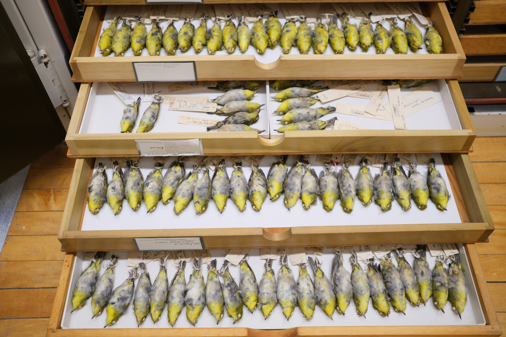

{fig-align="center" width="1200"}

## Goals

Included here is are analyses of morphological phenotypes in East Asian Zosterops taken from linear measurements of museum skins at the Cincinnati Museum Center, National Museum of Natural History at the Smithsonian, the American Museum of Natural History, and the Field Museum of Natural History.

## Getting started

We are using R version 4.4.2, RStudio version 2024.09.1 for the analysis. Quarto version 1.6.39 for Mac OS was used to document the workflow. Set the working directory in RStudio to one where the `Zosterops_linear_measurements.csv` data file is accessible.

### Packages

Set the working directory to one where the file Zosterops_linear_measurements.csv is accessible. Install the following packages.

- ggplot2 [@ggplot2]

- dplyr [@dplyr]

- tidyr [@tidyr]

- gt [@gt]

- factoextra [@factoextra]

- broom [@broom]

- readr [@readr]

- gridExtra [@gridExtra]

Load the package libraries.

```{r}
#| label: Load package libraries. 
# Load necessary libraries
library(ggplot2)
library(dplyr)
library(tidyr)
library(gt)
library(factoextra)
library(broom)
library(readr)
library(gridExtra)
library(grid)
```

### Data files

#### Linear measurements

Linear measurements were obtained from a series of seven characters (bill culmen length, bill length from nares to tip, bill depth at the nares, bill width at the nares, tarsus length, wing cord, and tail length) taken from round museum skins across four museum collections (Cincinnati Museum Center, The American Museum of Natural History, the Field Museum of Natural History, and the National Museum of Natural history at the Smithsonian).

#### Final morphometric dataset

Morphological data for this analysis is in the comma delimited file titled `Zosterops_linear_measurements.csv`. Import the morphological dataset using `read.csv` and summarize. In total 388 individual specimens were measured. Measurements for 354 skins were retained for analysis after omitting those cases where there was some ambiguity regarding the taxon designation or locality or where damaged or poorly positioned specimens created missing measurements.

```{r}
#| label: Load data from .csv file.
# Import data from CSV file
ZosteropsMorph <- read.csv('./Data/Morphometrics/Zosterops_linear_measurements2.csv')
summary(ZosteropsMorph)
```

Add log transformed data for each measurement.

```{r}
#| label: Log transformed data
ZosteropsMorph <- ZosteropsMorph %>%
  mutate(
    Log_BillCulmen = log(BillCulmen),
    Log_BillNareTip = log(BillNareTip),
    Log_BillDepth = log(BillDepth),
    Log_BillWidth = log(BillWidth),
    Log_Tarsus = log(Tarsus),
    Log_Wing = log(Wing),
    Log_Tail = log(Tail)
  )
```

Create a table displaying all the data in the file `Zosterops_linear_measurements.csv`.

```{r}
#| label: Table for morphometric dataset
ZosteropsMorph %>%
  gt(auto_align = FALSE)
```

## Principal component analyses (PCA)

### PCA for species

```{r}
#| label: PCA for species
# Group data by 'species' and select relevant variables for PCA
ZosteropsMorph_species <- ZosteropsMorph %>%
  select(species, BillCulmen, BillNareTip, BillDepth, BillWidth, Tarsus, Wing, Tail) %>%
  group_by(species)

# Perform PCA on the selected variables
pca_result <- prcomp(ZosteropsMorph_species[, -1], center = TRUE, scale. = TRUE)

# Convert PCA result to a data frame for plotting
pca_data <- as.data.frame(pca_result$x)

# Add 'species' variable to PCA data for coloring
pca_data$species <- ZosteropsMorph_species$species

# Plot the first two principal components
ggplot(pca_data, aes(x = PC1, y = PC2, color = species)) +
  geom_point(size = 3) + 
  labs(title = "PCA of Zosterops Morphological Measurements",
       x = "Principal Component 1",
       y = "Principal Component 2") +
  theme_minimal() +
  theme(legend.title = element_blank())
```

### PCA for subspecies

```{r}
#| label: PCA for subspecies
# Group data by 'Name' (subspecies) and select relevant variables for PCA
ZosteropsMorph_subspecies <- ZosteropsMorph %>%
  select(Name, BillCulmen, BillNareTip, BillDepth, BillWidth, Tarsus, Wing, Tail) %>%
  group_by(Name)

# Perform PCA on the selected variables
pca_result <- prcomp(ZosteropsMorph_subspecies[, -1], center = TRUE, scale. = TRUE)

# Convert PCA result to a data frame for plotting
pca_data <- as.data.frame(pca_result$x)

# Add 'Name' variable to PCA data for coloring
pca_data$Name <- ZosteropsMorph_subspecies$Name

# Plot the first two principal components
ggplot(pca_data, aes(x = PC1, y = PC2, color = Name)) +
  geom_point(size = 3) + 
  labs(title = "PCA of Zosterops Morphological Measurements",
       x = "Principal Component 1",
       y = "Principal Component 2") +
  theme_minimal() +
  theme(legend.title = element_blank())
```

## Box-and-whisker plots and pairwise t-tests

### Species plots, summaries, and t-tests

Define color values for box plots to match prior color schemes.

```{r}
#| label: Define color values for box-and-whisker plots for species. 
species_colors <- c("#004949", "#DB6D00", "#D82632", "#FED439", "#FA9C88", "#924900", "#8DB6CD", "#CDAA7D", "#008600")
```

Create box-and-whisker plots for each individual trait.

```{r}
#| label: Box-and-whisker plots for morphometric traits.
# Define a function to create boxplots for each trait
create_boxplot <- function(ZosteropsMorph_species, trait) {
  ggplot(ZosteropsMorph_species, aes_string(x = "species", y = trait)) + 
    geom_boxplot(outlier.shape = NA) + # Boxplot without outliers
    geom_jitter(width = 0.2, aes(color = species), size = 2, alpha = 0.5) + # Add jitter for individual points
    labs(title = paste("Boxplot of", trait, "by Species"), x = "Species", y = trait) + 
    scale_color_manual(values = species_colors) +
    theme_minimal() # Minimal theme for better aesthetics
}
# List of traits to plot
traits <- c("BillCulmen", "BillNareTip", "BillDepth", "BillWidth", "Tarsus", "Wing", "Tail")
# Loop through each trait and create boxplots
for (trait in traits) {
  print(create_boxplot(ZosteropsMorph_species, trait)) # Print each boxplot
}
```

Descriptive statistics for morphometric traits by species.

```{r}
#| label: Descriptive statistics for each trait by species.
ZosteropsMorph_descriptive_stats_species <- ZosteropsMorph_species %>%
  select(species, BillCulmen, BillNareTip, BillDepth, BillWidth, Tarsus, Wing, Tail) %>%  # Select relevant columns
  group_by(species) %>%  # Group by 'Group'
  summarise(  # Summarize to get descriptive statistics
    Mean_BillCulmen = mean(BillCulmen, na.rm = TRUE),
    Median_BillCulmen = median(BillCulmen, na.rm = TRUE),
    SD_BillCulmen = sd(BillCulmen, na.rm = TRUE),
    
    Mean_BillNareTip = mean(BillNareTip, na.rm = TRUE),
    Median_BillNareTip = median(BillNareTip, na.rm = TRUE),
    SD_BillNareTip = sd(BillNareTip, na.rm = TRUE),
    
    Mean_BillDepth = mean(BillDepth, na.rm = TRUE),
    Median_BillDepth = median(BillDepth, na.rm = TRUE),
    SD_BillDepth = sd(BillDepth, na.rm = TRUE),
    
    Mean_BillWidth = mean(BillWidth, na.rm = TRUE),
    Median_BillWidth = median(BillWidth, na.rm = TRUE),
    SD_BillWidth = sd(BillWidth, na.rm = TRUE),
    
    Mean_Tarsus = mean(Tarsus, na.rm = TRUE),
    Median_Tarsus = median(Tarsus, na.rm = TRUE),
    SD_Tarsus = sd(Tarsus, na.rm = TRUE),
    
    Mean_Wing = mean(Wing, na.rm = TRUE),
    Median_Wing = median(Wing, na.rm = TRUE),
    SD_Wing = sd(Wing, na.rm = TRUE),
    
    Mean_Tail = mean(Tail, na.rm = TRUE),
    Median_Tail = median(Tail, na.rm = TRUE),
    SD_Tail = sd(Tail, na.rm = TRUE)
  )
# View the descriptive statistics table
print(ZosteropsMorph_descriptive_stats_species)
write.csv(ZosteropsMorph_descriptive_stats_species)
ZosteropsMorph_descriptive_stats_species %>%
  gt(auto_align = FALSE)
```

Pairwise t-tests by species.

```{r}
#| label: Pairwise statistical tests for morphometric traits by species. 
# Conduct pairwise statistical tests between every pair of species for specified variables
results_list_species <- list() # Initialize a list to store results
# Loop through each trait for pairwise tests
for (trait in traits) {
  # Perform pairwise t-tests
  pairwise_results_species <- pairwise.t.test(ZosteropsMorph_species[[trait]], 
                                       ZosteropsMorph_species$species, 
                                       p.adjust.method = "bonferroni")
  
  # Convert results to a tidy format
  tidy_results_species <- tidy(pairwise_results_species) %>%
    mutate(p.value = format.pval(p.value, digits = 2, format = "e")) # Format p-values in scientific notation
  
  results_list_species[[trait]] <- tidy_results_species # Store results in the list
}
# Combine all results into a single data frame
final_results_species <- bind_rows(results_list_species, .id = "trait")
# Save the results to a CSV file
write.csv(final_results_species, "pairwise_test_results_species.csv", row.names = FALSE)
final_results_species %>%
  gt(auto_align = FALSE)
```

Organize pairwise t-tests by morphometric trait.

```{r}
#| label: Table of pairwise results for each morphometric trait. 
# Read the CSV file into a data frame
data <- read_csv("./pairwise_test_results_species.csv")
# Define the traits to create tables for
traits <- c('BillCulmen', 'BillNareTip', 'BillDepth', 'BillWidth', 'Tarsus', 'Wing', 'Tail')
# Loop through each trait to create and save tables
for (trait in traits) {
  # Filter data for the current trait
  trait_data_species <- data %>% filter(trait == !!trait)
  
  # Create a readable table for the current trait
  table_name_species <- paste0(trait, "_results_species.csv")
  write_csv(trait_data_species, table_name_species)
}
```

### Taxonomic/biogeographic group plots, summaries, and t-tests

Define colors for box-and-whisker plots for taxonomic/biogeographic groups.

```{r}
#| label: Define color values for box-and-whisker plots for taxonomic/biogeographic groups. 
group_colors <- c("#004949", "#DB6D00", "#D82632", "#290AD8", "#FED439", "#B66DFF", "#FA9C88", "#924900", "#CDAA7D", "#8DB6CD", "#008600")
```

Test each trait within each taxonomic/biogeographic group for normality.

```{r}
#| label: Select data and group by taxonomic/biogeographic groups
# Select relevant variables and group by taxonomic group separating montanus into NORTH and SOUTH groups and japonicus into CONTINENTAL and OCEANIC groups and create datasets with the original data and log transformed data. 
ZosteropsMorph_groups <- ZosteropsMorph %>%
  select(Group, BillCulmen, BillNareTip, BillDepth, BillWidth, Tarsus, Wing, Tail) %>%
  group_by(Group)

ZosteropsMorph_LOG_groups <- ZosteropsMorph %>%
  select(Group, Log_BillCulmen, Log_BillNareTip, Log_BillDepth, Log_BillWidth, Log_Tarsus, Log_Wing, Log_Tail) %>%
  group_by(Group)

# Function to perform Kolmogorov-Smirnov test for each variable within each group
perform_ks_test <- function(group_data, variable) {
  # Create a list to store results
  results <- list()
  
  # Get unique groups
  unique_groups <- unique(group_data$Group)
  
  # Iterate over each unique group
  for (i in 1:length(unique_groups)) {
    # Filter data for the specific group
    group_name <- unique_groups[i]
    group_values <- group_data %>% filter(Group == group_name) %>% pull(variable)
    
    # Perform KS test with the first group's data as reference
    if (i == 1) {
      reference_values <- group_values
    } else {
      ks_test_result <- ks.test(group_values, reference_values)
      results[[group_name]] <- ks_test_result
    }
  }
  return(results)
}
# List of variables to test
variables <- c("Log_BillCulmen", "Log_BillNareTip", "Log_BillDepth", "Log_BillWidth", "Log_Tarsus", "Log_Wing", "Log_Tail")
# Perform KS tests for all variables
ks_results <- lapply(variables, function(var) perform_ks_test(ZosteropsMorph_LOG_groups, var))
# Naming the results list based on variables
names(ks_results) <- variables
# View results
ks_results


```

Box and whisker plots by taxonomic/biogeographic group splitting japonicus into continental and oceanic groups and montanus into north and south groups.

```{r}
#| label: Box-and-whisker plots for morphometric traits by taxonomic/biogeographic group.

# Define a function to create boxplots for each trait
create_boxplot <- function(data, trait) {
  ggplot(data, aes_string(x = "Group", y = trait)) +
    geom_boxplot(outlier.shape = NA) + # Boxplot without outliers
    geom_jitter(width = 0.2, aes(color = Group), size = 2, alpha = 0.5) + # Add jitter for individual points
    scale_color_manual(values = group_colors) + # Define colors for groups
    theme_minimal() + # Minimal theme for better aesthetics
    theme(axis.text.x = element_text(angle = 45, hjust = 1)) # Adjust labels on X axis
}

# List of traits to plot
traits <- c("BillCulmen", "BillNareTip", "BillDepth", "BillWidth", "Tarsus", "Wing", "Tail")

# Loop through each trait and create boxplots
for (trait in traits) {
  assign(paste0("boxplot_groups_", trait), create_boxplot(ZosteropsMorph_groups, trait)) # Create and save boxplot as an object named by trait
}
boxplot_groups_BillCulmen
boxplot_groups_BillNareTip
boxplot_groups_BillDepth
boxplot_groups_BillWidth
boxplot_groups_Tarsus
boxplot_groups_Wing
boxplot_groups_Tail
```

Isolate just the legend from one of the group box-and-whisker figures.

```{r}
#| label: Isolate a figure legend from one of the box-and-whisker figures
Zosterops_groups_legend <- cowplot::get_legend(boxplot_groups_Tail + theme(legend.position = "right"))
ggsave("boxplot_legend.png", plot = Zosterops_groups_legend, width = 1.75, height = 3)
```

Combine plots into a single figure.

```{r}
#| label: Combine all group trait boxplots into a single figure.
#| fig-height: 25
#| fig-width: 18
ZosteropsMorph_groups_combined <- grid.arrange(
  # Plot A: Bill Culmen
  boxplot_groups_BillCulmen + 
    theme(legend.position = "none",
          axis.title.x = element_blank(),
          axis.text.x = element_blank(), 
          axis.title.y = element_text(size = 19),
          axis.text.y = element_text(size = 15)) +
    scale_y_continuous(limits = c(7.5, NA), name = "Bill length culmen (mm)") + 
    annotate("text", x = Inf, y = Inf, label = "a.", hjust = 1, vjust = 1.3, size = 12) +
    theme(panel.border = element_rect(colour = "black", fill = NA, size = 1)),
  
  # Plot B: Bill Nare Tip
  boxplot_groups_BillNareTip + 
    theme(legend.position = "none",
          axis.title.x = element_blank(),
          axis.text.x = element_blank(), 
          axis.title.y = element_text(size = 19),
          axis.text.y = element_text(size = 15)) + 
    scale_y_continuous(limits = c(5, NA), name = "Bill length nare-to-tip (mm)") + 
    annotate("text", x = Inf, y = Inf, label = "b.", hjust = 1, vjust = 1.2, size = 12) +
    theme(panel.border = element_rect(colour = "black", fill = NA, size = 1)),
  
  # Plot C: Bill Depth
  boxplot_groups_BillDepth + 
    theme(legend.position = "none",
          axis.title.x = element_blank(),
          axis.text.x = element_blank(), 
          axis.title.y = element_text(size = 19),
          axis.text.y = element_text(size = 15)) +
    scale_y_continuous(limits = c(1.5, NA), name = "Bill depth (mm)") + 
    annotate("text", x = Inf, y = Inf, label = "c.", hjust = 1, vjust = 1.3, size = 12) +
    theme(panel.border = element_rect(colour = "black", fill = NA, size = 1)),
  
  # Plot D: Bill Width
  boxplot_groups_BillWidth + 
    theme(legend.position = "none",
          axis.title.x = element_blank(),
          axis.text.x = element_blank(), 
          axis.title.y = element_text(size = 19),
          axis.text.y = element_text(size = 15)) + 
    scale_y_continuous(limits = c(2, NA), name = "Bill width (mm)") + 
    annotate("text", x = Inf, y = Inf, label = "d.", hjust = 1, vjust = 1.2, size = 12) +
    theme(panel.border = element_rect(colour = "black", fill = NA, size = 1)),
  
  # Plot E: Tarsus
  boxplot_groups_Tarsus + 
    theme(legend.position = "none",
          axis.title.x = element_blank(),
          axis.text.x = element_blank(), 
          axis.title.y = element_text(size = 19),
          axis.text.y = element_text(size = 15)) +
    scale_y_continuous(limits = c(10, NA), name = "Tarsus length (mm)") + 
    annotate("text", x = Inf, y = Inf, label = "e.", hjust = 1, vjust = 1.3, size = 12) +
    theme(panel.border = element_rect(colour = "black", fill = NA, size = 1)),
  
  # Plot F: Wing
  boxplot_groups_Wing + 
    theme(legend.position = "none",
          axis.title.x = element_blank(),
          axis.text.x = element_blank(), 
          axis.title.y = element_text(size = 19),
          axis.text.y = element_text(size = 15)) + 
    scale_y_continuous(limits = c(48, NA), name = "Wing cord length (mm)") + 
    annotate("text", x = Inf, y = Inf, label = "f.", hjust = 1, vjust = 1.2, size = 12) +
    theme(panel.border = element_rect(colour = "black", fill = NA, size = 1)),
  
  # Plot G: Tail
  boxplot_groups_Tail + 
    theme(legend.position = "none",
          axis.title.x = element_blank(),
          axis.text.x = element_blank(), 
          axis.title.y = element_text(size = 19),
          axis.text.y = element_text(size = 15)) +
    scale_y_continuous(limits = c(25, NA), name = "Tail length (mm)") + 
    annotate("text", x = Inf, y = Inf, label = "g.", hjust = 1, vjust = 0.9, size = 12) +
    theme(panel.border = element_rect(colour = "black", fill = NA, size = 1)),
  
  # Add image in 4th row, 2nd column
  grid::rasterGrob(png::readPNG("boxplot_legend.png"), interpolate = TRUE), 
  ncol = 2, 
  layout_matrix = rbind(c(1, 2), 
                        c(3, 4), 
                        c(5, 6), 
                        c(7, 8))
)
```

Descriptive statistics for morphometric traits by taxonomic/biogeographic group.

```{r}
#| label: Descriptive statistics for each trait by taxonomic/biogeographic group.
ZosteropsMorph_descriptive_stats_groups <- ZosteropsMorph_groups %>%
  select(Group, BillCulmen, BillNareTip, BillDepth, BillWidth, Tarsus, Wing, Tail) %>%  # Select relevant columns
  group_by(Group) %>%  # Group by 'Group'
  summarise(  # Summarize to get descriptive statistics
    Mean_BillCulmen = mean(BillCulmen, na.rm = TRUE),
    Median_BillCulmen = median(BillCulmen, na.rm = TRUE),
    SD_BillCulmen = sd(BillCulmen, na.rm = TRUE),
    
    Mean_BillNareTip = mean(BillNareTip, na.rm = TRUE),
    Median_BillNareTip = median(BillNareTip, na.rm = TRUE),
    SD_BillNareTip = sd(BillNareTip, na.rm = TRUE),
    
    Mean_BillDepth = mean(BillDepth, na.rm = TRUE),
    Median_BillDepth = median(BillDepth, na.rm = TRUE),
    SD_BillDepth = sd(BillDepth, na.rm = TRUE),
    
    Mean_BillWidth = mean(BillWidth, na.rm = TRUE),
    Median_BillWidth = median(BillWidth, na.rm = TRUE),
    SD_BillWidth = sd(BillWidth, na.rm = TRUE),
    
    Mean_Tarsus = mean(Tarsus, na.rm = TRUE),
    Median_Tarsus = median(Tarsus, na.rm = TRUE),
    SD_Tarsus = sd(Tarsus, na.rm = TRUE),
    
    Mean_Wing = mean(Wing, na.rm = TRUE),
    Median_Wing = median(Wing, na.rm = TRUE),
    SD_Wing = sd(Wing, na.rm = TRUE),
    
    Mean_Tail = mean(Tail, na.rm = TRUE),
    Median_Tail = median(Tail, na.rm = TRUE),
    SD_Tail = sd(Tail, na.rm = TRUE)
  )
# View the descriptive statistics table
print(ZosteropsMorph_descriptive_stats_groups)
write.csv(ZosteropsMorph_descriptive_stats_groups)
library(gt)
ZosteropsMorph_descriptive_stats_groups %>%
  gt(auto_align = FALSE)

```

Pairwise tests by by taxonomic/biogeographic group splitting japonicus into continental and oceanic groups and montanus into north and south groups.

```{r}
#| label: Pairwise t-tests for taxnomic/biogeographic groups.
# Conduct pairwise statistical tests between every pair of species for specified variables
results_list_groups <- list() # Initialize a list to store results
# Loop through each trait for pairwise tests
for (trait in traits) {
  # Perform pairwise t-tests
  pairwise_results_groups <- pairwise.t.test(ZosteropsMorph_groups[[trait]], 
                                       ZosteropsMorph_groups$Group, 
                                       p.adjust.method = "bonferroni")
  
  # Convert results to a tidy format
  tidy_results_groups <- tidy(pairwise_results_groups) %>%
    mutate(p.value = format.pval(p.value, digits = 2, format = "e")) # Format p-values in scientific notation
  
  results_list_groups[[trait]] <- tidy_results_groups # Store results in the list
}
# Combine all results into a single data frame
final_results_groups <- bind_rows(results_list_groups, .id = "trait")
# Save the results to a CSV file
write.csv(final_results_groups, "pairwise_test_results_groups.csv", row.names = FALSE)
final_results_groups %>%
  gt(auto_align = FALSE)
```

Organize pairwise t-tests by morphometric trait for taxonomic/biogeographic groups.

```{r}
#| label: Table of pairwise t-test results for taxonomic/biogeographic groups for each morphometric trait. 
# Read the CSV file into a data frame
data <- read_csv("./pairwise_test_results_groups.csv")
# Define the traits to create tables for
traits <- c('BillCulmen', 'BillNareTip', 'BillDepth', 'BillWidth', 'Tarsus', 'Wing', 'Tail')
# Loop through each trait to create and save tables
for (trait in traits) {
  # Filter data for the current trait
  trait_data_groups <- data %>% filter(trait == !!trait)
  
  # Create a readable table for the current trait
  table_name_groups <- paste0(trait, "_results_groups.csv")
  write_csv(trait_data_groups, table_name_groups)
}
```

Wilcoxon pairwise tests

```{r}
#| Label: Nonparametric Wilcoxon pairwise tests. 
# Conduct a nonparametric Wilcoxon paired test for each measurement. 
WILCOX_BillCulmen <- pairwise.wilcox.test(ZosteropsMorph_groups$BillCulmen, ZosteropsMorph_groups$Group, p.adjust.method="bonferroni", exact = FALSE)
WILCOX_BillNareTip <- pairwise.wilcox.test(ZosteropsMorph_groups$BillNareTip, ZosteropsMorph_groups$Group, p.adjust.method="bonferroni", exact = FALSE)
WILCOX_BillDepth <- pairwise.wilcox.test(ZosteropsMorph_groups$BillDepth, ZosteropsMorph_groups$Group, p.adjust.method="bonferroni", exact = FALSE)
WILCOX_BillWidth <- pairwise.wilcox.test(ZosteropsMorph_groups$BillWidth, ZosteropsMorph_groups$Group, p.adjust.method="bonferroni", exact = FALSE)
WILCOX_Tarsus <- pairwise.wilcox.test(ZosteropsMorph_groups$Tarsus, ZosteropsMorph_groups$Group, p.adjust.method="bonferroni", exact = FALSE)
WILCOX_Wing <- pairwise.wilcox.test(ZosteropsMorph_groups$Wing, ZosteropsMorph_groups$Group, p.adjust.method="bonferroni", exact = FALSE)
WILCOX_Tail <- pairwise.wilcox.test(ZosteropsMorph_groups$Tail, ZosteropsMorph_groups$Group, p.adjust.method="bonferroni", exact = FALSE)
WILCOX_BillCulmen
WILCOX_BillNareTip
WILCOX_BillDepth
WILCOX_Tarsus
WILCOX_Wing

# Function to convert test results to a table format
generate_WILCOX_table <- function(test_result) {
  p_values <- format(test_result$p.value, nsmall = 2, digits = 2)
  data.frame(p_values)
}
# Generate tables for each test result
WILCOX_table_BillCulmen <- generate_WILCOX_table(WILCOX_BillCulmen)
WILCOX_table_BillNareTip <- generate_WILCOX_table(WILCOX_BillNareTip)
WILCOX_table_BillDepth <- generate_WILCOX_table(WILCOX_BillDepth)
WILCOX_table_BillWidth <- generate_WILCOX_table(WILCOX_BillWidth)
WILCOX_table_Tarsus <- generate_WILCOX_table(WILCOX_Tarsus)
WILCOX_table_Wing <- generate_WILCOX_table(WILCOX_Wing)
WILCOX_table_Tail <- generate_WILCOX_table(WILCOX_Tail)

WILCOX_table_BillCulmen
WILCOX_table_BillNareTip
WILCOX_table_BillDepth
WILCOX_table_BillWidth
WILCOX_table_Tarsus
WILCOX_table_Wing
WILCOX_table_Tail
```
