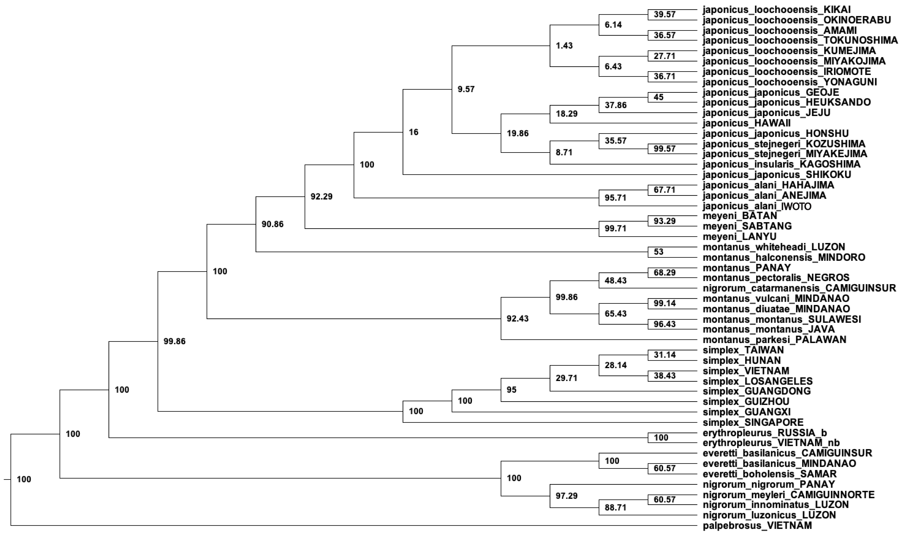
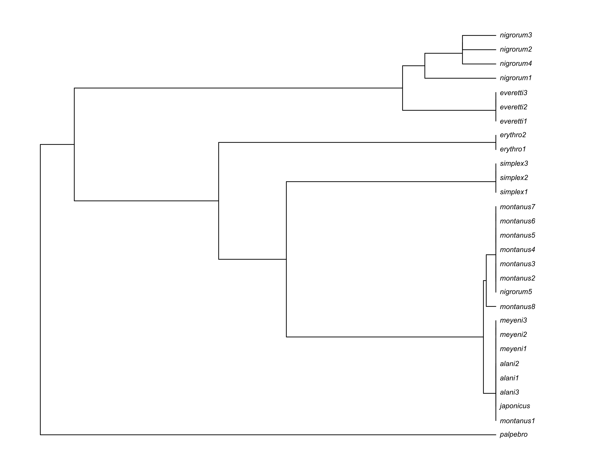
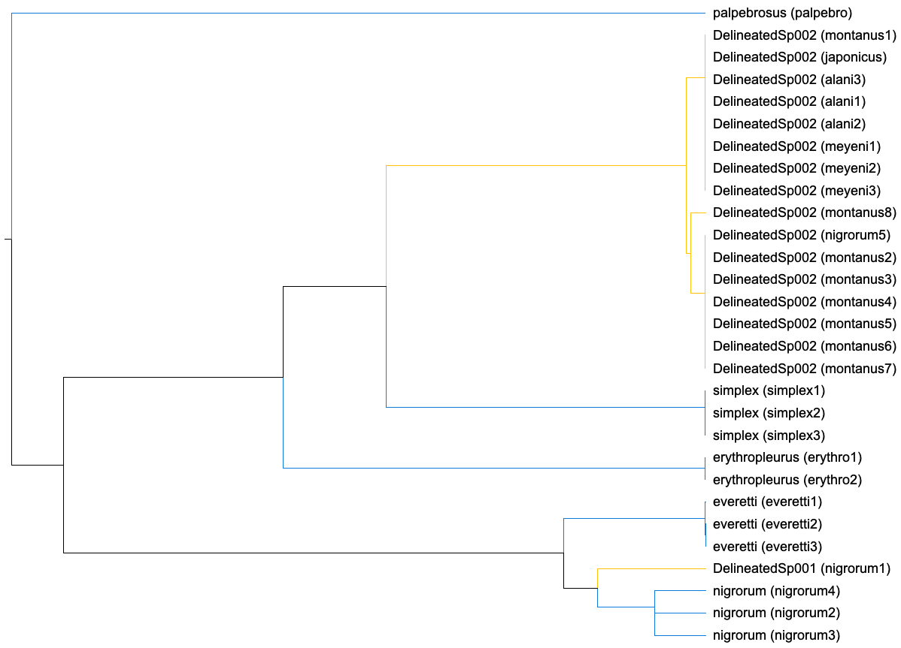
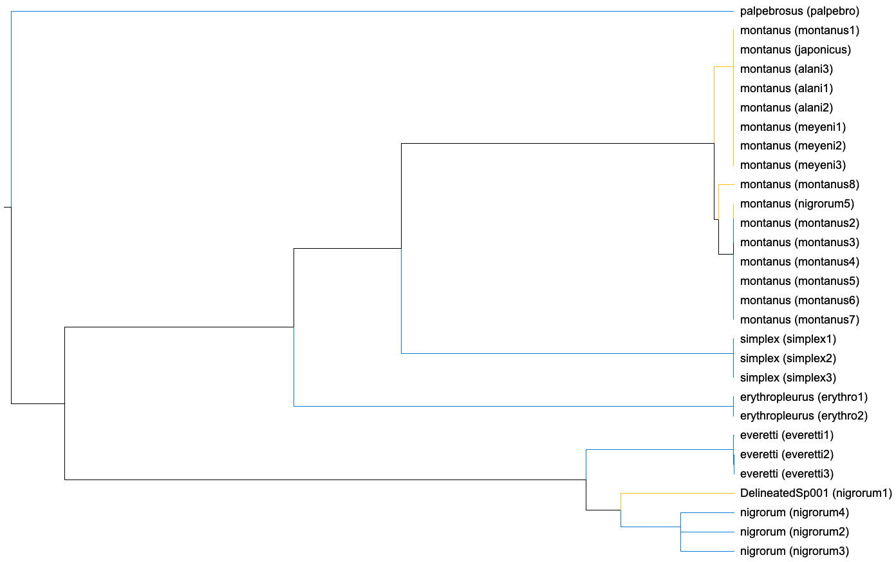
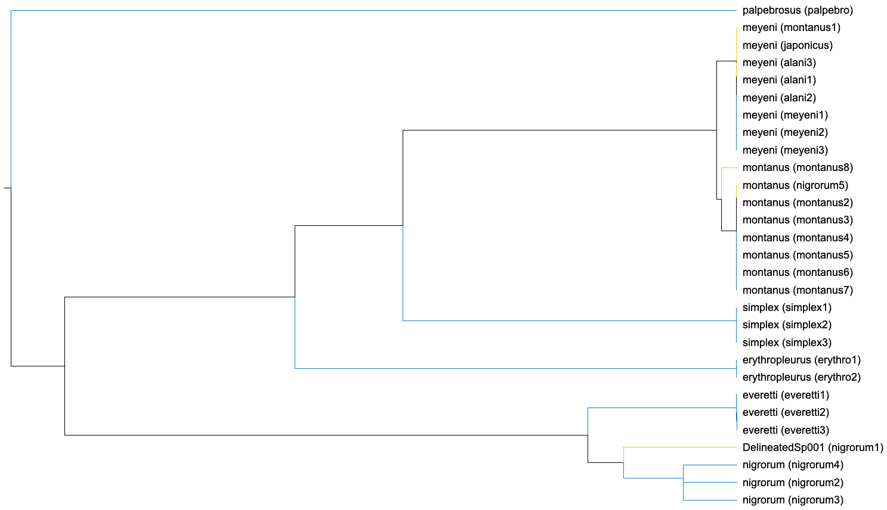
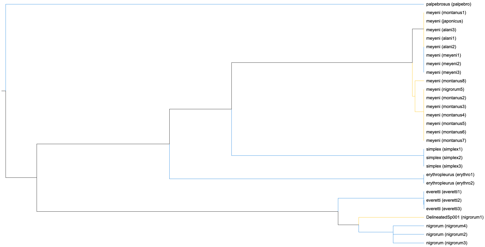
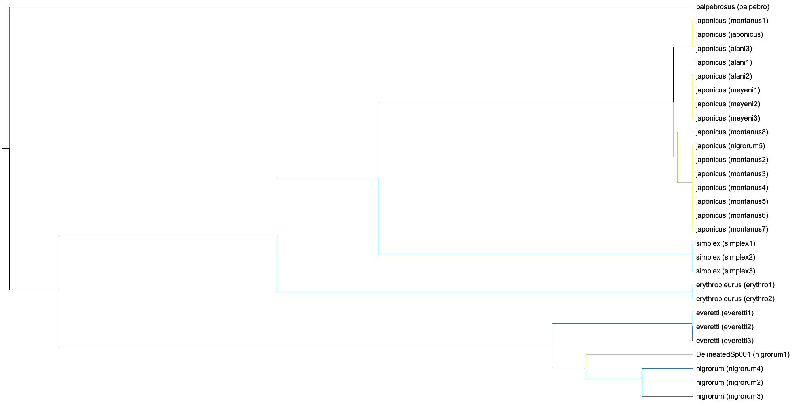
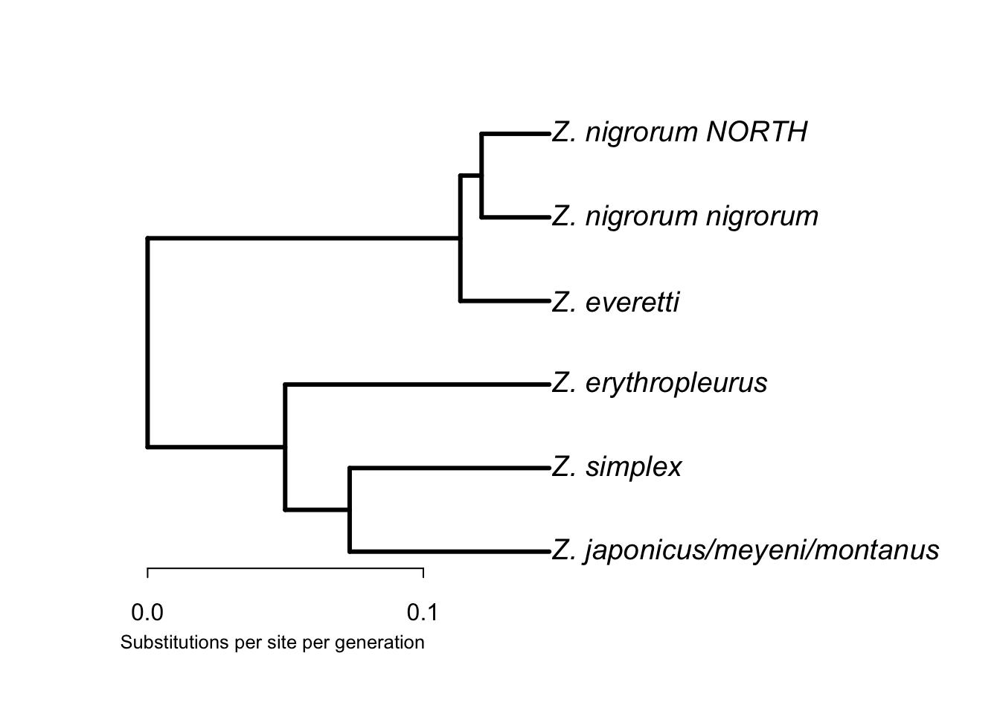
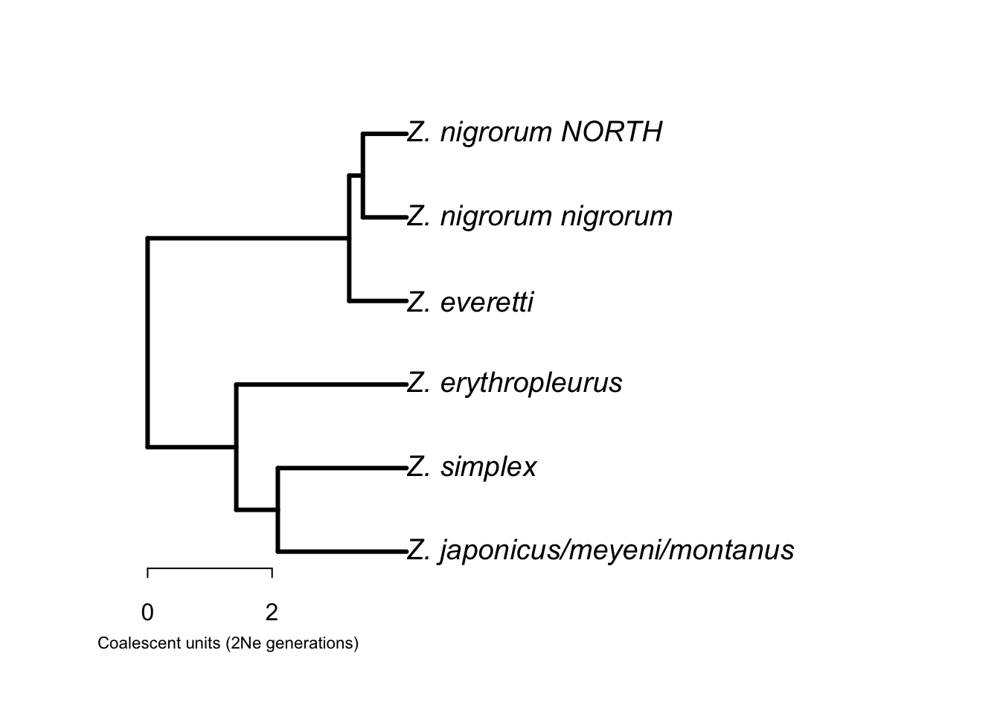

::: {#quarto-search-results}
:::

::: {.navbar-container .container-fluid}
::: {#quarto-search title="Search"}
:::

[]{.navbar-toggler-icon}

::: {#navbarCollapse .collapse .navbar-collapse}
-   [[Title and authors]{.menu-text}](./index.html){.nav-link}
-   [[Introduction]{.menu-text}](./about.html){.nav-link}
-   [[Sampling Maps]{.menu-text}](./ZosteropsMaps.html){.nav-link}
-   [[Sanger sequencing summary statistics and
    trees]{.menu-text}](./Summary_Sanger.html){.nav-link}
-   [[StarBEAST2]{.menu-text}](./Zosterops_StarBEAST2.html){.nav-link}
-   [[BPP and GDI based species
    delimitation]{.menu-text}](./ZosteropsBPP.html){.nav-link}
-   [[MSN, Distance trees, PCA, UMAP, and DAPC
    analyses]{.menu-text}](./ZosteropsSNPs_analysis.html){.nav-link}
-   [[Genetic differentiation and biogeographic
    breaks]{.menu-text}](./Zosterops_SNPFst.html){.nav-link}
-   [[Species trees and delimitation with SVDQuartets, PICL, and
    DELINEATE]{.menu-text}](./Zosterops_SVDQ.html){.nav-link .active}
-   [[Linear
    morphometrics]{.menu-text}](./ZosteropsMorphometrics.html){.nav-link}
:::

::: {.quarto-navbar-tools}
:::
:::

::: {#quarto-content .quarto-container .page-columns .page-rows-contents .page-layout-article .page-navbar}
::: {#quarto-margin-sidebar .sidebar .margin-sidebar}
## On this page {#toc-title}

-   [Goals](#goals){#toc-goals .nav-link .active}
-   [Getting started](#getting-started){#toc-getting-started .nav-link}
-   [General methods
    summary](#general-methods-summary){#toc-general-methods-summary
    .nav-link}
    -   [Species trees](#species-trees){#toc-species-trees .nav-link}
    -   [Species
        delimitation](#species-delimitation){#toc-species-delimitation
        .nav-link}
-   [Data](#data){#toc-data .nav-link}
-   [Software](#software){#toc-software .nav-link}
    -   [R packages](#r-packages){#toc-r-packages .nav-link}
    -   [Data files](#data-files){#toc-data-files .nav-link}
-   [SVDQuartets](#svdquartets){#toc-svdquartets .nav-link}
    -   [SVDQuartets tree and
        bootstraps](#svdquartets-tree-and-bootstraps){#toc-svdquartets-tree-and-bootstraps
        .nav-link}
    -   [SVDQuartets consensus
        tree](#svdquartets-consensus-tree){#toc-svdquartets-consensus-tree
        .nav-link}
    -   [Cleaning up the consensus
        tree](#cleaning-up-the-consensus-tree){#toc-cleaning-up-the-consensus-tree
        .nav-link}
-   [PICL](#picl){#toc-picl .nav-link}
    -   [Run 1](#run-1){#toc-run-1 .nav-link}
    -   [Run 2](#run-2){#toc-run-2 .nav-link}
-   [Delineate](#delineate){#toc-delineate .nav-link}
    -   [Run 1](#run-1-1){#toc-run-1-1 .nav-link}
    -   [Run 2](#run-2-1){#toc-run-2-1 .nav-link}
    -   [Run 3](#run-3-1){#toc-run-3-1 .nav-link}
    -   [Run 4](#run-4-1){#toc-run-4-1 .nav-link}
    -   [Run 5](#run-5-1){#toc-run-5-1 .nav-link}
-   [Speciation rate](#speciation-rate){#toc-speciation-rate .nav-link}
:::

::: {#quarto-document-content .content role="main"}
::: {.quarto-title}
:::

::: {.quarto-title-meta}
:::

::: {#goals .section .level2}
## Goals {#goals .anchored anchor-id="goals"}

Included here are phylogenetic analyses of East Asian Zosterops using
the single nucleotide polymorphism (SNP) data from our double digest
restriction-site associated DNA (ddRAD) library. The goals of these
analyses are to determine species tree topology, estimate branch
lengths, and to test hypotheses about species limits.
:::

::: {#getting-started .section .level2}
## Getting started {#getting-started .anchored anchor-id="getting-started"}

Along with the software listed below we are using R version 4.4.2 and
RStudio version 2024.09.1 for the analysis. Quarto version 1.6.39 for
Mac OS was used to document the workflow. Set the working directory to
one where the data files are accessible.
:::

::: {#general-methods-summary .section .level2}
## General methods summary {#general-methods-summary .anchored anchor-id="general-methods-summary"}

::: {#species-trees .section .level3}
### Species trees {#species-trees .anchored anchor-id="species-trees"}

A species tree was produced from the SNP dataset using Singular Value
Decomposition Quartets (SVDQuartets) [([Chifman and Kubatko
2014](#ref-chifman2014))]{.citation cites="chifman2014"} implemented in
PAUP\* v4.0 [([Wilgenbusch and Swofford
2003](#ref-wilgenbusch2003))]{.citation cites="wilgenbusch2003"} and
Phylogenetic Inference with Composite Likelihood (PICL) [([Swofford and
Kubatko 2023](#ref-swofford2023a); [Kubatko et al.
2025](#ref-kubatko2025); [Kong, Swofford, and Kubatko
2024](#ref-kong2024))]{.citation
cites="swofford2023a kubatko2025 kong2024"}. The SNP file was converted
to nexus format using the Python3 script *vcf2phylip* [([Ortiz
2019](#ref-ortiz2019))]{.citation cites="ortiz2019"}. A taxon file was
created to assign individual samples to narrowly defined groups assorted
primarily by species, subspecies, and island of origin. Samples from *Z.
palpebrosus* were defined as the outgroup taxon. SVDQuartets was run in
PAUP\* using this taxon file and the nexus formatted SNP data by
evaluating all quartets ('evalquartets = all') and 700 bootstrap
replicates. A 50% majority rule consensus tree was then derived from the
output trees using the 'contree' command in PAUP\*, saved, and
visualized in *FigTree* (<http://tree.bio.ed.ac.uk/software/figtree/>).

We conducted two estimates of branch lengths using PICL based on the
tree topology determined from the SVDQuartets. Taxon designations for
individual samples were assigned by a combination of taxonomy and
geography, similar to prior analyses. For the first run *Z. japonicus*
was split into *Z. japonicus alani* from the Ogasawara and Volcano
Islands and a *Z. japonicus* group with the remaining subspecies, a
northern Philippine group of *Z. montanus* that included the subspecies
from Luzon and Mindoro, and another grouping the *Z. montanus parkesi*
subspecies from Palawan. The remainder of the *Z. montanus* populations
were split into *Z. montanus* from the Visayas, Camiguin South, and
Mindanao and another group containing nominate *Z. montanus* subspecies
samples from Sulawesi and Java. As in prior analyses *Z.nigrorum
catarmanensis* (`Zni14341`) on Camiguin South was grouped with the
central/southern Philippine *Z. montanus* samples. The remainder of the
samples were grouped by species.

For the second run taxon assignments were based on any population
lineages from the SVDQuartets analysis with bootstrap values greater
than 60%. Poorly supported lineages (\<60%) were collapsed, with two
exceptions. *Z. japonicus stejnegeri* on Kozushima and Miyakejima in the
Izu Islands exhibited bootstrap support greater than 60% but because
these sister populations were deeply embedded in a group of very poorly
supported lineages, all these continental island populations of *Z.
japonicus*, along with those Izu Island populations of *Z. japonicus
stejnegeri*, were collapsed into a single 'continental' *Z. japonicus*
clade. Also, despite the mismatched *Z. nigrorum catarmanensis* sample
resting within a poorly supported group along with the *Z. montanus*
populations in the Visayas, we treated this sample as its own group to
explore the taxonomic mismatch. The tree topology for this second PICL
run was created by sequentially collapsing branches using the *ape*
package in R.

For both runs the parameters were the same except for the
taxon/population assignments for the individual samples to determine
branch lengths on more collapsed (run 1) and less collapsed (run 2)
versions of the SVDQuartets consensus tree. The model parameter was set
to indicate SNP data was being used and the 'Random_tree' and
'Tree_search' parameters were set to 0 to indicate the use of a
predefined tree. 'Theta' was set to 0.035 and 'Num_iter' to 30,000. 100
bootstrap replicates were performed to obtain 95% confidence intervals
associated with each split time.
:::

::: {#species-delimitation .section .level3}
### Species delimitation {#species-delimitation .anchored anchor-id="species-delimitation"}

We took the resulting species tree with the topology determined by
SVDQuartets and branch lengths by run 2 of PICL and used this to test
species hypotheses in *Delineate* [([Sukumaran, Holder, and Knowles
2021](#ref-sukumaran2021))]{.citation cites="sukumaran2021"}. We
conducted five independent runs of *Delineate* each with a different
constraint schema. Because of a comparatively deep split between *Z.
nigrorum nigrorum* on Panay and the other *Z. nigrorum* subspecies in
this study, this lineage was left unconstrained in all five analyses.
All of the lineages in the recently diverged *Z.
japonicus*/*meyeni*/*montanus* clade, including the mismatched *Z.
nigrorum catarmanesnis*, were left unconstrained in run 1. *Z. meyeni*,
*Z. japonicus*, and the southern populations of *Z. montanus* were
variously constrained in runs 2 -- 5. In run 2 only the southern
Philippine and Indonesian *Z. montanus* within *Z.
japonicus*/*meyeni*/*montanus* clade were constrained as a species
lineage. In run 3 both the southern *Z. montanus* and *Z. meyeni*
lineages were constrained. In run 4 only *Z. meyeni* was constrained. In
run 5 only *Z. japonicus* was constrained (both the 'continental' *Z.
japonicus* and *Z. japonicus alani*). For each of these runs the
'estimate partitions' command was run in *Delineate* with a nexus
formatted version of the consensus tree from SVQuartets and PICL with
branch lengths in coalescent units (2N~e~ generations) and a file
designating the lineage assignments as either constrained (1) or
unconstrained (0). For each run only those partitions contributing to
95% of the cumulative probability were reported.
:::
:::

::: {#data .section .level2}
## Data {#data .anchored anchor-id="data"}

The dataset used in these analyses is the `zost.filtered.snps.vcf` file.
The filtered SNP data are in variant call format (`vcf`) (see DeRaad et
al. 2024 for details on creation of the ddRAD library, sequencing, and
filtering the SNP dataset) [([DeRaad et al.
2024](#ref-deraad2024))]{.citation cites="deraad2024"}.
:::

::: {#software .section .level2}
## Software {#software .anchored anchor-id="software"}

-   [vcf2phylip](https://github.com/edgardomortiz/vcf2phylip) - Python
    script to convert a `vcf` file to a `phy` or `nexus` formatted file
    [([Ortiz 2019](#ref-ortiz2019))]{.citation cites="ortiz2019"}.

-   [PAUP\*4.0](https://paup.phylosolutions.com/) - Phylogenetic
    Analyses Using Parsimony (PAUP) [([Wilgenbusch and Swofford
    2003](#ref-wilgenbusch2003))]{.citation cites="wilgenbusch2003"}.

-   [SVDQuartets](https://github.com/j-chou/SVDquartets) - Singular
    Value Decomposition Quartets (SVDQuartets), implemented in PAUP\*4.0
    [([Chifman and Kubatko 2014](#ref-chifman2014))]{.citation
    cites="chifman2014"}.

-   [PICL](https://github.com/lkubatko/PICL/?tab=readme-ov-file) -
    Phylogenetic Inference with Composite Likelihood (PICL) [([Kubatko
    et al. 2025](#ref-kubatko2025); [Swofford and Kubatko
    2023](#ref-swofford2023a))]{.citation
    cites="kubatko2025 swofford2023a"}.

-   [FigTree](https://beast.community/figtree) - Software for editing
    and visualizing trees.

-   [Delineate](https://jeetsukumaran.github.io/delineate/) - Species
    delimitation using the multipopulation or multispecies coalescent
    and explicit models of speciation from a tree with branch lengths
    [([Sukumaran, Holder, and Knowles
    2021](#ref-sukumaran2021))]{.citation cites="sukumaran2021"}.

::: {#r-packages .section .level3}
### R packages {#r-packages .anchored anchor-id="r-packages"}

-   ape - For visualizing and manipulating trees [([Paradis and Schliep
    2019](#ref-ape))]{.citation cites="ape"}.

-   dplyr - For manipulating data [([Wickham et al.
    2023](#ref-dplyr))]{.citation cites="dplyr"}.

-   gt - For creating tables and figures [([Iannone et al.
    2024](#ref-gt))]{.citation cites="gt"}.

-   tidyr - For manipulating data [([Wickham, Vaughan, and Girlich
    2024](#ref-tidyr))]{.citation cites="tidyr"}.

-   webshot2 - For creating images to export for tables [([Chang
    2025](#ref-webshot2))]{.citation cites="webshot2"}.
:::

::: {#data-files .section .level3}
### Data files {#data-files .anchored anchor-id="data-files"}

For use in PAUP\*, the `vcf` file containing the SNP data must first be
converted into `nexus` format. The Python script `vcf2phylip.py`
[([Ortiz 2019](#ref-ortiz2019))]{.citation cites="ortiz2019"} is used
for this conversion. Make sure that Python version 3 is installed before
running this script. Execute the following command in the terminal in a
directory containing the file `zost.filtered.snps.vcf`. The `-i`
argument identifies the input file and `-n` specifies conversion to
`nexus` format.

    python3 vcf2phylip.py -i zost.filtered.snps.vcf -n 

By default `vcf2phylip.py` requires at least four samples to be present
at any given locus and adds `min4` to the file name. This setting can be
changed with the `-m` argument but the default value is four. The newly
created `nexus` file will now be called `zost.filtered.snps.min4.nexus`.
Many of the sample names have dashes (-) and underscores(\_) and these
characters create problems in PAUP\* and other software packages. Remove
these characters from the file with the following commands executed in
the terminal.

    sed ’s/_//g’ zost.filtered.snps.min4.nexus > zost.filtered.snps.min4edited.nexus
    sed ’s/-//g’ zost.filtered.snps.min4edited.nexus > zost.filtered.snps.min4edited2.nexus

The final file used in subsequent SVDQuartets analyses will be
`zost.filtered.snps.min4edited2.nexus`.

For later analyses using Phylogenetic Inference with Composite
Likelihood (PICL) a SNP file in phylip (`phy)` format will be needed.
This conversion of the `vcf` file to a `phy` file can be performed by
changing the `-n` argument in `vcf2phylip.py` to `-p`, or alternatively
you may omit the last argument altogether as `vcf2phylip.py` converts a
`vcf` file to `phy` format by default.

    python3 vcf2phylip.py -i zost.filtered.snps.vcf

The converted `phy` file can then be cleaned of any \_ and - in the
individual sample names by executing the `sed ’s/_//g’` and
`sed ’s/-//g’` commands in the terminal as described above for the
`nexus` file.

    sed ’s/_//g’ zost.filtered.snps.min4.phy > zost.filtered.snps.min4edited.phy
    sed ’s/-//g’ zost.filtered.snps.min4edited.phy > zost.filtered.snps.min4edited2.phy

In some formats gaps are designated by -, but do not worry you are
eliminating gaps from the data when editing the `.nex` and `.phy` files.
Gaps are not coded with - in `vcf` files and will appear in the
converted `phy` and `nexus` files as N along with any other missing
data. The lesson here is to not include these characters in sample names
to begin with!

The new `phy` formatted file will be
`zost.filtered.snps.min4edited2.phy` but the file name will have to be
changed later for the PICL analysis (see below).

A taxon file will also be needed to match samples with specific taxa and
populations. The taxon file we will use first is
`ZosteropsTaxa_POPS.nexus`. This file identifies individual samples
according to taxon and geographic population in order of the sample's
appearance in the `zost.filtered.snps.min4.nexus` file.

    begin sets;
        taxpartition ZosteropsTaxa =
            japonicus_loochooensis_KIKAI : 1 13,
            japonicus_loochooensis_AMAMI : 2 9,
            japonicus_loochooensis_MIYAKOJIMA : 3 10,
            japonicus_loochooensis_IRIOMOTE : 4,
            japonicus_loochooensis_TOKUNOSHIMA : 5 6,
            japonicus_loochooensis_YONAGUNI : 7,
            japonicus_loochooensis_KUMEJIMA : 8,
            japonicus_loochooensis_OKINOERABU : 11 12,
            japonicus_japonicus_GEOJE : 14 15,
            japonicus_japonicus_JEJU : 16-18,
            japonicus_japonicus_HEUKSANDO : 19 20 25,
            japonicus_japonicus_HONSHU : 21-23,
            japonicus_japonicus_SHIKOKU : 24,
            japonicus_alani_HAHAJIMA : 26-28,
            japonicus_alani_ANEJIMA : 29-31,
            japonicus_alani_IWOTO : 32,
            japonicus_stejnegeri_KOZUSHIMA : 33-35,
            japonicus_stejnegeri_MIYAKEJIMA : 36-38,
            japonicus_insularis_KAGOSHIMA: 39-40,
            japonicus_HAWAII : 120-124,
            simplex_TAIWAN : 41 104,
            simplex_GUANGXI : 42 43 46-49 111,
            simplex_GUANGDONG : 44 45,
            simplex_GUIZHOU : 108 109 112-114,
            simplex_HUNAN : 110,
            simplex_VIETNAM : 78 79,
            simplex_SINGAPORE : 50 51,
            simplex_LOSANGELES : 105-107, 
            palpebrosus_VIETNAM : 80-82 103,
            meyeni_BATAN : 52 89-91,
            meyeni_SABTANG : 92-95,
            meyeni_LANYU : 53-56,
            montanus_PANAY : 57-60,
            montanus_halconensis_MINDORO : 61,
            montanus_whiteheadi_LUZON : 62-66,
            montanus_vulcani_MINDANAO : 67-70,
            montanus_montanus_SULAWESI : 71, 
            montanus_montanus_JAVA : 87 88,
            montanus_parkesi_PALAWAN : 72 73,
            montanus_pectoralis_NEGROS : 83-86 115,
            montanus_diuatae_MINDANAO : 116,
            everetti_basilanicus_CAMIGUINSUR : 117,
            everetti_basilanicus_MINDANAO : 119,
            everetti_boholensis_SAMAR : 118,
            nigrorum_nigrorum_PANAY : 74,
            nigrorum_meyleri_CAMIGUINNORTE : 99,
            nigrorum_catarmanensis_CAMIGUINSUR : 100,
            nigrorum_innominatus_LUZON : 101,
            nigrorum_luzonicus_LUZON : 102,
            erythropleurus_RUSSIA_b : 75-77, 
            erythropleurus_VIETNAM_nb : 96-98;
    end;
:::
:::

::: {#svdquartets .section .level2}
## SVDQuartets {#svdquartets .anchored anchor-id="svdquartets"}

Open the terminal (Mac OSX) and use the `cd` command to navigate to the
desired directory where the output will be stored. Data and taxon files
should be readily accessible from this directory. From the finder drag
the executable file `paup4a168_osx` into the terminal. This should
execute the PAUP\* program and now you will be able to run PAUP\*
commands in the terminal window.

::: {#svdquartets-tree-and-bootstraps .section .level3}
### SVDQuartets tree and bootstraps {#svdquartets-tree-and-bootstraps .anchored anchor-id="svdquartets-tree-and-bootstraps"}

First create and provide a name for a log file by entering the following
command. Add a semicolon after each PAUP\* command.

    log file=Zosterops_populations_SVDQ.log;

Next load the SNP data from the `zost.filtered.snps.min4edited2.nexus`
file into PAUP\* with the `exe` command. For our run the data and taxon
files were in the parent directory in the folder containing the PAUP\*
output in a folder called `SNPdata`.

    exe ../SNPdata/zost.filtered.snps.min4edited2.nexus;

The output from that command should read as follows.

    Processing of file "~/Library/Mobile
    Documents/com~apple~CloudDocs/Marshall_University/Research/Zosterops/Kansas collaboration/SNP
    species tree analysis /SVDQ/SNPdata/zost.filtered.snps.min4edited2.nexus" begins...

    Data read in DNA format

    Data matrix has 124 taxa, 15704 characters
    Valid character-state symbols: ACGT
    Missing data identified by 'N'
    Gaps identified by '-'
    "Equate" macros in effect:
       R,r ==> {AG}
       Y,y ==> {CT}
       M,m ==> {AC}
       K,k ==> {GT}
       S,s ==> {CG}
       W,w ==> {AT}
       H,h ==> {ACT}
       B,b ==> {CGT}
       V,v ==> {ACG}
       D,d ==> {AGT}

    Processing of input file "zost.filtered.snps.min4edited2.nexus" completed.

Load the taxon designations with the `exe` command.

    exe ../SNPdata/ZosteropsTaxa_POPS.nexus;

The following output should follow execution of the taxon file.

    Processing of file "~/Library/Mobile
    Documents/com~apple~CloudDocs/Marshall_University/Research/Zosterops/Kansas collaboration/SNP
    species tree analysis /SVDQ/SNPdata/ZosteropsTaxa_POPS.nexus" begins...

    Processing of input file "ZosteropsTaxa_POPS.nexus" completed.

Once the taxon file has been processed, specify which taxa will serve as
phylogenetic outgroups. Based on prior studies the best available
outgroup for the East Asian and Philippine Zosterops species is
*Zosterops palpebrosus* from South and Southeast Asia. Identify the
outgroup samples by the order in which they appear in the
`zost.filtered.snps.min4edited2.nexus` file (80-82, and 103).

    outgroup 80-82 103;

This will produce the following output confirming the 4 outgroup samples
and the remaining 120 ingroup samples.

    Outgroup status changed:
      4 taxa transferred to outgroup
      Total number of taxa now in outgroup = 4
      Number of ingroup taxa = 120

Now we are ready to run SVDQuartets with the `svdq` command. In the
`nexus` taxon file we named the taxon partitions `ZosteropsTaxa`. Use
this for the `taxpartition` designation in the `svdq` command line. We
will evaluate all quartets (`evalquartets=all`), produce 700 bootstrap
replicates (`bootstrap nreps=700`), and provide a name for the resulting
tree file (`treefile=ZosteropsPOPS_SVDQ.tre`). 700 bootstrap replicates
takes a very long time even on an M2 max MacbookPro with 96Gb RAM and is
probably more than is needed. 200-300 replicates would likely perform
just as well. But, we had time so we just waited for the biggest
bootstrap procedure we could reasonably afford to do. The SVDQuartets
analysis of these data was executed with the following command.

    svdq taxpartition=ZosteropsTaxa evalquartets=all bootstrap nreps=700 treefile=ZosteropsPOPS_SVDQ.tre;

The following output will appear in the terminal and be added to the log
file upon completion of SVDQuartets.

    Analysis using SVDQuartets method

      Number of taxa (lineages) in the analysis = 124
      Tips assigned to species using taxon partition 'ZosteropsTaxa'
      Quartet sampling = exhaustive (8383326 quartets)
      Doing standard bootstrap analysis
        Initial bootstrap seed = generated automatically
        Number of bootstrap replicates = 700
      Tree model = multispecies coalescent (expected rank of flattening matrix for true tree = 10)
      Using 2 parallel threads on 8 processors
      Tree search:
        Quartet assembly algorithm = QFM
        Local search = none
      Writing trees for bootstrap replicates to file: ZosteropsPOPS_SVDQ.tre

    Quartet assembly completed:
      Total weight of incompatible quartets = 29398.3173 (11.764%)
      Total weight of compatible quartets   = 220501.6875 (88.236%)
      Time used for QFM = 0.05 sec (CPU time = 0.09 sec)

    Tree from SVDQuartets analysis (also stored to tree buffer):

                                                                         /----- japonicus loochooensis KIKAI
                                                                     /---+
                                                                     |   \----- japonicus loochooensis OKINOERAB
                                              /----------------------+
                                              |                      |   /----- japonicus loochooensis AMAMI
                                              |                      \---+
                                              |                          \----- japonicus loochooensis TOKUNOSHI
                                              |
                                              |                      /--------- japonicus loochooensis MIYAKOJIM
                                         /----+                      |
                                         |    |   /------------------+   /----- japonicus loochooensis IRIOMOTE
                                         |    |   |                  \---+
                                         |    |   |                      \----- japonicus loochooensis YONAGUNI
                                         |    |   |
                                         |    |   |                      /----- japonicus loochooensis KUMEJIMA
                                         |    \---+    /-----------------+
                                         |        |    |                 \----- japonicus japonicus SHIKOKU
                                         |        |    |
                                         |        |    |                 /----- japonicus japonicus GEOJE
                                         |        |    |             /---+
                                         |        \----+             |   \----- japonicus japonicus HEUKSANDO
                                         |             |        /----+
                                         |             |    /---+    \--------- japonicus japonicus JEJU
                                    /----+             |    |   |
                                    |    |             |    |   \-------------- japonicus HAWAII
                                    |    |             |    |
                                    |    |             \----+            /----- japonicus japonicus HONSHU
                                    |    |                  |        /---+
                                    |    |                  |        |   \----- japonicus insularis KAGOSHIMA
                                    |    |                  \--------+
                                    |    |                           |   /----- japonicus stejnegeri KOZUSHIMA
                                    |    |                           \---+
                                    |    |                               \----- japonicus stejnegeri MIYAKEJIMA
                                /---+    |
                                |   |    |                               /----- japonicus alani HAHAJIMA
                                |   |    |                           /---+
                                |   |    |                           |   \----- japonicus alani ANEJIMA
                                |   |    \---------------------------+
                                |   |                                \--------- japonicus alani IWOTO
                           /----+   |
                           |    |   |                                    /----- meyeni BATAN
                           |    |   |                                /---+
                           |    |   |                                |   \----- meyeni SABTANG
                           |    |   \--------------------------------+
                       /---+    |                                    \--------- meyeni LANYU
                       |   |    |
                       |   |    \---------------------------------------------- montanus halconensis MINDORO
                       |   |
                       |   \--------------------------------------------------- montanus whiteheadi LUZON
                       |
                       |                                                 /----- montanus PANAY
                       |                                    /------------+
                  /----+                                    |            \----- montanus pectoralis NEGROS
                  |    |                                    |
                  |    |                                    |            /----- montanus vulcani MINDANAO
                  |    |                               /----+        /---+
                  |    |                               |    |        |   \----- montanus diuatae MINDANAO
                  |    |                               |    |   /----+
                  |    |                               |    |   |    |   /----- montanus montanus SULAWESI
                  |    |                               |    |   |    \---+
                  |    \-------------------------------+    \---+        \----- montanus montanus JAVA
                  |                                    |        |
                  |                                    |        \-------------- nigrorum catarmanensis CAMIGUINS
                  |                                    |
                  |                                    \----------------------- montanus parkesi PALAWAN
             /----+
             |    |                                                      /----- simplex TAIWAN
             |    |                                                  /---+
             |    |                                                  |   \----- simplex HUNAN
             |    |                                             /----+
             |    |                                             |    \--------- simplex GUANGDONG
             |    |                                         /---+
             |    |                                         |   |        /----- simplex VIETNAM
             |    |                                    /----+   \--------+
         /---+    |                                    |    |            \----- simplex LOSANGELES
         |   |    |                                    |    |
         |   |    |                               /----+    \------------------ simplex GUIZHOU
         |   |    |                               |    |
         |   |    \-------------------------------+    \----------------------- simplex GUANGXI
         |   |                                    |
         |   |                                    \---------------------------- simplex SINGAPORE
         |   |
    /----+   |                                                           /----- erythropleurus RUSSIA b
    |    |   \-----------------------------------------------------------+
    |    |                                                               \----- erythropleurus VIETNAM nb
    |    |
    |    |                                                           /--------- everetti basilanicus CAMIGUINSUR
    |    |                                                           |
    |    |                                                  /--------+   /----- everetti basilanicus MINDANAO
    |    |                                                  |        \---+
    |    |                                                  |            \----- everetti boholensis SAMAR
    |    \--------------------------------------------------+
    |                                                       |   /-------------- nigrorum nigrorum PANAY
    |                                                       |   |
    |                                                       \---+        /----- nigrorum meyleri CAMIGUINNORTE
    |                                                           |    /---+
    |                                                           |    |   \----- nigrorum innominatus LUZON
    |                                                           \----+
    |                                                                \--------- nigrorum luzonicus LUZON
    |
    \-------------------------------------------------------------------------- palpebrosus VIETNAM

    Bootstrap 50% majority-rule consensus tree
       (plus other groups compatible with this tree)

                                                                                 /------ japonicus loochooensis KIKAI(1)
                                                                           /-40--+
                                                                           |     \------ japonicus loochooensis OKINOERAB(8)
                                                                     /--6--+
                                                                     |     |     /------ japonicus loochooensis AMAMI(2)
                                                                     |     \-37--+
                                                                     |           \------ japonicus loochooensis TOKUNOSHI(5)
                                                         /-----1-----+
                                                         |           |           /------ japonicus loochooensis MIYAKOJIM(3)
                                                         |           |     /-28--+
                                                         |           |     |     \------ japonicus loochooensis KUMEJIMA(7)
                                                         |           \--6--+
                                                         |                 |     /------ japonicus loochooensis IRIOMOTE(4)
                                                         |                 \-37--+
                                                         |                       \------ japonicus loochooensis YONAGUNI(6)
                                                         |
                                                   /-10--+                       /------ japonicus japonicus GEOJE(9)
                                                   |     |                 /-45--+
                                                   |     |                 |     \------ japonicus japonicus HEUKSANDO(11)
                                                   |     |           /-38--+
                                                   |     |     /-18--+     \------------ japonicus japonicus JEJU(10)
                                                   |     |     |     |
                                                   |     |     |     \------------------ japonicus HAWAII(20)
                                                   |     |     |
                                              /-16-+     \-20--+           /------------ japonicus japonicus HONSHU(12)
                                              |    |           |           |
                                              |    |           |     /-36--+     /------ japonicus stejnegeri KOZUSHIMA(17)
                                              |    |           |     |     \-100-+
                                              |    |           \--9--+           \------ japonicus stejnegeri MIYAKEJIMA(18)
                                              |    |                 |
                                        /-100-+    |                 \------------------ japonicus insularis KAGOSHIMA(19)
                                        |     |    |
                                        |     |    \------------------------------------ japonicus japonicus SHIKOKU(13)
                                        |     |
                                        |     |                                  /------ japonicus alani HAHAJIMA(14)
                                        |     |                            /-68--+
                                  /-92--+     |                            |     \------ japonicus alani ANEJIMA(15)
                                  |     |     \-------------96-------------+
                                  |     |                                  \------------ japonicus alani IWOTO(16)
                                  |     |
                                  |     |                                        /------ meyeni BATAN(30)
                                  |     |                                  /-93--+
                            /-91--+     |                                  |     \------ meyeni SABTANG(31)
                            |     |     \---------------100----------------+
                            |     |                                        \------------ meyeni LANYU(32)
                            |     |
                            |     |                                              /------ montanus halconensis MINDORO(34)
                            |     \----------------------53----------------------+
                            |                                                    \------ montanus whiteheadi LUZON(35)
                            |
                            |                                                    /------ montanus PANAY(33)
                      /-100-+                                              /-68--+
                      |     |                                              |     \------ montanus pectoralis NEGROS(40)
                      |     |                                        /-48--+
                      |     |                                        |     \------------ nigrorum catarmanensis CAMIGUINS(47)
                      |     |                                        |
                      |     |                                  /-100-+           /------ montanus vulcani MINDANAO(36)
                      |     |                                  |     |     /-99--+
                      |     |                                  |     |     |     \------ montanus diuatae MINDANAO(41)
                      |     |                                  |     \-65--+
                      |     \----------------92----------------+           |     /------ montanus montanus SULAWESI(37)
                      |                                        |           \-96--+
                      |                                        |                 \------ montanus montanus JAVA(38)
                      |                                        |
                /-100-+                                        \------------------------ montanus parkesi PALAWAN(39)
                |     |
                |     |                                                          /------ simplex TAIWAN(21)
                |     |                                                    /-31--+
                |     |                                                    |     \------ simplex HUNAN(25)
                |     |                                              /-28--+
                |     |                                              |     |     /------ simplex VIETNAM(26)
                |     |                                              |     \-38--+
                |     |                                        /-30--+           \------ simplex LOSANGELES(28)
                |     |                                        |     |
          /-100-+     |                                  /-95--+     \------------------ simplex GUANGDONG(23)
          |     |     |                                  |     |
          |     |     |                            /-100-+     \------------------------ simplex GUIZHOU(24)
          |     |     |                            |     |
          |     |     \------------100-------------+     \------------------------------ simplex GUANGXI(22)
          |     |                                  |
          |     |                                  \------------------------------------ simplex SINGAPORE(27)
          |     |
    /-----+     |                                                                /------ erythropleurus RUSSIA b(50)
    |     |     \------------------------------100-------------------------------+
    |     |                                                                      \------ erythropleurus VIETNAM nb(51)
    |     |
    |     |                                                                /------------ everetti basilanicus CAMIGUINSUR(42)
    |     |                                                                |
    |     |                                                    /----100----+     /------ everetti basilanicus MINDANAO(43)
    |     |                                                    |           \-61--+
    |     |                                                    |                 \------ everetti boholensis SAMAR(44)
    |     \------------------------100-------------------------+
    |                                                          |     /------------------ nigrorum nigrorum PANAY(45)
    |                                                          |     |
    |                                                          \-97--+           /------ nigrorum meyleri CAMIGUINNORTE(46)
    |                                                                |     /-61--+
    |                                                                |     |     \------ nigrorum innominatus LUZON(48)
    |                                                                \-89--+
    |                                                                      \------------ nigrorum luzonicus LUZON(49)
    |
    \----------------------------------------------------------------------------------- palpebrosus VIETNAM(29)

    Bipartitions found in one or more trees and frequency of occurrence (bootstrap support values):

             111111111122222222223333333333444444444455
    123456789012345678901234567890123456789012345678901          Freq        %
    --------------------------------------------------------------------------
    .................................................**           700  100.00%
    .........................................***.......           700  100.00%
    .........................................*****.**..           700  100.00%
    ............................*............*****.**..           700  100.00%
    ....................******.*.......................           700  100.00%
    ....................********.......................           700  100.00%
    ....................*********............*****.****           700  100.00%
    ....................*******************************           700  100.00%
    ................................*..***.**.....*....           699   99.86%
    ............................*............*****.****           699   99.86%
    .............................***...................           698   99.71%
    ................**.................................           697   99.57%
    ...................................*....*..........           694   99.14%
    ............................................**.**..           681   97.29%
    ....................................**.............           675   96.43%
    .............***...................................           670   95.71%
    ....................*.****.*.......................           665   95.00%
    .............................**....................           653   93.29%
    ................................*..******.....*....           647   92.43%
    ....................*********...*******************           646   92.29%
    ....................*********...*..****************           636   90.86%
    .............................................*.**..           621   88.71%
    ................................*......*...........           478   68.29%
    .............**....................................           474   67.71%
    ...................................***..*..........           458   65.43%
    ..........................................**.......           424   60.57%
    .............................................*.*...           424   60.57%
    .................................**................           371   53.00%
    ................................*......*......*....           339   48.43%
    ....................*********...*.*****************           328   46.86%
    ........*.*........................................           315   45.00%
    .******.*******************************************           277   39.57%
    .........................*.*.......................           269   38.43%
    ........***........................................           265   37.86%
    ...*.*.............................................           257   36.71%
    .*..*..............................................           256   36.57%
    ...........*....**.................................           249   35.57%
    ....................*...*..........................           218   31.14%
    ....................*.*.**.*.......................           208   29.71%
    ...............................................**..           204   29.14%
    ....................*..***.*.......................           201   28.71%
    ....................*...**.*.......................           197   28.14%
    ..*...*............................................           194   27.71%
    .........................................*.*.......           190   27.14%
    ...................................***..*.....*....           183   26.14%
    ........................**.*.......................           175   25.00%
    .............*****.................................           174   24.86%
    .............*.*...................................           172   24.57%
    .....*..............*******************************           157   22.43%
    ........................*..*.......................           153   21.86%
    ........****....****...............................           139   19.86%
    .*.************************************************           132   18.86%
    ........**.........................................           129   18.43%
    ........***........*...............................           128   18.29%
    ...................................*....*.....*....           120   17.14%
    ..*..*.............................................           120   17.14%
    ......*.....*......................................           117   16.71%
    ........................**.........................           115   16.43%
    ...........*......*................................           113   16.14%
    .............***....*******************************           112   16.00%
    .......................***.*.......................           110   15.71%
    ..*.*..............................................           108   15.43%
    ............*.......*******************************           107   15.29%
    ..................**...............................           106   15.14%
    ................................*.............*....           101   14.43%
    ................................*..*...**.....*....           100   14.29%
    .*................*................................            98   14.00%
    .........**........................................            96   13.71%
    .........*.........*...............................            91   13.00%
    ......................****.*.......................            88   12.57%
    .......................................*......*....            87   12.43%
    .........................................**........            86   12.29%
    ........*.........*................................            85   12.14%
    ......................*..*.........................            83   11.86%
    ......*...........*................................            82   11.71%
    ....................*.*............................            77   11.00%
    .......................**..........................            76   10.86%
    ...........*.......*...............................            75   10.71%
    .......*....****....*******************************            75   10.71%
    ............****...................................            74   10.57%
    ....................*...*..*.......................            72   10.29%
    ................................*..***.**..........            71   10.14%
    ..**.*.............................................            69    9.86%
    ............................................**.*...            67    9.57%
    ............****....*******************************            67    9.57%
    .............................................*..*..            65    9.29%
    .*.***.********************************************            63    9.00%
    .*......****....****...............................            62    8.86%
    ...........*....***................................            61    8.71%
    ........***.......**...............................            59    8.43%
    ......................*.**.*.......................            58    8.29%
    ........*..........*...............................            56    8.00%
    ......................*..*.*.......................            54    7.71%
    ..............**...................................            54    7.71%
    ....................*************.*****************            52    7.43%
    .**.***********************************************            50    7.14%
    ......................**...........................            47    6.71%
    ..*.*.*............................................            47    6.71%
    .......*.....***...................................            47    6.71%
    ................................*.*******.....*....            46    6.57%
    ...........*....****...............................            46    6.57%
    .......*.....***....*******************************            45    6.43%
    .....*.......***....*******************************            45    6.43%
    ........****....**.*...............................            45    6.43%
    ..**.**............................................            45    6.43%
    .*.....*...........................................            44    6.29%
    ...........**......................................            44    6.29%
    ...*.*..............*******************************            43    6.14%
    .*.*.**********************************************            43    6.14%
    ..**.**.*******************************************            43    6.14%
    ..*..**............................................            43    6.14%
    ....................*...**.........................            42    6.00%
    ...*..*............................................            42    6.00%
    ........****......**...............................            42    6.00%
    ....................*......*.......................            41    5.86%
    ....................*********...*..***.************            40    5.71%
    ........**.........*...............................            39    5.57%
    .......*....*......................................            38    5.43%
    ...*......*........................................            37    5.29%
    .......................*.*.........................            37    5.29%
    .*..*..*...........................................            37    5.29%
    ...*........*......................................            37    5.29%
    ....................*....*.*.......................            37    5.29%
    .......*............*******************************            36    5.14%
    ........*.......**.................................            35    5.00%
    ........*.*........*...............................            35    5.00%

    1443 groups at (relative) frequency less than 5% not shown

    Bootstrap consensus tree stored to tree buffer (replacing previously stored tree)

    Trees from bootstrap replicates written to treefile: ~/Library/Mobile
    Documents/com~apple~CloudDocs/Marshall_University/Research/Zosterops/Kansas collaboration/SNP species tree analysis
    /SVDQ/FINAL SVDQ QAGE/ZosteropsPOPS_SVDQ.tre

    Time used for SVDQuartet analysis = 107:58:45 (CPU time = 215:44:13.8)
:::

::: {#svdquartets-consensus-tree .section .level3}
### SVDQuartets consensus tree {#svdquartets-consensus-tree .anchored anchor-id="svdquartets-consensus-tree"}

Now we will create a consensus tree from the trees in the
`ZosteropsPOPS_svdq.tre` file using the majority rule criterion. Close
the current terminal window and start a new terminal session. Use the
`cd` command to select the proper directory and drag the executable file
`paup4a168_osx` into the terminal window. You can now start entering
PAUP\* commands.

First create a new log file for the consensus tree.

    log file=ZosteropsPOPS_SVDQcontree.log;

Next load the bootstrap trees from the SVDQuartets analysis with the
following command.

    gettrees file=ZosteropsPOPS_SVDQ.tre;

The following will appear after the `gettrees` command is executed.

    Processing TREES block from file: ~/Library/Mobile
    Documents/com~apple~CloudDocs/Marshall_University/Research/Zosterops/Kansas collaboration/SNP
    species tree analysis /SVDQ/FINAL SVDQ QAGE/ZosteropsPOPS_SVDQ.tre
      Keeping: trees from file (replacing any trees already in memory)

    The limit of 100 trees (= 'Maxtrees') has been reached.  Do you want to increase Maxtrees?

Respond to the `Do you want to increase Maxtrees?` query with `Y`. After
the prompt asking for a new value for the maximum number of bootstrap
trees enter `700`.

    Do you want to increase 'Maxtrees'? (Y/n)Y

    Enter new value for 'Maxtrees' (200):700

PAUP\* will then inquire as to what needs to be done if the maximum
number of trees is reached. Enter `1` for `Prompt a new value`.

    Action if limit is hit:
       (1) Prompt for new value
       (2) Automatically increase by 100 (= AUTOINC)
       (3) Leave unchanged, and don't prompt
    (1)>1

The following output will indicate the number of trees read from the
file and the time taken to execute this operation.

    700 trees read from file

    Time used = 15.51 sec (CPU time = 0.06 sec)

Specify the taxonomic outgroup from the taxa on the bootstrapped trees
with the following command.

    outgroup palpebrosus_VIETNAM;

The outgroup will be confirmed following this command with this output.

    Outgroup status changed:
      1 taxon transferred to outgroup
      Total number of taxa now in outgroup = 1
      Number of ingroup taxa = 50

Choose `outgroup` as the root method.

    roottrees rootmethod=outgroup;

The bootstrapped trees will be converted to rooted trees and the
following output will appear.

    700 trees converted from unrooted to rooted using outgroup method

Finally run the `contree` operation specifying a 50% majority rule
consensus using the `majRule` method and `LE50=yes` with the following
command. Remember to save the bootstrap support as node labels with
`saveSupport=nodelabels`.

    contree / majRule=yes LE50=yes treefile=ZosteropsPOPS_SVDQcontree.tre saveSupport=nodelabels;

This command will produce the following output. Ellipses (...) indicate
where the output has been abridged for this document. Groups with a
frequency \<10% are not shown here.

    Strict consensus of 700 trees:

                                                           /----------- japonicus loochooensis KIKAI
                                                           |
                                                           +----------- japonicus loochooensis AMAMI
                                                           |
                                                           +----------- japonicus japonicus GEOJE
                                                           |
                                                           +----------- japonicus japonicus HEUKSANDO
                                                           |
                                                           +----------- japonicus loochooensis KUMEJIMA
                                                           |
                                                           +----------- japonicus japonicus JEJU
                                                           |
                                                           +----------- japonicus HAWAII
                                                           |
                                                           +----------- japonicus japonicus HONSHU
                                                           |
                                                           +----------- japonicus insularis KAGOSHIMA
                                                           |
                                                           +----------- japonicus japonicus SHIKOKU
                                                /----------+
                                                |          +----------- japonicus alani HAHAJIMA
                                                |          |
                                                |          +----------- japonicus alani ANEJIMA
                                                |          |
                                                |          +----------- japonicus alani IWOTO
                                                |          |
                                                |          +----------- japonicus stejnegeri KOZUSHIMA
                                                |          |
                                                |          +----------- japonicus stejnegeri MIYAKEJIMA
                                                |          |
                                                |          +----------- japonicus loochooensis IRIOMOTE
                                                |          |
                                                |          +----------- japonicus loochooensis YONAGUNI
                                                |          |
                                                |          +----------- japonicus loochooensis MIYAKOJIM
                                                |          |
                                                |          +----------- japonicus loochooensis TOKUNOSHI
                                                |          |
                                                |          \----------- japonicus loochooensis OKINOERAB
                                                |
                                                +---------------------- montanus PANAY
                                                |
                                     /----------+---------------------- montanus pectoralis NEGROS
                                     |          |
                                     |          +---------------------- montanus vulcani MINDANAO
                                     |          |
                                     |          +---------------------- montanus diuatae MINDANAO
                                     |          |
                                     |          +---------------------- montanus montanus SULAWESI
                                     |          |
                                     |          +---------------------- montanus montanus JAVA
                                     |          |
                                     |          +---------------------- nigrorum catarmanensis CAMIGUINS
                                     |          |
                                     |          +---------------------- montanus parkesi PALAWAN
                                     |          |
                                     |          +---------------------- montanus whiteheadi LUZON
                                     |          |
                                     |          +---------------------- montanus halconensis MINDORO
                                     |          |
                                     |          +---------------------- meyeni BATAN
                                     |          |
                          /----------+          +---------------------- meyeni SABTANG
                          |          |          |
                          |          |          \---------------------- meyeni LANYU
                          |          |
                          |          |                     /----------- simplex TAIWAN
                          |          |                     |
                          |          |                     +----------- simplex HUNAN
                          |          |                     |
                          |          |                     +----------- simplex GUANGDONG
                          |          |                     |
                          |          |          /----------+----------- simplex VIETNAM
                          |          |          |          |
                          |          |          |          +----------- simplex LOSANGELES
                          |          |          |          |
                          |          +----------+          +----------- simplex GUIZHOU
                          |          |          |          |
               /----------+          |          |          \----------- simplex GUANGXI
               |          |          |          |
               |          |          |          \---------------------- simplex SINGAPORE
               |          |          |
               |          |          |                     /----------- erythropleurus RUSSIA b
               |          |          \---------------------+
               |          |                                \----------- erythropleurus VIETNAM nb
               |          |
               |          |                                /----------- everetti basilanicus CAMIGUINSUR
               |          |                                |
               |          |                     /----------+----------- everetti basilanicus MINDANAO
    -----------+          |                     |          |
               |          |                     |          \----------- everetti boholensis SAMAR
               |          |                     |
               |          |                     +---------------------- nigrorum nigrorum PANAY
               |          \---------------------+
               |                                +---------------------- nigrorum meyleri CAMIGUINNORTE
               |                                |
               |                                +---------------------- nigrorum innominatus LUZON
               |                                |
               |                                \---------------------- nigrorum luzonicus LUZON
               |
               \------------------------------------------------------- palpebrosus VIETNAM

    50% Majority-rule consensus of 700 trees

                                                              /---- japonicus loochooensis KIKAI(1)
                                                          /40-+
                                                          |   \---- japonicus loochooensis OKINOERAB(51)
                                                      /-6-+
                                                      |   |   /---- japonicus loochooensis AMAMI(2)
                                                      |   \37-+
                                                      |       \---- japonicus loochooensis TOKUNOSHI(50)
                                             /---1----+
                                             |        |       /---- japonicus loochooensis KUMEJIMA(5)
                                             |        |   /28-+
                                             |        |   |   \---- japonicus loochooensis MIYAKOJIM(49)
                                             |        \-6-+
                                             |            |   /---- japonicus loochooensis IRIOMOTE(16)
                                             |            \37-+
                                             |                \---- japonicus loochooensis YONAGUNI(17)
                                             |
                                         /10-+                /---- japonicus japonicus GEOJE(3)
                                         |   |            /45-+
                                         |   |            |   \---- japonicus japonicus HEUKSANDO(4)
                                         |   |        /38-+
                                         |   |   /-18-+   \-------- japonicus japonicus JEJU(6)
                                         |   |   |    |
                                         |   |   |    \------------ japonicus HAWAII(7)
                                         |   |   |
                                     /16-+   \20-+        /-------- japonicus japonicus HONSHU(8)
                                     |   |       |        |
                                     |   |       |    /36-+   /---- japonicus stejnegeri KOZUSHIMA(14)
                                     |   |       |    |   \100+
                                     |   |       \-9--+       \---- japonicus stejnegeri MIYAKEJIMA(15)
                                     |   |            |
                                 /100+   |            \------------ japonicus insularis KAGOSHIMA(9)
                                 |   |   |
                                 |   |   \------------------------- japonicus japonicus SHIKOKU(10)
                                 |   |
                                 |   |                        /---- japonicus alani HAHAJIMA(11)
                                 |   |                    /68-+
                             /92-+   |                    |   \---- japonicus alani ANEJIMA(12)
                             |   |   \---------96---------+
                             |   |                        \-------- japonicus alani IWOTO(13)
                             |   |
                             |   |                            /---- meyeni BATAN(46)
                             |   |                        /93-+
                         /91-+   |                        |   \---- meyeni SABTANG(47)
                         |   |   \----------100-----------+
                         |   |                            \-------- meyeni LANYU(48)
                         |   |
                         |   |                                /---- montanus whiteheadi LUZON(44)
                         |   \---------------53---------------+
                         |                                    \---- montanus halconensis MINDORO(45)
                         |
                         |                                    /---- montanus PANAY(36)
                     /100+                                /68-+
                     |   |                                |   \---- montanus pectoralis NEGROS(37)
                     |   |                            /48-+
                     |   |                            |   \-------- nigrorum catarmanensis CAMIGUINS(42)
                     |   |                            |
                     |   |                       /100-+       /---- montanus vulcani MINDANAO(38)
                     |   |                       |    |   /99-+
                     |   |                       |    |   |   \---- montanus diuatae MINDANAO(39)
                     |   |                       |    \65-+
                     |   \----------92-----------+        |   /---- montanus montanus SULAWESI(40)
                     |                           |        \96-+
                     |                           |            \---- montanus montanus JAVA(41)
                     |                           |
                /100-+                           \----------------- montanus parkesi PALAWAN(43)
                |    |
                |    |                                        /---- simplex TAIWAN(18)
                |    |                                    /31-+
                |    |                                    |   \---- simplex HUNAN(19)
                |    |                                /28-+
                |    |                                |   |   /---- simplex VIETNAM(21)
                |    |                                |   \38-+
                |    |                           /-30-+       \---- simplex LOSANGELES(22)
                |    |                           |    |
            /100+    |                       /95-+    \------------ simplex GUANGDONG(20)
            |   |    |                       |   |
            |   |    |                   /100+   \----------------- simplex GUIZHOU(23)
            |   |    |                   |   |
            |   |    \--------100--------+   \--------------------- simplex GUANGXI(24)
            |   |                        |
            |   |                        \------------------------- simplex SINGAPORE(25)
            |   |
        /100+   |                                             /---- erythropleurus RUSSIA b(34)
        |   |   \---------------------100---------------------+
        |   |                                                 \---- erythropleurus VIETNAM nb(35)
        |   |
        |   |                                             /-------- everetti basilanicus CAMIGUINSUR(27)
        |   |                                             |
        |   |                                    /--100---+   /---- everetti basilanicus MINDANAO(28)
        |   |                                    |        \61-+
        |   |                                    |            \---- everetti boholensis SAMAR(29)
    ----+   \----------------100-----------------+
        |                                        |    /------------ nigrorum nigrorum PANAY(30)
        |                                        |    |
        |                                        \-97-+       /---- nigrorum meyleri CAMIGUINNORTE(31)
        |                                             |   /61-+
        |                                             |   |   \---- nigrorum innominatus LUZON(32)
        |                                             \89-+
        |                                                 \-------- nigrorum luzonicus LUZON(33)
        |
        \---------------------------------------------------------- palpebrosus VIETNAM(26)

    Groups found in one or more trees and frequency of occurrence:

             1         2         3         4         55
    123456789012345678901234567890123456789012345678901          Freq        %
    --------------------------------------------------------------------------
    ..........................***......................           700  100.00%
    ..........................*******..................           700  100.00%
    .................................**................           700  100.00%
    .................*******...........................           700  100.00%
    .................********..........................           700  100.00%
    *****************...............................***           700  100.00%
    *****************..................****************           700  100.00%
    *************************........******************           700  100.00%
    *************************.*************************           700  100.00%
    ...................................*******.........           699   99.86%
    *************************..........****************           699   99.86%
    .............................................***...           698   99.71%
    .............**....................................           697   99.57%
    .....................................**............           694   99.14%
    .............................****..................           681   97.29%
    .......................................**..........           675   96.43%
    ..........***......................................           670   95.71%
    .................******............................           665   95.00%
    .............................................**....           653   93.29%
    ...................................********........           647   92.43%
    *****************............................******           646   92.29%
    *****************..........................********           636   90.86%
    ..............................***..................           621   88.71%
    ...................................**..............           478   68.29%
    ..........**.......................................           474   67.71%
    .....................................****..........           458   65.43%
    ...........................**......................           424   60.57%
    ..............................**...................           424   60.57%
    ...........................................**......           371   53.00%
    ...................................**....*.........           339   48.43%
    *****************...........................*******           328   46.86%
    ..**...............................................           315   45.00%
    *.................................................*           277   39.57%
    ....................**.............................           269   38.43%
    ..**.*.............................................           265   37.86%
    ...............**..................................           257   36.71%
    .*...............................................*.           256   36.57%
    .......*.....**....................................           249   35.57%
    .................**................................           218   31.14%
    .................*****.............................           208   29.71%
    ...............................**..................           204   29.14%
    .................**.***............................           201   28.71%
    .................**.**.............................           197   28.14%
    ....*...........................................*..           194   27.71%
    ..........................*.*......................           190   27.14%
    .....................................*****.........           183   26.14%
    ..................*.**.............................           175   25.00%
    ..........*****....................................           174   24.86%
    ..........*.*......................................           172   24.57%
    ****************................................***           157   22.43%
    ..................*..*.............................           153   21.86%
    ..**.****....**....................................           139   19.86%
    *...............................................*..           132   18.86%
    ..*..*.............................................           129   18.43%
    ..**.**............................................           128   18.29%
    .....................................**..*.........           120   17.14%
    ................*...............................*..           120   17.14%
    ....*....*.........................................           117   16.71%
    ..................*.*..............................           115   16.43%
    .......**..........................................           113   16.14%
    **********...****...............................***           112   16.00%
    ..................*.***............................           110   15.71%
    ................................................**.           108   15.43%
    *********.*******...............................***           107   15.29%
    ......*.*..........................................           106   15.14%
    ...................................*.....*.........           101   14.43%
    ...................................****..*.........           100   14.29%
    .*......*..........................................            98   14.00%
    ...*.*.............................................            96   13.71%
    .....**............................................            91   13.00%
    ..................*****............................            88   12.57%
    ....................................*....*.........            87   12.43%
    ..........................**.......................            86   12.29%
    ..*.....*..........................................            85   12.14%
    ...................**..............................            83   11.86%
    ....*...*..........................................            82   11.71%
    .................*.*...............................            77   11.00%
    ..................*...*............................            76   10.86%
    ......**...........................................            75   10.71%
    *********....****...............................**.            75   10.71%
    .........****......................................            74   10.57%
    .................**..*.............................            72   10.29%
    ...................................******..........            71   10.14%

    ...

    Consensus tree(s) written to treefile: ~/Library/Mobile
    Documents/com~apple~CloudDocs/Marshall_University/Research/Zosterops/Kansas collaboration/SNP
    species tree analysis /SVDQ/FINAL SVDQ QAGE/ZosteropsPOPS_SVDQcontree.tre
:::

::: {#cleaning-up-the-consensus-tree .section .level3}
### Cleaning up the consensus tree {#cleaning-up-the-consensus-tree .anchored anchor-id="cleaning-up-the-consensus-tree"}

Open the file `ZosteropsPOPS_SVDQcontree.tre` from the SVDQuartets
consensus tree results in [FigTree](https://beast.community/figtree) and
edit as needed for readability and save as a `png` file. Below is the
resulting consensus SVDQuartets tree based on the 50% majority rule
method with bootstrap support shown at the nodes.

{.img-fluid}
:::
:::

::: {#picl .section .level2}
## PICL {#picl .anchored anchor-id="picl"}

Here we will use the software package [Phylogenetic Inference with
Composite
Likelihood](https://github.com/lkubatko/PICL/?tab=readme-ov-file) (PICL,
pronounced "pickle") to generate a species tree with branch lengths from
the SNP data using the starting tree topology from SVDQuartets
[([Kubatko et al. 2025](#ref-kubatko2025))]{.citation
cites="kubatko2025"}. Additionally, PICL will generate confidence
intervals for the speciation times using bootstraps to estimate the
reliability of each split on the tree.

::: {#run-1 .section .level3}
### Run 1 {#run-1 .anchored anchor-id="run-1"}

Each run of PICL requires the following three files in a directory with
a copy of the executable `picl` program. Create a directory titled
`PICL/Zosterops1` with a copy of the executable `picl` program and
copies of these files, remember that the file names must be the same as
listed below.

-   `data.phy` - The SNP data in phylip format.

-   `treefile.tre` - A treefile in Newick format obtained from a
    collapsed version of the consensus tree in SVDQuartets (see above).
    Branch support values are removed and dummy initial branch lengths
    are added (see below).

-   `settings` - A settings file with the run settings and a taxon map
    assigning individual samples to taxa matching those in the
    `treefile.tre`.

::: {#taxa-and-starting-tree .section .level4}
#### Taxa and starting tree {#taxa-and-starting-tree .anchored anchor-id="taxa-and-starting-tree"}

For the first PICL analysis we took the topology from SVDQ and collapsed
populations into putative taxa and labeled those taxa as follows with
abbreviated taxon names as follows.

-   *Zosterops japonicus*

    -   `japonicus` - All *Z. japonicus* subspecies and populations
        other than *Z. japonicus alani* in the Ogasawara and Volcano
        Islands. This taxon includes individual samples from the Korean
        Peninsula and adjacent islands of the East China Sea and Korean
        Strait, the main islands of the Japanese archipelago, the Ryukyu
        Islands, the Izu Islands, and the introduced population in the
        Hawaiian archipelago.

    -   `alani` - Populations of the *Z. japonicus alani* subspecies in
        the Ogasawara (Chichijima, Hahajima, Anejima, and Imotojima
        islands) and Volcano islands (Iwoto).

-   *Zosterops meyeni*

    -   `meyeni` - Lanyu island off the east coast fo Taiwan and the
        Batan Islands of the Philippines including Batan and Sabtang
        islands.

-   *Zosterops montanus*

    -   `north` - *Z. montanus* from the Northern Philippine islands of
        Luzon and Mindoro.

    -   `south` - *Z. montanus* from the Visayas in the central
        Philippines including the main islands of Negros, Panay, Cebu,
        Bohol, Leyte, and Samar and subspecies/populations from the
        southern most islands of the Philippines including the island of
        Mindanao. Included with the central and southern Philippine *Z.
        montanus* samples is a *Z. nigrorum* sample (`Zni14341`). This
        sample originating from the island of Camiguin South off the
        northern coast of Mindanao was initially assigned to the *Z.
        nigrorum* subspecies *catarmanensis* but in this study was found
        to cluster strongly with the central and southern Philippine
        populations of *Z. montanus* in both Sanger sequencing and SNP
        datasets.

    -   `palawan` - Philippine *Z. montanus* *parkesi* population on the
        island of Palawan.

    -   `indonesia` - *Z. montanus* *montanus* populations of the
        Indonesian archipelago represented in this study by samples from
        Java and Sulawesi.

-   *Zosterops simplex*

    -   `simplex` - All *Z. simplex* populations either from the island
        of Taiwan or on mainland continental Asia and introduced
        populations in the southern California region of North America.

-   Additional outgroup taxa

    -   `erythro` - *Z. erythropleurus* including samples originating in
        the breeding range in the Russian Far East and wintering
        individuals in Southeast Asia.

    -   `everetti` - *Z. everetti* in the Visayas and Southern
        Philippines.

    -   `nigrorum` - *Z. nigrorum* in the Visayas and Northern
        Philippines.

    -   `palpebro` - *Z. palpebrosus* samples from Vietnam.

Because run 1 is using a significantly collapsed tree with few taxa it
can easily be entered in Newick format manually. Plot the final
collapsed tree for PICL run 1 to see if it is correct. Manually save a
copy of this as `treefile.tre` into the directory where PICL run 1 will
be executed. The names of the files for a PICL run need to be specific.
Dummy branch lengths will need to be added to this Newick formatted tree
for PICL to have starting branch lengths to work from. Those branch
lengths are arbitrary but made the final `treefile.tre` tree roughly
clock-like and ultrametric. Below is the final starting tree for the
PICL run 1 with the initial branch lengths and the final collapsed
topology plotted using `ape`.

    ((((((((japonicus:0.1,alani:0.1):0.1,meyeni:0.2):0.1,north:0.3):0.1,((indonesia:0.1,south:0.1):0.1,palawan:0.2):0.2):0.1,simplex:0.5):0.1,erythro:0.6):0.1,(everetti:0.4,nigrorum:0.4):0.3):0.1,palpebro:0.8);

::: {.cell}
::: {#cb28 .sourceCode .cell-code}
``` {.sourceCode .r .code-with-copy}
library(ape)
# Define the Newick string
topology <- "((((((((japonicus:0.1,alani:0.1):0.1,meyeni:0.2):0.1,north:0.3):0.1,((indonesia:0.1,south:0.1):0.1,palawan:0.2):0.2):0.1,simplex:0.5):0.1,erythro:0.6):0.1,(everetti:0.4,nigrorum:0.4):0.3):0.1,palpebro:0.8);"
# Read the tree from the Newick string
PICL_topology1 <- read.tree(text = topology)
plot(PICL_topology1, edge.width = 4, label.offset = 0.02, cex = 1.5)
```
:::

::: {.cell-output-display}
<div>

{.img-fluid
.figure-img width="672"}

</div>
:::
:::
:::

::: {#settings .section .level4}
#### Settings {#settings .anchored anchor-id="settings"}

The PICL `settings` file is a text file that establishes the parameters
for a particular run and matches individual samples to assigned groups.
This file must be saved in the directory where PICL is to be run and
named `settings`. Arguments for PICL are described in detail at
<https://github.com/lkubatko/PICL/blob/main/Documentation.md>. The
`Model` prompt specifies the type of data being utilized. 3 is entered
for `Model` to indicate SNP data is being used. `Theta` is determined
empirically for these data beforehand but any value that makes sense
probably will do. Multiple runs with different entries for `Theta` would
help the user assess the sensitivity of the analysis to this parameter.
The `Random_tree` parameter set to 0 signifies that we are using a
predefined tree included in the `treefile.tre` file (see above).
Additionally, since a tree is provided for this analysis the
`Tree_search` setting is also set to 0. The `Num_opt` setting should be
a large number, 1,000,000 seems to work well for this dataset. Between
runs the `Seed1` and `Seed2` settings should be set to any arbitrary
number to set the random number seeds for the analysis. Following the
last setting parameter (`Verbose`) should be a tally of all the taxa
defined in the analysis, followed by the names of those taxa on the next
line, and following that a list of the taxa and their associated samples
separated by a space (the taxon name should come first). All these
parameters should match. The individual sample names should match those
in the `nexus` and `phy` files converted from the original `vcf` file.
The taxon names associated with each sample should match the list of
names directly above the sample list. Make sure the count of taxon names
is correct and matches what appears in `treefile.tre`. It is wise to
double (and triple) check these entries before starting a run.
Additional details on the parameters in the `settings` file can be found
in the PICL documentation.

    Model: 3
    Gaps: 1
    Bootstrap: 100
    Theta: 0.03501696
    Rate_param: 1.0
    Random_tree: 0
    Opt_bl: 1
    User_bl: 0
    Num_opt: 1000000
    Seed1: 12345
    Seed2: 67890
    Num_cat: 4
    Tree_search: 0
    Num_iter: 30000
    Beta: 0.005
    Verbose: 1
    12
    japonicus alani simplex palpebro meyeni indonesia south north palawan everetti nigrorum erythro
    japonicus ZJlo012
    japonicus ZJlo015
    japonicus ZJlo016
    japonicus ZJlo017
    japonicus ZJlo021
    japonicus ZJlo022
    japonicus ZJlo024
    japonicus ZJlo031
    japonicus ZJlo045
    japonicus ZJlo046
    japonicus ZJlo050
    japonicus ZJlo052
    japonicus ZJlo055
    japonicus ZJja001
    japonicus ZJja002
    japonicus ZJja003
    japonicus ZJja004
    japonicus ZJja005
    japonicus ZJja009
    japonicus ZJja010
    japonicus ZJja012
    japonicus ZJja013
    japonicus ZJja014
    japonicus ZJja016
    japonicus ZJja030
    alani ZJal003
    alani  Zjal004
    alani  ZJal005
    alani  ZJal010
    alani  ZJal011
    alani  ZJal012
    alani  ZJal020
    japonicus ZJst007
    japonicus ZJst009
    japonicus ZJst010
    japonicus ZJst012
    japonicus ZJst014
    japonicus ZJst015
    japonicus ZJin001
    japonicus ZJin003
    simplex ZJsi002
    simplex ZJsi017
    simplex ZJsi032
    simplex ZJsi023
    simplex ZJsi024
    simplex ZJsi027
    simplex ZJsi028
    simplex ZJsi029
    simplex ZJsi031
    simplex ZPxx001
    simplex ZPxx002
    meyeni ZMxx002
    meyeni ZMxx003
    meyeni ZMxx004
    meyeni ZMxx005
    meyeni ZMxx006
    south ZMOxx001
    south ZMOxx002
    south ZMOxx003
    south ZMOxx005
    north ZMOha001
    north ZMOwh002
    north ZMOwh003
    north ZMOwh004
    north ZMOwh005
    north ZMOwh006
    south ZMOvu002
    south ZMOvu003
    south ZMOvu004
    south ZMOvu005
    south ZMOmo001
    palawan ZMOpa001
    palawan ZMOpa002
    nigrorum ZNni001
    erythro ZERxx002
    erythro ZERxx004
    erythro ZERxx005
    simplex Zsim23588
    simplex Zsim28142
    palpebro Zsim30897
    palpebro Zpal23498
    palpebro Zpal23522
    south Zmon20893
    south Zmon20892
    south Zmon20902
    south Zmon20909
    indonesia Zsim31166
    indonesia Zsim31159
    meyeni Zmey17876
    meyeni Zmey17877
    meyeni Zmey17852
    meyeni Zmey17922
    meyeni Zmey17920
    meyeni Zmey17925
    meyeni Zmey17923
    erythro Zery28090
    erythro Zery28091
    erythro Zery28088
    nigrorum Zni10863
    south Zni14341
    nigrorum Zni19650
    nigrorum Zni17984
    palpebro ZjaDOT10981
    simplex ZjaDOT5235
    simplex ZLA1228662
    simplex ZLA1225772
    simplex ZLA1221882
    simplex Zsim13809
    simplex Zsim13773
    simplex Zsim6797
    simplex Zsim10336
    simplex Zsim11362
    simplex Zsim11102
    simplex Zsim11220
    south Zmon20899
    south Zmon28375
    everetti Zev13949
    everetti Zev31650
    everetti Zev28451
    japonicus ZHIBRY431
    japonicus ZHINAN290
    japonicus ZHIWAI087
    japonicus ZHIWAI078
    japonicus ZHISOL783
:::

::: {#run .section .level4}
#### Run {#run .anchored anchor-id="run"}

To run the analysis open a terminal session and `cd` to the
`PICL/Zosterops1` directory that was created earlier. Enter `./picl` to
run the program. Remember a copy of the `picl` executable file must be
present in this directory along with the three needed data (`data.phy`)
and settings files (`settings` and `treefile.tre`). After executing the
`./picl` command a summary of the settings should appear in the terminal
followed by a list of the taxon designations and the number of
individual samples in each. An alert will follow stating
`Estimation will be carried out using the SNP model` followed by a
summary of the `data.phy` file which should contain 124 lineages and
15704 sites. The tree will be read from the `treefile.tre` file and a
summary showing the dummy branch lengths will follow. Once the tree is
successfully read a composite likelihood for the initial tree will be
calculated and a revised list of branch lengths and a new composite
likelihood will follow. The program will state that the tree has been
written to the file `outtree.tre` and the bootstrapping reps will
follow. A running tally of the bootstrap reps will appear as each
replicate bootstrap run is completed. 100 bootstrap replicates under
these settings may take a while (up to several hours or more) depending
on the size of the starting tree.
:::

::: {#results .section .level4}
#### Results {#results .anchored anchor-id="results"}

Three files will be produced following a PICL run.The `results` file
contains the branch lengths in the final estimated tree if `Verbose` is
set to 1 (this is primarily used for debugging and simulation studies,
and will not be useful for most users). The `outtree.tre` file should
contain two trees in Newick format with branch lengths in mutation units
(substitutions per site per generation) in the first tree and coalescent
units (generations in units of twice the effective population size,
2N~e~) for the second tree. The `boot.dat` file stores the results of
the bootstrapping replicates. This file should have n-1 columns
corresponding to the internal nodes of the tree where n equals the
number of taxa designated in the `settings` file.

Numbering the tips and internal nodes is a little tricky. Numbering
begins consecutively with the tips and is followed by the numbers for
the internal nodes. Because there are 12 taxa on this particular tree
the internal nodes are numbered beginning at the root with 13.

Using the ape package in R read the `outtree.tre` upon completion of the
PICL run and plot both the tree in mutation units and the tree in
coalescent units. Add the correct node labels to the tree. You can make
sure they make sense by matching up with the speciation time estimates
from the bootstraps (see below).

::: {.cell}
::: {#cb30 .sourceCode .cell-code}
``` {.sourceCode .r .code-with-copy}
# Read the outtree file from PICL
Zosterops1_outtree <- read.tree("Data/PICL/Zosterops1/outtree.tre")
node_labels1 <- c(13:23)

# Plot the PICL outtree with the mutation units [1] and coalescent units [2]. 
plot(Zosterops1_outtree[[1]], edge.width = 3, label.offset = 0.001, cex = 1.2)
axis(1, at = seq(0, max(Zosterops1_outtree[[1]]$edge.length), by = 0.05), labels = FALSE, tck = -0.02)
  mtext("0.1 substitutions per site per generation", side = 1, line = 2, at = max(Zosterops1_outtree[[1]]$edge.length) / 2.7)
# Add labels to the internal nodes of the first tree with an offset
n_internal_nodes1 <- Nnode(Zosterops1_outtree[[1]])  # Number of internal nodes
nodelabels(node_labels1[1:n_internal_nodes1], 
            node = (Ntip(Zosterops1_outtree[[1]]) + 1):(Ntip(Zosterops1_outtree[[1]]) + n_internal_nodes1), 
            frame = "none", cex = 0.8, adj = c(1.1, 1.2))  # Adjust adj for positioning
```
:::

::: {.cell-output-display}
<div>

{.img-fluid
.figure-img width="1152"}

</div>
:::

::: {#cb31 .sourceCode .cell-code}
``` {.sourceCode .r .code-with-copy}
plot(Zosterops1_outtree[[2]], edge.width = 3, label.offset = 0.035, cex = 1.2)
axis(1, at = seq(0, max(Zosterops1_outtree[[2]]$edge.length), by = 1.5), labels = FALSE, tck = -0.02)
  mtext("3 coalescent units (2Ne)", side = 1, line = 2, at = max(Zosterops1_outtree[[2]]$edge.length) / 2.7)
# Add labels to the internal nodes of the second tree with an offset
n_internal_nodes2 <- Nnode(Zosterops1_outtree[[2]])  # Number of internal nodes
nodelabels(node_labels1[1:n_internal_nodes2], 
            node = (Ntip(Zosterops1_outtree[[2]]) + 1):(Ntip(Zosterops1_outtree[[2]]) + n_internal_nodes2), 
            frame = "none", cex = 0.8, adj = c(1.1, 1.2))  # Adjust adj for positioning
```
:::

::: {.cell-output-display}
<div>

{.img-fluid
.figure-img width="1152"}

</div>
:::
:::

Finally calculate the 95% confidence intervals for each node (speciation
or split time) from the `boot.dat` file. Again, the `boot.dat` file
should have no header and n-1 columns and 100 rows (or whatever value
was set in the settings file at the `Bootstrap` prompt for the number of
bootstrap replicates) of numerical estimates of speciation times
measured in coalescent units. After calculating the means and 95%
confidence interval for each column use the `gt` package to save the
results to a table.

::: {.cell}
::: {#cb32 .sourceCode .cell-code}
``` {.sourceCode .r .code-with-copy}
# Load necessary libraries
library(dplyr)
```
:::

::: {.cell-output .cell-output-stderr}
    Attaching package: 'dplyr'
:::

::: {.cell-output .cell-output-stderr}
    The following object is masked from 'package:ape':

        where
:::

::: {.cell-output .cell-output-stderr}
    The following objects are masked from 'package:stats':

        filter, lag
:::

::: {.cell-output .cell-output-stderr}
    The following objects are masked from 'package:base':

        intersect, setdiff, setequal, union
:::

::: {#cb37 .sourceCode .cell-code}
``` {.sourceCode .r .code-with-copy}
library(gt)
```
:::

::: {.cell-output .cell-output-stderr}
    Attaching package: 'gt'
:::

::: {.cell-output .cell-output-stderr}
    The following object is masked from 'package:ape':

        where
:::

::: {#cb40 .sourceCode .cell-code}
``` {.sourceCode .r .code-with-copy}
library(tidyr)
library(webshot2)
options(webshot2.chrome = "/Applications/Google Chrome.app/Contents/MacOS/Google Chrome")

# Read the text file
PICLbootstraps1 <- read.table('Data/PICL/Zosterops1/boot.dat', header = FALSE)

# Add a header line labeled 1-11
colnames(PICLbootstraps1) <- as.character(13:23)

# Initialize vectors to store means and confidence intervals
means <- numeric(ncol(PICLbootstraps1))
lower_ci <- numeric(ncol(PICLbootstraps1))
upper_ci <- numeric(ncol(PICLbootstraps1))

# Calculate means and 95% confidence intervals for each column
for (i in 1:ncol(PICLbootstraps1)) {
    # Remove NA values. NA values should not appear in the bootstraps however. This would mean there is a problem with the code that needs to be investigated. 
    # This is just a precautionary alert for a very beta software.
    column_data <- PICLbootstraps1[[i]]
    column_data <- column_data[!is.na(column_data)]
    
    n <- length(column_data)  # Sample size
    means[i] <- mean(column_data)  # Sample mean
    sd_value <- sd(column_data)  # Sample standard deviation
    
    # Calculate the t-value for 95% confidence
    t_value <- qt(0.975, df = n - 1)  # 0.975 for two-tailed test
    
    # Calculate the margin of error
    margin_of_error <- t_value * (sd_value / sqrt(n))
    
    # Calculate lower and upper confidence intervals
    lower_ci[i] <- means[i] - margin_of_error
    upper_ci[i] <- means[i] + margin_of_error
}

# Create a data frame for the results
results1 <- data.frame(
    Column = 13:23,
    Mean = means,
    Lower_CI = lower_ci,
    Upper_CI = upper_ci
)

# Create a gt table
results_table1 <- results1 %>%
    gt() %>%
    tab_header(
        title = "Zosterops1 Mean and 95% CIs for speciation times"
    ) %>%
    cols_label(
        Column = "Node",
        Mean = "Mean",
        Lower_CI = "Lower CI",
        Upper_CI = "Upper CI"
    ) %>%
    fmt_number(
        columns = vars(Mean, Lower_CI, Upper_CI),
        decimals = 8
    )
```
:::

::: {.cell-output .cell-output-stderr}
    Warning: Since gt v0.3.0, `columns = vars(...)` has been deprecated.
    • Please use `columns = c(...)` instead.
:::

::: {#cb42 .sourceCode .cell-code}
``` {.sourceCode .r .code-with-copy}
# Display the table
results_table1
```
:::

::: {.cell-output-display}
::: {#pypninxyaj style="padding-left:0px;padding-right:0px;padding-top:10px;padding-bottom:10px;overflow-x:auto;overflow-y:auto;width:auto;height:auto;"}
  Zosterops1 Mean and 95% CIs for speciation times                             
  -------------------------------------------------- ------------ ------------ ------------
  Node                                               Mean         Lower CI     Upper CI
  13                                                 4.00483643   3.98403036   4.02564251
  14                                                 3.69477670   3.67557376   3.71397965
  15                                                 2.39617261   2.38282684   2.40951837
  16                                                 1.76974043   1.75950535   1.77997551
  17                                                 0.05512250   0.05218192   0.05806309
  18                                                 0.00000058   0.00000045   0.00000071
  19                                                 0.00000000   0.00000000   0.00000000
  20                                                 0.00000000   0.00000000   0.00000000
  21                                                 0.02672204   0.02198279   0.03146129
  22                                                 0.00000033   0.00000024   0.00000043
  23                                                 0.79131947   0.78042892   0.80221002
:::
:::

::: {#cb43 .sourceCode .cell-code}
``` {.sourceCode .r .code-with-copy}
# Save the gt table as a PNG file
gtsave(results_table1, "Zosterops1PICL_mean_CIss.png")
```
:::
:::
:::
:::

::: {#run-2 .section .level3}
### Run 2 {#run-2 .anchored anchor-id="run-2"}

Create another directory named `PICL/Zosterops2` and copy to that
directory the executable `picl` program and the following three files,
remember the file names need to be specific.

-   `data.phy` - The same SNP data in phylip format used in run 1.

-   `treefile.tre` - A treefile in Newick format with support values
    removed and dummy initial branch lengths added. For run 2 the
    starting tree will include additional taxa based on the support
    values from the SVDQ 50% majority consensus tree. To make sure there
    are no mistakes in creating this tree, the workflow for carefully
    collapsing branches will be done using the `ape` package (see
    below).

-   `settings` - The settings file includes the same parameters as in
    run 1 except new random numbers are selected for the `Seed1` and
    `Seed2` settings and new taxon assignments for the individual
    samples are needed to match the new `treefile.tre` file.

::: {#taxa-and-starting-tree-1 .section .level4}
#### Taxa and starting tree {#taxa-and-starting-tree-1 .anchored anchor-id="taxa-and-starting-tree-1"}

For the second PICL analysis we took the topology from SVDQuartets and
collapsed populations where bootsrap support for a split was less than
60% (mostly, see below). We defined these lineages as putative taxa and
labeled those taxa as follows with abbreviated taxon names as follows.

-   *Zosterops japonicus*

    -   `japonicus` - Within the subspecies/populations of *Z.
        japonicus* in the Ryukyus and the main islands of Japan and
        their nearby islands only the *Z. japonicus stejnegeri*
        populations on Kozushima and Miyakejima in the Izu Islands
        exhibited bootstrap support greater than 60%. Because these
        sister populations of *Z. japonicus* are deeply embedded in a
        grouping of very poorly supported lineages, all these
        continental island populations of *Z. japonicus*, along with
        those Izu Island populations of *Z. japonicus*, were collapsed
        into a single "continental" clade.

    -   `alani1` - The far flung oceanic populations of *Z. japonicus
        alani* in the Ogasawara and Volcano Islands in the Pacific enjoy
        high support from all the "continental" populations of *Z.
        japonicus* in the Ryukyu Islands, Izu Islands, and the main
        islands of Japan (Honshu, Hokkaido, Shikoku, and Kyushu), and
        from one another in the SVDQuartets tree. The population of *Z.
        japonicus alani* on Hahajima is assigned the `alani1`
        designation.

    -   `alani2` - *Z. japonicus alani* from Anejima.

    -   `alani3` - The most geographically isolated population of *Z.
        japonicus alani* from the Volcano Island of Iwoto.

-   *Zosterops meyeni*

    -   `meyeni1` - The northernmost population of *Z. meyeni* in this
        study collected on the island of Lanyu near Taiwan.

    -   `meyeni2` - *Z. meyeni* population on the island of Sabtang in
        the Batanes Islands in the Luzon Strait.

    -   `meyeni3` - *Z meyeni* population on the island of Batan in the
        Batanes Islands in the Luzon Strait.

-   *Zosterops montanus*

    -   `montanus1` - *Z. montanus* subspecies in the Northern
        Philippines including *Z. montanus whiteheadi* on the island of
        Luzon and *Z. montanus halconensis* on Mindoro.

    -   `montanus2` - *Z. montanus* on the island of Panay represents a
        hypothesized but as of yet unnamed subspecies.

    -   `montanus3` - *Z. montanus pectoralis* on the island of Negros
        in the Visayas in the Central Philippines.

    -   `montanus4` - *Z. montanus vulcani* in the southern part of the
        island of Mindanao.

    -   `montanus5` - *Z. montanus diuatae* in the northern and
        northeastern parts of Mindanao.

    -   `montanus6` - *Z. montanus montanus* on the Indonesian island of
        Sulawesi.

    -   `montanus7`- *Z. montanus montanus* on the Indonesian island of
        Java.

    -   `montanus8` - *Z. montanus parkesi* on the Philippine island of
        Palawan.

-   *Zosterops simplex*

    -   `simplex1` - *Z. simplex* from Singapore.

    -   `simplex2` - *Z. simplex* from the Chinese province of Guangxi.

    -   `simplex3` - A clade of poorly supported *Z. simplex*
        populations (all with \<40% support) including those from
        Vietnam, the island of Taiwan, the Chinese provinces of
        Guangdong, Guizhou and Hunan, and the introduced population in
        Los Angeles, California, USA.

-   Additional outgroup taxa

    -   `erythro1` - *Z. erythropleurus* collected from the breeding
        range in the Russian Far East.

    -   `erythro2` - *Z. erythropleurus* collected from the winter,
        non-breeding range in Vietnam.

    -   `everetti1` - *Z. everetti basilanicus* from the island of
        Camiguin South off the north coast of Mindanao.

    -   `everetti2` - *Z. everetti basilanicus* from the Philippine
        island of Mindanao.

    -   `everetti3` - *Z. everetti boholensis* from Philippine island of
        Samar.

    -   `nigrorum1` - *Z. nigrorum nigrorum* from the Philippine island
        of Panay.

    -   `nigrorum2` - *Z. nigrorum meyleri* from the Philippine island
        of Camiguin North off the north coast of Luzon.

    -   `nigrorum3` - *Z. nigrorum innominatus* from east-central Luzon.

    -   `nigrorum4`- *Z. nigrorum luzonicus* from the south-east Luzon.

    -   `nigrorum5` - *Z. nigrorum catarmanensis* from the Philippine
        island of Camiguin South off the north coast of Mindanao. This
        taxon is represented by a single sample (`Zni14341`) that is
        consistently mismatched in every analysis with the *Z. montanus*
        clade instead of with *Z. nigrorum*, usually allied with those
        populations from either the central or southern Philippines.

    -   `palpebro` - *Z. palpebrosus* from Vietnam.

Below is the full Zosterops topology from SVDQuartets. The next steps
may seem overly tedious but it is good to carefully ensure the right
branches are being collapsed. What follows is a step wise procedure for
achieving this using the `ape` package. Only branches with bootstrap
values below 60% are being collapsed with two exceptions.

The *Z. japonicus stejnegeri* populations on the islands of Kozushima an
Miyakejima are sister lineages with near 100% bootstrap support, but
they are nested in a group of 15 other populations with extremely poor
support. For this reason they were lumped into a single "continental"
clade of *Z. japonicus* that includes all *Z. japonicus* populations
except for the most far flung oceanic populations of *Z. japonicus
alani* on the Ogasawara and Volcano Islands.

Also, *Z. nigrorum catarmanensis* from the Philippine island of Camiguin
South is strongly nested within a clade of *Z. montanus* from the
central and southern Philippines. Within this clade however it is
positioned with poor support (48%) with a branch containing *Z. montanus
pectoralis* from Negros and an unnamed population of *Z. montanus* from
Panay. Because of this unexpected mismatch we kept *Z. nigrorum
catarmanensis* as distinct in the taxon assignments from populations of
*Z. montanus*.

::: {.cell}
::: {#cb44 .sourceCode .cell-code}
``` {.sourceCode .r .code-with-copy}
PICL_topology2 <- read.tree("Data/SVDQ/ZosteropsPOPS_SVDQtopology.tre")
plot(PICL_topology2, label.offset = 0.1, cex = 0.7)
```
:::

::: {.cell-output-display}
<div>

{.img-fluid
.figure-img width="1152"}

</div>
:::
:::

From the root of the tree collapse nodes with relatively poor support
(\<60, with exceptions noted above) starting with the *Zosterops
japonicus* clade. Do this by removing all but one taxon for the group to
be collapsed and then rename the remaining group with the name assigned
to the collapsed group, `japonicus`.

::: {.cell}
::: {#cb45 .sourceCode .cell-code}
``` {.sourceCode .r .code-with-copy}
# Starting from the root of the tree collapse all the nodes with branch support <60 starting with the japonicus clade. Include the well supported (99.57) split between the Z. japonicus stejnegeri populations on Miyakejima and Kozushima. This is the only well supported split in the entire continental japonicus clade. Collapse all "continental" japonicus into a single branch. 
ZOSTEROPS_collapse1 <- c("japonicus_insularis_KAGOSHIMA", 
                        "japonicus_japonicus_GEOJE", 
                        "japonicus_japonicus_HEUKSANDO", 
                        "japonicus_japonicus_JEJU", 
                        "japonicus_HAWAII", 
                        "japonicus_japonicus_HONSHU", 
                        "japonicus_stejnegeri_KOZUSHIMA", 
                        "japonicus_stejnegeri_MIYAKEJIMA",
                        "japonicus_loochooensis_YONAGUNI",
                        "japonicus_loochooensis_IRIOMOTE",
                        "japonicus_loochooensis_YONAGUNI",
                        "japonicus_loochooensis_MIYAKOJIMA",
                        "japonicus_loochooensis_KUMEJIMA",
                        "japonicus_loochooensis_TOKUNOSHIMA",
                        "japonicus_loochooensis_AMAMI",
                        "japonicus_loochooensis_OKINOERABU",
                        "japonicus_loochooensis_KIKAI")

# Change the name of the "japonicus_japonicus_SHIKOKU" tip to "japonicus"
PICL_topology2$tip.label[PICL_topology2$tip.label == "japonicus_japonicus_SHIKOKU"] <- "japonicus"

# Drop the specified tips
PICL_topology2_collapsed1 <- drop.tip(PICL_topology2, ZOSTEROPS_collapse1)

# Save the resulting tree to a file in Newick format
write.tree(PICL_topology2_collapsed1, file = "Data/PICL/ZosteropsTrees/PICL_topology2_collapsed1")

# Optionally, plot the resulting tree
plot(PICL_topology2_collapsed1)
```
:::

::: {.cell-output-display}
<div>

-1.png){.img-fluid
.figure-img width="1152"}

</div>
:::
:::

Because all the *Z. japonicus alani* populations are supported \>60%
simply rename each population as `alani1` for *Z. zosterops alani* from
Hahajima, `alani2` for the population on Anejima, and `alani3` for the
population on Iwoto. The same process will be performed for the *Z.
meyeni* clade since those three populations are also relatively well
supported on the SVQD tree. The *Z. meyeni* population form Lanyu will
become `meyeni1`, the population of *Z. meyeni* on Sabtang will be
renamed `meyeni2`, and the *Z. meyeni* population on Batan will now be
`meyeni3`.

::: {.cell}
::: {#cb46 .sourceCode .cell-code}
``` {.sourceCode .r .code-with-copy}
# All the groups in both the Z. japonicus alani clade and the Z. meyeni clade are supported >60. Just rename these taxa. 

# Change the name of the "japonicus_alani_HAHAJIMA" tip to "alani1"
PICL_topology2_collapsed1$tip.label[PICL_topology2_collapsed1$tip.label == "japonicus_alani_HAHAJIMA"] <- "alani1"
# Change the name of the "japonicus_alani_ANEJIMA" tip to "alani2"
PICL_topology2_collapsed1$tip.label[PICL_topology2_collapsed1$tip.label == "japonicus_alani_ANEJIMA"] <- "alani2"
# Change the name of the "japonicus_alani_IWOTO" tip to "alani3"
PICL_topology2_collapsed1$tip.label[PICL_topology2_collapsed1$tip.label == "japonicus_alani_IWOTO"] <- "alani3"
# The meyeni populations all ave strong support on the SVDQ tree (>90) so don't need further collapsing. 
PICL_topology2_collapsed1$tip.label[PICL_topology2_collapsed1$tip.label == "meyeni_LANYU"] <- "meyeni1"
PICL_topology2_collapsed1$tip.label[PICL_topology2_collapsed1$tip.label == "meyeni_SABTANG"] <- "meyeni2"
PICL_topology2_collapsed1$tip.label[PICL_topology2_collapsed1$tip.label == "meyeni_BATAN"] <- "meyeni3"

# Move to the next tree file
PICL_topology2_collapsed2 <- PICL_topology2_collapsed1

# Save the resulting tree to a file in Newick format
write.tree(PICL_topology2_collapsed2, file = "Data/PICL/ZosteropsTrees/PICL_topology2_collapsed2")

# Optionally, plot the resulting tree
plot(PICL_topology2_collapsed2)
```
:::

::: {.cell-output-display}
<div>

{.img-fluid
.figure-img width="1152"}

</div>
:::
:::

Collapse the northern subspecies of Z. montanus in the Philippines, *Z.
montanus halconensis* and *Z. montanus whiteheadi*, into a group renamed
`montanus1`.

::: {.cell}
::: {#cb47 .sourceCode .cell-code}
``` {.sourceCode .r .code-with-copy}
# Collapse the Northern Philippine subspecies of whiteheadi and halconensis into a single clade called montanus1.
ZOSTEROPS_collapse3 <- c("montanus_whiteheadi_LUZON")

# Change the name of the "montanus_halconensis_MINDORO" tip to "montanus1"
PICL_topology2_collapsed2$tip.label[PICL_topology2_collapsed2$tip.label == "montanus_halconensis_MINDORO"] <- "montanus1"

# Drop the specified tips
PICL_topology2_collapsed3 <- drop.tip(PICL_topology2_collapsed2, ZOSTEROPS_collapse3)

# Save the resulting tree to a file in Newick format
write.tree(PICL_topology2_collapsed3, file = "Data/PICL/ZosteropsTrees/PICL_topology2_collapsed3")

# Optionally, plot the resulting tree
plot(PICL_topology2_collapsed3)
```
:::

::: {.cell-output-display}
<div>

{.img-fluid
.figure-img width="1152"}

</div>
:::
:::

Collapse the southern Philippine *Z. montanus* populations. Keep the
mismatched *Z. nigrorum catarmanensis* and rename as `nigrorum5` and
also maintain each *Z. montanus* population as a separate group;
`montanus2` (Panay), `montanus3` (Negros), `montanus4` (Southern
Mindanao), `montanus5` (Northern Mindanao), `montanus6` (Sulawesi),
`montanus7` (Java), and `montanus8` (Palawan).

::: {.cell}
::: {#cb48 .sourceCode .cell-code}
``` {.sourceCode .r .code-with-copy}
# Rename the Z. montanus groups. No collapses. 

# Change the name of the "montanus_PANAY" tip to "montanus2"
PICL_topology2_collapsed3$tip.label[PICL_topology2_collapsed3$tip.label == "montanus_PANAY"] <- "montanus2"
# Change the name of the "montanus_pectoralis_NEGROS" tip to "montanus3"
PICL_topology2_collapsed3$tip.label[PICL_topology2_collapsed3$tip.label == "montanus_pectoralis_NEGROS"] <- "montanus3"
# Change the name of the "nigrorum_catarmanensis_CAMIGUINSUR" tip to "nigrorum5"
PICL_topology2_collapsed3$tip.label[PICL_topology2_collapsed3$tip.label == "nigrorum_catarmanensis_CAMIGUINSUR"] <- "nigrorum5"
# Change the name of the "montanus_vulcani_MINDANAO" tip to "montanus4"
PICL_topology2_collapsed3$tip.label[PICL_topology2_collapsed3$tip.label == "montanus_vulcani_MINDANAO"] <- "montanus4"
# Change the name of the "montanus_diuatae_MINDANAO" tip to "montanus5"
PICL_topology2_collapsed3$tip.label[PICL_topology2_collapsed3$tip.label == "montanus_diuatae_MINDANAO"] <- "montanus5"
# Change the name of the "montanus_montanus_SULAWESI" tip to "montanus6"
PICL_topology2_collapsed3$tip.label[PICL_topology2_collapsed3$tip.label == "montanus_montanus_SULAWESI"] <- "montanus6"
# Change the name of the "montanus_montanus_JAVA" tip to "montanus7"
PICL_topology2_collapsed3$tip.label[PICL_topology2_collapsed3$tip.label == "montanus_montanus_JAVA"] <- "montanus7"
# Change the name of the "montanus_parkesi_PALAWAN" tip to "montanus8"
PICL_topology2_collapsed3$tip.label[PICL_topology2_collapsed3$tip.label == "montanus_parkesi_PALAWAN"] <- "montanus8"

# Move to the next tree file
PICL_topology2_collapsed4 <- PICL_topology2_collapsed3

# Save the resulting tree to a file in Newick format
write.tree(PICL_topology2_collapsed4, file = "Data/PICL/ZosteropsTrees/PICL_topology2_collapsed4")

# Optionally, plot the resulting tree
plot(PICL_topology2_collapsed4)
```
:::

::: {.cell-output-display}
<div>

{.img-fluid
.figure-img width="1152"}

</div>
:::
:::

The *Z. simplex* populations from Singapore and Guangxi each are
assigned their own group, `simplex1` and `simplex2`, respectively. Lump
the poorly supported *Z. simplex* populations in Guizhou, Guangdong,
Hunan, Taiwan, Vietnam, and the introduced population from Los Angeles,
California into a single group named `simplex3`. Also rename the *Z.
erythropleurus* groups from the breeding range in the Russian far east
and the non-breeding samples from Vietnam `erythro1` and `erythro2`,
respectively.

::: {.cell}
::: {#cb49 .sourceCode .cell-code}
``` {.sourceCode .r .code-with-copy}
# Collapse and rename the Z. simplex clade. 
ZOSTEROPS_collapse4 <- c("simplex_GUANGDONG",
                         "simplex_LOSANGELES",
                         "simplex_VIETNAM",
                         "simplex_HUNAN",
                         "simplex_TAIWAN")

# Change the name of the "simplex_GUIZHOU" tip to "simplex3"
PICL_topology2_collapsed4$tip.label[PICL_topology2_collapsed4$tip.label == "simplex_GUIZHOU"] <- "simplex3"
# Change the name of the "simplex_GUANGXI" tip to "simplex2"
PICL_topology2_collapsed4$tip.label[PICL_topology2_collapsed4$tip.label == "simplex_GUANGXI"] <- "simplex2"
# Change the name of the "simplex_SINGAPORE" tip to "simplex1"
PICL_topology2_collapsed4$tip.label[PICL_topology2_collapsed4$tip.label == "simplex_SINGAPORE"] <- "simplex1"
# Change the name of the "erythropleurus_VIETNAM_nb" tip to "erythro2"
PICL_topology2_collapsed4$tip.label[PICL_topology2_collapsed4$tip.label == "erythropleurus_VIETNAM_nb"] <- "erythro2"
# Change the name of the "erythropleurus_RUSSIA_b" tip to "erythro1"
PICL_topology2_collapsed4$tip.label[PICL_topology2_collapsed4$tip.label == "erythropleurus_RUSSIA_b"] <- "erythro1"

# Drop the specified tips
PICL_topology2_collapsed5 <- drop.tip(PICL_topology2_collapsed4, ZOSTEROPS_collapse4)

# Save the resulting tree to a file in Newick format
write.tree(PICL_topology2_collapsed5, file = "Data/PICL/ZosteropsTrees/PICL_topology2_collapsed5")

# Optionally, plot the resulting tree
plot(PICL_topology2_collapsed5)
```
:::

::: {.cell-output-display}
<div>

{.img-fluid
.figure-img width="1152"}

</div>
:::
:::

The branch support for each of the popluations of *Z. everetti* and *Z.
nigrorum* (minus the mismatched *Z. nigroum catarmanensis*, see above)
were all \>60%. No collapsing occurred in this clade but instead each
was simply renamed with a more convenient name for further analyses. *Z.
everetti* *baslianicus* from Camiguin South and Mindanao were renamed
`everetti1` and `everetti2`, respectively, and *Z. everetti boholensis*
from Samar was renamed `everetti3`. The nominate *Z. nigrorum*
subspecies on Panay was renamed `nigrorum1`, the *Z. nigrorum meyleri*
subspecies on Camiguin North was renamed `nigrorum2`, *Z. nigrorum
innominatus* was renamed `nigrorum3`, and *Z. nigrorum luzonicus* was
renamed `nigrorum4`. The mismatched *Z. nigrorum catarmanensis* on
Camiguin South was already renamed `nigrorum5` in a previous step.
Finally, change the name of the *Z. palpebrosus* outgroup to `palpebro`.

::: {.cell}
::: {#cb50 .sourceCode .cell-code}
``` {.sourceCode .r .code-with-copy}
# Rename the Z. everetti and Z. nigrorum clades and Z. palpebrosus. All the banches in this clade however have bootstrap support >60 so no collapses in this clade. 

# Change the name of the "everetti_basilanicus_CAMIGUINSUR" tip to "everetti1"
PICL_topology2_collapsed5$tip.label[PICL_topology2_collapsed5$tip.label == "everetti_basilanicus_CAMIGUINSUR"] <- "everetti1"
# Change the name of the "everetti_basilanicus_MINDANAO" tip to "everetti2"
PICL_topology2_collapsed5$tip.label[PICL_topology2_collapsed5$tip.label == "everetti_basilanicus_MINDANAO"] <- "everetti2"
# Change the name of the "everetti_boholensis_SAMAR" tip to "everetti3"
PICL_topology2_collapsed5$tip.label[PICL_topology2_collapsed5$tip.label == "everetti_boholensis_SAMAR"] <- "everetti3"
# Change the name of the "nigrorum_nigrorum_PANAY" tip to "nigrorum1"
PICL_topology2_collapsed5$tip.label[PICL_topology2_collapsed5$tip.label == "nigrorum_nigrorum_PANAY"] <- "nigrorum1"
# Change the name of the "nigrorum_meyleri_CAMIGUINNORTE" tip to "nigrorum2"
PICL_topology2_collapsed5$tip.label[PICL_topology2_collapsed5$tip.label == "nigrorum_meyleri_CAMIGUINNORTE"] <- "nigrorum2"
# Change the name of the "nigrorum_innominatus_LUZON" tip to "nigrorum3"
PICL_topology2_collapsed5$tip.label[PICL_topology2_collapsed5$tip.label == "nigrorum_innominatus_LUZON"] <- "nigrorum3"
# Change the name of the "nigrorum_luzonicus_LUZON" tip to "nigrorum4"
PICL_topology2_collapsed5$tip.label[PICL_topology2_collapsed5$tip.label == "nigrorum_luzonicus_LUZON"] <- "nigrorum4"
# Change the name of the "palpebrosus_VIETNAM" tip to "palpebro" just to an abbreviated taxon name
PICL_topology2_collapsed5$tip.label[PICL_topology2_collapsed5$tip.label == "palpebrosus_VIETNAM"] <- "palpebro"

# Move to the next tree file
PICL_topology2_collapsed6 <- PICL_topology2_collapsed5

# Save the resulting tree to a file in Newick format
write.tree(PICL_topology2_collapsed6, file = "Data/PICL/ZosteropsTrees/PICL_topology2_collapsed6")

# Optionally, plot the resulting tree
plot(PICL_topology2_collapsed6)
```
:::

::: {.cell-output-display}
<div>

{.img-fluid
.figure-img width="1152"}

</div>
:::
:::

Plot the final collapsed tree for PICL run 2 from the file
`PICL_topology2_collapse6` to check and see if it is correct. Manually
save a copy of this as `treefile.tre` into the directory where PICL run
2 will be executed (`PICL/Zosterops2` in this analysis). Dummy branch
lengths are added manually to this Newick formatted file for PICL to
have starting branch lengths to work from. Those branch lengths were
arbitrary but made the final `treefile.tre` tree roughly clock-like and
ultrametric. This however does not matter for the algorithm but it just
makes the tree look prettier when it is plotted out. Below is the final
starting tree for the PICL run 2 with the initial branch lengths and the
final collapsed topology plotted using `ape`.

    ((((((((japonicus:0.3,((alani1:0.1,alani2:0.1):0.1,alani3:0.2):0.1):0.1,((meyeni3:0.1,meyeni2:0.1):0.1,meyeni1:0.2):0.2):0.1,montanus1:0.5):0.3,((((montanus2:0.1,montanus3:0.1):0.1,nigrorum5:0.2):0.2,((montanus4:0.1,montanus5:0.1):0.1,(montanus6:0.1,montanus7:0.1):0.1):0.2):0.1,montanus8:0.5):0.3):0.3,((simplex3:0.1,simplex2:0.1):0.3,simplex1:0.4):0.7):0.6,(erythro1:0.1,erythro2:0.1):1.6):0.1,((everetti1:0.2,(everetti2:0.1,everetti3:0.1):0.1):0.2,(nigrorum1:0.3,((nigrorum2:0.1,nigrorum3:0.1):0.1,nigrorum4:0.2):0.1):0.1):1.4):0.8,palpebro:2.6);

::: {.cell}
::: {#cb52 .sourceCode .cell-code}
``` {.sourceCode .r .code-with-copy}
# Display topology for PICL tree from Zosterops2 run remember that the tree file used in the PICL run will have the dummy branch lengths. 
PICL_topology <- read.tree("Data/PICL/ZosteropsTrees/PICL_topology2_collapsed6")
plot(PICL_topology, label.offset = 0.05)
```
:::

::: {.cell-output-display}
<div>

{.img-fluid
.figure-img width="1152"}

</div>
:::
:::
:::

::: {#settings-1 .section .level4}
#### Settings {#settings-1 .anchored anchor-id="settings-1"}

The PICL `settings` file is a text file that establishes the parameters
for a particular run and matches individual samples to assigned groups.
This file must be saved in the directory where PICL is to be run and
named `settings`. See the description of the `settings` file for run 1
above. Arguments for PICL are described in detail at
<https://github.com/lkubatko/PICL/blob/main/Documentation.md>.

The only difference between the `settings` files for run 1 and run 2 is
that the taxon assignments are different with more taxa in run 2 and the
random starting numbers for `Seed1` and `Seed2` are changed.

    Model: 3
    Gaps: 1
    Bootstrap: 100
    Theta: 0.03501696
    Rate_param: 1.0
    Random_tree: 0
    Opt_bl: 1
    User_bl: 0
    Num_opt: 1000000
    Seed1: 65456
    Seed2: 11290
    Num_cat: 4
    Tree_search: 0
    Num_iter: 30000
    Beta: 0.005
    Verbose: 1
    29
    japonicus alani1 alani2 alani3 meyeni1 meyeni2 meyeni3 montanus1 montanus2 montanus3 montanus4 montanus5 montanus6 montanus7 montanus8 simplex1 simplex2 simplex3 erythro1 erythro2 everetti1 everetti2 everetti3 nigrorum1 nigrorum2 nigrorum3 nigrorum4 nigrorum5 palpebro
    japonicus ZJlo012
    japonicus ZJlo015
    japonicus ZJlo016
    japonicus ZJlo017
    japonicus ZJlo021
    japonicus ZJlo022
    japonicus ZJlo024
    japonicus ZJlo031
    japonicus ZJlo045
    japonicus ZJlo046
    japonicus ZJlo050
    japonicus ZJlo052
    japonicus ZJlo055
    japonicus ZJja001
    japonicus ZJja002
    japonicus ZJja003
    japonicus ZJja004
    japonicus ZJja005
    japonicus ZJja009
    japonicus ZJja010
    japonicus ZJja012
    japonicus ZJja013
    japonicus ZJja014
    japonicus ZJja016
    japonicus ZJja030
    alani1 ZJal003
    alani1  Zjal004
    alani1  ZJal005
    alani2  ZJal010
    alani2  ZJal011
    alani2  ZJal012
    alani3  ZJal020
    japonicus ZJst007
    japonicus ZJst009
    japonicus ZJst010
    japonicus ZJst012
    japonicus ZJst014
    japonicus ZJst015
    japonicus ZJin001
    japonicus ZJin003
    simplex3 ZJsi002
    simplex2 ZJsi017
    simplex2 ZJsi032
    simplex3 ZJsi023
    simplex3 ZJsi024
    simplex2 ZJsi027
    simplex2 ZJsi028
    simplex2 ZJsi029
    simplex2 ZJsi031
    simplex1 ZPxx001
    simplex1 ZPxx002
    meyeni3 ZMxx002
    meyeni1 ZMxx003
    meyeni1 ZMxx004
    meyeni1 ZMxx005
    meyeni1 ZMxx006
    montanus2 ZMOxx001
    montanus2 ZMOxx002
    montanus2 ZMOxx003
    montanus2 ZMOxx005
    montanus1 ZMOha001
    montanus1 ZMOwh002
    montanus1 ZMOwh003
    montanus1 ZMOwh004
    montanus1 ZMOwh005
    montanus1 ZMOwh006
    montanus4 ZMOvu002
    montanus4 ZMOvu003
    montanus4 ZMOvu004
    montanus4 ZMOvu005
    montanus6 ZMOmo001
    montanus8 ZMOpa001
    montanus8 ZMOpa002
    nigrorum1 ZNni001
    erythro1 ZERxx002
    erythro1 ZERxx004
    erythro1 ZERxx005
    simplex3 Zsim23588
    simplex3 Zsim28142
    palpebro Zsim30897
    palpebro Zpal23498
    palpebro Zpal23522
    montanus3 Zmon20893
    montanus3 Zmon20892
    montanus3 Zmon20902
    montanus3 Zmon20909
    montanus7 Zsim31166
    montanus7 Zsim31159
    meyeni3 Zmey17876
    meyeni3 Zmey17877
    meyeni3 Zmey17852
    meyeni2 Zmey17922
    meyeni2 Zmey17920
    meyeni2 Zmey17925
    meyeni2 Zmey17923
    erythro2 Zery28090
    erythro2 Zery28091
    erythro2 Zery28088
    nigrorum2 Zni10863
    nigrorum5 Zni14341
    nigrorum3 Zni19650
    nigrorum4 Zni17984
    palpebro ZjaDOT10981
    simplex3 ZjaDOT5235
    simplex3 ZLA1228662
    simplex3 ZLA1225772
    simplex3 ZLA1221882
    simplex3 Zsim13809
    simplex3 Zsim13773
    simplex3 Zsim6797
    simplex2 Zsim10336
    simplex3 Zsim11362
    simplex3 Zsim11102
    simplex3 Zsim11220
    montanus3 Zmon20899
    montanus5 Zmon28375
    everetti1 Zev13949
    everetti3 Zev31650
    everetti2 Zev28451
    japonicus ZHIBRY431
    japonicus ZHINAN290
    japonicus ZHIWAI087
    japonicus ZHIWAI078
    japonicus ZHISOL783
:::

::: {#run-3 .section .level4}
#### Run {#run-3 .anchored anchor-id="run-3"}

To run the analysis open a terminal session and `cd` to the
`PICL/Zosterops2` directory that was created earlier. Enter `./picl` to
run the program. Remember a copy of the `picl` executable file must be
present in this directory along with the needed data (`data.phy`) and
settings files (`settings` and `treefile.tre`). After executing the
`./picl` command a summary of the settings should appear in the terminal
followed by a list of the taxon designations and the number of
individual samples in each. An alert will follow stating
`Estimation will be carried out using the SNP model` followed by a
summary of the `data.phy` file which should contain 124 lineages and
15704 sites. The tree will be read from the `treefile.tre` file and a
summary showing the dummy branch lengths will follow. Once the tree is
successfully read a composite likelihood for the initial tree will be
calculated and a revised list of branch lengths and a new composite
likelihood will follow. The program will state that the tree has been
written to the file `outtree.tre` and the bootstrapping reps will
follow. A running tally of the bootstrap reps will appear as each
replicate bootstrap run is completed. 100 bootstrap replicates under
these settings takes maybe 15 hours or so on an M2 max MacBook Pro with
96Gb RAM with this particular starting tree.
:::

::: {#results-1 .section .level4}
#### Results {#results-1 .anchored anchor-id="results-1"}

Three files will be produced following a PICL run.The `results` file
contains the branch lengths in the final estimated tree if `Verbose` is
set to 1 (this is primarily used for debugging and simulation studies,
and will not be useful for most users). The `outtree.tre` file should
contain two trees in Newick format with branch lengths in mutation units
(substitutions per site per generation) in the first tree and coalescent
units (generations in units of twice the effective population size,
2N~e~) for the second tree. The `boot.dat` file stores the results of
the bootstrapping replicates. This file should have n-1 columns
corresponding to the internal nodes of the tree where n equals the
number of taxa designated in the `settings` file.

Numbering the tips and internal nodes is a little tricky. Numbering
begins consecutively with the tips and is followed by the numbers for
the internal nodes. Because there are 29 taxa on this particular tree
the internal nodes are numbered beginning at the root with 30.

Using the ape package in R read the `outtree.tre` upon completion of the
PICL run and plot both the tree in mutation units and the tree in
coalescent units. Add the correct node labels to the tree. You can make
sure they make sense by making sure they match up with the speciation
time estimates from the bootstraps (see below).

::: {.cell}
::: {#cb54 .sourceCode .cell-code}
``` {.sourceCode .r .code-with-copy}
# Read the outtree file from PICL
Zosterops2_outtree <- read.tree("Data/PICL/Zosterops2/outtree.tre")
node_labels2 <- c(30:57)

# Plot the PICL outtree with the mutation units [1] and coalescent units [2]. 
plot(Zosterops2_outtree[[1]], edge.width = 3, label.offset = 0.001, cex = 1.2)
axis(1, at = seq(0, max(Zosterops2_outtree[[1]]$edge.length), by = 0.1), labels = FALSE, tck = -0.02)
  mtext("0.1 substitutions per site per generation", side = 1, line = 2, at = max(Zosterops1_outtree[[1]]$edge.length) / 2.5, cex = 2)
# Add labels to the internal nodes of the first tree with an offset
n_internal_nodes1 <- Nnode(Zosterops2_outtree[[1]])  # Number of internal nodes
nodelabels(node_labels2[1:n_internal_nodes1], 
            node = (Ntip(Zosterops2_outtree[[1]]) + 1):(Ntip(Zosterops2_outtree[[1]]) + n_internal_nodes1), 
            frame = "none", cex = 1.5, adj = c(1.1, 1.2))  # Adjust adj for positioning
```
:::

::: {.cell-output-display}
<div>

{.img-fluid
.figure-img width="2400"}

</div>
:::

::: {#cb55 .sourceCode .cell-code}
``` {.sourceCode .r .code-with-copy}
plot(Zosterops2_outtree[[2]], edge.width = 3, label.offset = 0.035, cex = 1.2)
axis(1, at = seq(0, max(Zosterops2_outtree[[2]]$edge.length), by = 3), labels = FALSE, tck = -0.02)
  mtext("3 coalescent units (2Ne)", side = 1, line = 2, at = max(Zosterops1_outtree[[2]]$edge.length) / 3.3, cex = 2)
# Add labels to the internal nodes of the first tree with an offset
n_internal_nodes2 <- Nnode(Zosterops2_outtree[[2]])  # Number of internal nodes
nodelabels(node_labels2[1:n_internal_nodes2], 
            node = (Ntip(Zosterops2_outtree[[2]]) + 1):(Ntip(Zosterops2_outtree[[2]]) + n_internal_nodes2), 
            frame = "none", cex = 1.5, adj = c(1.1, 1.2))  # Adjust adj for positioning
```
:::

::: {.cell-output-display}
<div>

{.img-fluid
.figure-img width="2400"}

</div>
:::

::: {#cb56 .sourceCode .cell-code}
``` {.sourceCode .r .code-with-copy}
# Print existing tip labels to see the order, enter the actual scientific names in the right order, replace the tip labels with the scientific names
print(Zosterops2_outtree[[2]]$tip.label)
```
:::

::: {.cell-output .cell-output-stdout}
     [1] "palpebro"  "montanus1" "japonicus" "alani3"    "alani1"    "alani2"   
     [7] "meyeni1"   "meyeni2"   "meyeni3"   "montanus8" "nigrorum5" "montanus2"
    [13] "montanus3" "montanus4" "montanus5" "montanus6" "montanus7" "simplex1" 
    [19] "simplex2"  "simplex3"  "erythro1"  "erythro2"  "everetti1" "everetti2"
    [25] "everetti3" "nigrorum1" "nigrorum4" "nigrorum2" "nigrorum3"
:::

::: {#cb58 .sourceCode .cell-code}
``` {.sourceCode .r .code-with-copy}
# Choose the new names. 
Zosterops2_outtree_species <- c("Z. palpebrosus", "Z. montanus NORTH", "Z. japonicus CONTINENTAL", "Z. japonicus alani IWOTO", "Z. japonicus alani HAHAJIMA", 
                                "Z. japonicus alani ANEJIMA", "Z. meyeni LANYU", "Z. meyeni SABTANG", "Z. meyeni BATAN", "Z. montanus parkesi", "Z. nigrorum catarmanensis",
                                "Z. montanus PANAY", "Z. montanus pectoralis", "Z. montanus vulcani", "Z. montanus diuatae", "Z. montanus montanus SULAWESI", 
                                "Z. montanus montanus JAVA", "Z. simplex SINGAPORE", "Z. simplex GUANGXI", "Z. simplex CHINA, TAIWAN, VIETNAM, USA", "Z. erythropleurus RUSSIA", 
                                "Z. erythropleurus VIETNAM", "Z. everetti basilanicus CAMIGUINSUR", "Z. everetti basilanicus MINDANAO", "Z. everetti boholensis SAMAR", "Z. nigrorum nigrorum", 
                                "Z. nigrorum luzonicus", "Z. nigrorum meyleri", "Z. nigrorum innominatus")
Zosterops2_outtree[[2]]$tip.label <- Zosterops2_outtree_species  

# Plot the PICL outtree with the coalescent units, this will be used later to create a figure
plot(Zosterops2_outtree[[2]], edge.width = 3, label.offset = 0.08, cex = 1.2, direction = "upwards")
```
:::

::: {.cell-output-display}
<div>

{.img-fluid
.figure-img width="2400"}

</div>
:::

::: {#cb59 .sourceCode .cell-code}
``` {.sourceCode .r .code-with-copy}
# Remove the branch lengths and plot just the topology, this will be used later to create a figure
Zosterops2_outtree_topology <- Zosterops2_outtree[[2]]
Zosterops2_outtree_topology$edge.length <- NULL
plot(Zosterops2_outtree_topology, edge.width = 3, label.offset = 0.3, cex = 1.2, direction = "downwards")
```
:::

::: {.cell-output-display}
<div>

{.img-fluid
.figure-img width="2400"}

</div>
:::
:::

Calculate the 95% confidence intervals for each node (speciation or
split time) from the `boot.dat` file. Again, the `boot.dat` file should
have no header and n-1 columns and 100 rows (or whatever value was set
in the settings file at the `Bootstrap` prompt) of numerical estimates
of split times measured in coalescent units. After calculating the means
and 95% confidence interval for each column use the `gt` package to save
the results to a table.

::: {.cell}
::: {#cb60 .sourceCode .cell-code}
``` {.sourceCode .r .code-with-copy}
# Read the text file
PICLbootstraps2 <- read.table('Data/PICL/Zosterops2/boot.dat', header = FALSE)

# Add a header line labeled 1-28
colnames(PICLbootstraps2) <- as.character(30:57)

# Initialize vectors to store means and confidence intervals
means <- numeric(ncol(PICLbootstraps2))
lower_ci <- numeric(ncol(PICLbootstraps2))
upper_ci <- numeric(ncol(PICLbootstraps2))

# Calculate means and 95% confidence intervals for each column
for (i in 1:ncol(PICLbootstraps2)) {
    # Remove NA values. NA values should not appear in the bootstraps however. This would mean there is a problem with the code that needs to be investigated. 
    # This is just a precautionary alert for a very beta software.
    column_data <- PICLbootstraps2[[i]]
    column_data <- column_data[!is.na(column_data)]
    
    n <- length(column_data)  # Sample size
    means[i] <- mean(column_data)  # Sample mean
    sd_value <- sd(column_data)  # Sample standard deviation
    
    # Calculate the t-value for 95% confidence
    t_value <- qt(0.975, df = n - 1)  # 0.975 for two-tailed test
    
    # Calculate the margin of error
    margin_of_error <- t_value * (sd_value / sqrt(n))
    
    # Calculate lower and upper confidence intervals
    lower_ci[i] <- means[i] - margin_of_error
    upper_ci[i] <- means[i] + margin_of_error
}

# Create a data frame for the results
results2 <- data.frame(
    Column = 30:57,
    Mean = means,
    Lower_CI = lower_ci,
    Upper_CI = upper_ci
)

# Create a gt table
results_table2 <- results2 %>%
    gt() %>%
    tab_header(
        title = "Zosterops2 Mean and 95% CIs for speciation times"
    ) %>%
    cols_label(
        Column = "Node",
        Mean = "Mean",
        Lower_CI = "Lower CI",
        Upper_CI = "Upper CI"
    ) %>%
    fmt_number(
        columns = vars(Mean, Lower_CI, Upper_CI),
        decimals = 8
    )
```
:::

::: {.cell-output .cell-output-stderr}
    Warning: Since gt v0.3.0, `columns = vars(...)` has been deprecated.
    • Please use `columns = c(...)` instead.
:::

::: {#cb62 .sourceCode .cell-code}
``` {.sourceCode .r .code-with-copy}
# Display the table
results_table2
```
:::

::: {.cell-output-display}
::: {#atxzxucerb style="padding-left:0px;padding-right:0px;padding-top:10px;padding-bottom:10px;overflow-x:auto;overflow-y:auto;width:auto;height:auto;"}
  Zosterops2 Mean and 95% CIs for speciation times                              
  -------------------------------------------------- ------------ ------------- ------------
  Node                                               Mean         Lower CI      Upper CI
  30                                                 4.50701383   4.48543103    4.52859663
  31                                                 4.16711517   4.14830936    4.18592097
  32                                                 2.72914868   2.71607279    2.74222458
  33                                                 2.06876869   2.05516129    2.08237609
  34                                                 0.12941373   0.12510362    0.13372385
  35                                                 0.00000409   0.00000331    0.00000487
  36                                                 0.00000000   0.00000000    0.00000000
  37                                                 0.00000000   0.00000000    0.00000000
  38                                                 0.00000000   0.00000000    0.00000000
  39                                                 0.00000000   0.00000000    0.00000000
  40                                                 0.00000000   0.00000000    0.00000000
  41                                                 0.00000000   0.00000000    0.00000000
  42                                                 0.10102479   0.09394097    0.10810861
  43                                                 0.00019391   −0.00017823   0.00056605
  44                                                 0.00019076   −0.00018080   0.00056231
  45                                                 0.00000000   0.00000000    0.00000001
  46                                                 0.00000001   −0.00000001   0.00000003
  47                                                 0.00000000   0.00000000    0.00000000
  48                                                 0.00000000   0.00000000    0.00000000
  49                                                 0.00005008   0.00003858    0.00006159
  50                                                 0.00000000   0.00000000    0.00000000
  51                                                 0.00997728   0.00665223    0.01330233
  52                                                 0.92572939   0.91456738    0.93689140
  53                                                 0.00017073   −0.00011833   0.00045980
  54                                                 0.00000001   0.00000000    0.00000002
  55                                                 0.70166163   0.69110160    0.71222167
  56                                                 0.32407711   0.31449242    0.33366180
  57                                                 0.32143755   0.31165783    0.33121727
:::
:::

::: {#cb63 .sourceCode .cell-code}
``` {.sourceCode .r .code-with-copy}
# Save the gt table as a PNG file
gtsave(results_table2, "Zosterops2PICL_mean_CIss.png")
```
:::
:::
:::
:::
:::

::: {#delineate .section .level2}
## Delineate {#delineate .anchored anchor-id="delineate"}

Now we have a well supported tree with branch lengths and at least some
known, undisputed species we can use the python3 program
[Delineate](https://jeetsukumaran.github.io/delineate/install.html)
[([Sukumaran, Holder, and Knowles 2021](#ref-sukumaran2021))]{.citation
cites="sukumaran2021"} to test hypotheses regarding species limits.
Delineate estimates speciation rates and rates of lineage birth from a
tree where some lineages belong to known species and have been
constrained as such while other lineages on the tree are unconstrained
and therefore may be assigned to an existing species or delineated as a
new species. Five runs are done with Delineate using the tree created in
PICL and five different sets of lineage constraints.

::: {#run-1-1 .section .level3}
### Run 1 {#run-1-1 .anchored anchor-id="run-1-1"}

::: {#constraints .section .level4}
#### Constraints {#constraints .anchored anchor-id="constraints"}

Delineate needs two files to run. They can be named whatever you wish.
The first is a tree file. For this use the final tree produced from PICL
run 2 with the branch lengths in coalescent units and exported to a
nexus formatted file using [Figtree](https://beast.community/figtree)
(see above). Because the branch lengths are in coalescent units the
speciation completion rates from Delineate will also be in these units.
Some of the branch lengths are zero or very near zero with 95% CIs that
include zero. Where there was a zero or near zero branch length on the
tree the number of significant digits was changed to nine and a final
estimated branch length of 1.0 x 10^-9^ was used instead. This nexus
formatted tree is named `ZosteropsPICL_tree.nex`.

    #NEXUS
    begin trees;
        tree tree_2 = [&R] (palpebro:4.495118,(((((montanus1:0.000000001,((japonicus:0.000000001,(alani3:0.000000001,(alani1:0.000000001,alani2:0.000000001):0.000000001):0.000000001):0.000000001,(meyeni1:0.000000001,(meyeni2:0.000000001,meyeni3:0.000000001):0.000000001):0.000000001):0.000000001):0.122653,(montanus8:0.094776,((nigrorum5:0.000000001,(montanus2:0.000000001,montanus3:0.000000001):0.000000001):0.000003,((montanus4:0.000000001,montanus5:0.000000001):0.000000001,(montanus6:0.000000001,montanus7:0.000000001):0.000000001):0.000003):0.094772):0.027878):1.944734,(simplex1:0.000019,(simplex2:0.000000001,simplex3:0.000000001):0.000019):2.067368):0.667965,(erythro1:0.000072,erythro2:0.000072):2.73528):1.424642,((everetti1:0.000029,(everetti2:0.000000001,everetti3:0.000000001):0.000029):0.920545,(nigrorum1:0.700863,(nigrorum4:0.329469,(nigrorum2:0.329464,nigrorum3:0.329464):0.000005):0.371394):0.219711):3.239421):0.335124);
    end;

Plot the tree for Delineate.

::: {.cell data-label="Tree from PICL run2 with branch lengths in coalescent units to use as tree for Delineate."}
::: {#cb65 .sourceCode .cell-code}
``` {.sourceCode .r .code-with-copy}
# Plot the PICL outtree with the coalescent units
# Read the outtree file from PICL
ZosteropsPICL_tree <- read.nexus("Data/Delineate/ZosteropsPICL_tree.nex")
plot(ZosteropsPICL_tree, edge.width = 3, label.offset = 0.04, cex = 1.8)
```
:::

::: {.cell-output-display}
<div>

{.img-fluid
.figure-img width="2400"}

</div>
:::
:::

In addition to a tree file, Delineate requires that each lineage on the
tree be identified with a taxon name and the status of that
identification need be either constrained or unconstrained. This is done
with a tab delimited text file with three columns and the column headers
'lineage', 'species', and 'status'. The entries in the 'lineage' column
should correspond to the lineages on the tree. 'Species' should reflect
the species assignment for that particular lineage. 'Status' should
indicate that this assignment is constrained (1) or unconstrained (0).
In this first run all the lineages *Z. japonicus*, *Z. japonicus alani*,
*Z. meyeni*, *Z. montanus* lineages were set as unconstrained. *Z.
nigrorum nigrorum* (nigrorum1) and *Z. nigrorum catarmanensis*
(nigrorum5) were also set as unconstrained due to their relatively long
branches or taxonomic mismatch, respectively. The name for this
assignment file for the first Delineate run is
`ZosteropsDELINEATE1_assignments.tsv`.

    lineage species status
    japonicus   japonicus   0
    alani1  alani   0
    alani2  alani   0
    alani3  alani   0
    meyeni1 meyeni  0
    meyeni2 meyeni  0
    meyeni3 meyeni  0
    montanus1   montanus    0
    montanus2   montanus    0
    montanus3   montanus    0
    montanus4   montanus    0
    montanus5   montanus    0
    montanus6   montanus    0
    montanus7   montanus    0
    montanus8   montanus    0
    simplex1    simplex 1
    simplex2    simplex 1
    simplex3    simplex 1
    erythro1    erythropleurus  1
    erythro2    erythropleurus  1
    everetti1   everetti    1
    everetti2   everetti    1
    everetti3   everetti    1
    nigrorum1   nigrorum    0
    nigrorum2   nigrorum    1
    nigrorum3   nigrorum    1
    nigrorum4   nigrorum    1
    nigrorum5   nigrorum    0
    palpebro    palpebrosus 1
:::

::: {#run-4 .section .level4}
#### Run {#run-4 .anchored anchor-id="run-4"}

The authors of Delineate recommend running in a dedicated environment
with the program and its dependencies installed. So that is what we did.
Create a dedicated environment for Delineate using
[Anaconda](https://www.anaconda.com/). The authors of Delineate link to
instructions for creating environments in their
[documentation](https://jeetsukumaran.github.io/delineate/install.html).
Once you have created an environment to run Delineate install the
program and its dependencies within this environment. Again see the
Delineate
[documentation](https://jeetsukumaran.github.io/delineate/install.html)
for installation instructions. In the Anaconda Navigator app navigate to
the **Environments** tab and choose the play button next to the
**DELINEATE** environment (this is the obvious name we chose for our
dedicated Delineate environment) and then from the dropdown menu select
**Open Terminal**. You now should have a prompt in the terminal that
looks like this.

    (DELINEATE) <specific-user-name>-mac Delineate %

Go to the directory created for the Delineate runs containing the
assignments (`ZosteropsDELINEATE1_assignments.tsv`) and the nexus
formatted tree (`ZosteropsPICL_tree.nex`) with the `cd` command. To run
an analysis that will estimate the partitions among the lineages enter
the following command. The `-t` argument specifies the tree file and the
`-c` argument identifies the assignment file used to define the
constraints based on known species lineages. The default using
`delineate-estimate` is to estimate all possible partitions and their
probabilities. When there are relatively few constraints on the tree,
this is an enormous number that will consume a commensurate enormous
amount of computing resources and create huge data files for even a
moderate number of lineages. The vast majority of these partitions will
be associated with infinitesimally small probabilities. The `-P`
argument restricts the report to the partitions that contribute most of
the cumulative probability. `-P 0.95` will cause Delineate to report
only the partitions that contribute to 95% of the cumulative
probability. The `-u` argument allows Delineate to better handle the
numerical computing challenges when dealing with very small partition
probabilities. This option is recommended for larger datasets with fewer
*a priori* constraints. A full list of options and operations in
Delineate is available in their
[documentation](https://jeetsukumaran.github.io/delineate/quickstart.html).

    delineate-estimate partitions -t ZosteropsPICL_tree.nex -c ZosteropsDELINEATE1_assignments.tsv -P 0.95 -u
:::

::: {#results-2 .section .level4}
#### Results {#results-2 .anchored anchor-id="results-2"}

The fewer constraints in the assignments file the more possible
partitions Delineate has to explore and the longer it will take. Three
files will be created upon completion of a run.

-   `ZosteropsDELINEATE1_assignments.delimitation-results.json`

-   `ZosteropsDELINEATE1_assignments.delimitation-results.trees`

-   `ZosteropsDELINEATE1_assignments.delimitation-results.trunc.trees`

Notice that each file begins with the name given to the `.tsv`
assignment file. The `.json` file shows the results in a format that may
be accessed in a browser or as a text document. The results in the
`.json` file begin with a summary of the taxa, the tree used, estimates
of the birth rate of lineages, the speciation rate, and a list of the
constrained (known) and unconstrained (unknown or uncertain) lineages
identified in the `.tsv` file.

        "lineages": [
            "palpebro",
            "montanus1",
            "japonicus",
            "alani3",
            "alani1",
            "alani2",
            "meyeni1",
            "meyeni2",
            "meyeni3",
            "montanus8",
            "nigrorum5",
            "montanus2",
            "montanus3",
            "montanus4",
            "montanus5",
            "montanus6",
            "montanus7",
            "simplex1",
            "simplex2",
            "simplex3",
            "erythro1",
            "erythro2",
            "everetti1",
            "everetti2",
            "everetti3",
            "nigrorum1",
            "nigrorum4",
            "nigrorum2",
            "nigrorum3"
        ],
        "speciation_completion_rate": 0.7115674145319365,
        "speciation_completion_rate_source": "estimated",
        "speciation_completion_rate_estimate_lnl": -1.1529717191683189,
        "speciation_completion_rate_estimation_initial": 0.013202358749198284,
        "speciation_completion_rate_estimation_min": 1e-08,
        "speciation_completion_rate_estimation_max": 13.202358749198284,
        "lineage_tree_birth_rate": 1.3202358749198284,
        "constrained_lineage_tree": "[&R] (palpebro:4.495118,(((simplex1:1.9e-05,(simplex2:1e-09,simplex3:1e-09):1.9e-05):2.7353330000000002,(erythro1:7.2e-05,erythro2:7.2e-05):2.73528):1.424642,((everetti1:2.9e-05,(everetti2:1e-09,everetti3:1e-09):2.9e-05):0.920545,(nigrorum4:0.329469,(nigrorum2:0.329464,nigrorum3:0.329464):5e-06):0.591105):3.239421):0.335124);\n",
        "species_constraints": {
            "constrained_lineages": [
                "simplex1",
                "simplex2",
                "simplex3",
                "erythro1",
                "erythro2",
                "everetti1",
                "everetti2",
                "everetti3",
                "nigrorum2",
                "nigrorum3",
                "nigrorum4",
                "palpebro"
            ],
            "unconstrained_lineages": [
                "japonicus",
                "alani1",
                "alani2",
                "alani3",
                "meyeni1",
                "meyeni2",
                "meyeni3",
                "montanus1",
                "montanus2",
                "montanus3",
                "montanus4",
                "montanus5",
                "montanus6",
                "montanus7",
                "montanus8",
                "nigrorum1",
                "nigrorum5"
            ],

Following this summary in the `.json` file is a description of the
partitions in the analysis in descending order starting with the most
probable partition.

            "lineage_species_map": {
                "japonicus": "japonicus",
                "alani1": "alani",
                "alani2": "alani",
                "alani3": "alani",
                "meyeni1": "meyeni",
                "meyeni2": "meyeni",
                "meyeni3": "meyeni",
                "montanus1": "montanus",
                "montanus2": "montanus",
                "montanus3": "montanus",
                "montanus4": "montanus",
                "montanus5": "montanus",
                "montanus6": "montanus",
                "montanus7": "montanus",
                "montanus8": "montanus",
                "simplex1": "simplex",
                "simplex2": "simplex",
                "simplex3": "simplex",
                "erythro1": "erythropleurus",
                "erythro2": "erythropleurus",
                "everetti1": "everetti",
                "everetti2": "everetti",
                "everetti3": "everetti",
                "nigrorum1": "nigrorum",
                "nigrorum2": "nigrorum",
                "nigrorum3": "nigrorum",
                "nigrorum4": "nigrorum",
                "nigrorum5": "nigrorum",
                "palpebro": "palpebrosus"
            },
            "constrained_lineage_species_map": {
                "simplex1": "simplex",
                "simplex2": "simplex",
                "simplex3": "simplex",
                "erythro1": "erythropleurus",
                "erythro2": "erythropleurus",
                "everetti1": "everetti",
                "everetti2": "everetti",
                "everetti3": "everetti",
                "nigrorum2": "nigrorum",
                "nigrorum3": "nigrorum",
                "nigrorum4": "nigrorum",
                "palpebro": "palpebrosus"
            },
            "species_constrained_lineage_map": {
                "simplex": [
                    "simplex1",
                    "simplex2",
                    "simplex3"
                ],
                "erythropleurus": [
                    "erythro1",
                    "erythro2"
                ],
                "everetti": [
                    "everetti1",
                    "everetti2",
                    "everetti3"
                ],
                "nigrorum": [
                    "nigrorum2",
                    "nigrorum3",
                    "nigrorum4"
                ],
                "palpebrosus": [
                    "palpebro"
                ]
            }
        },
        "num_partitions": 53822103,
        "num_partitions_in_confidence_interval": 14,
        "report_mle_only": false,
        "report_constrained_probability_threshold": null,
        "report_constrained_cumulative_probability_threshold": 0.95,
        "partitions":  [
            {
                "lineage_species_name_map": {
                    "alani1": "DelineatedSp002",
                    "alani2": "DelineatedSp002",
                    "alani3": "DelineatedSp002",
                    "erythro1": "erythropleurus",
                    "erythro2": "erythropleurus",
                    "everetti1": "everetti",
                    "everetti2": "everetti",
                    "everetti3": "everetti",
                    "japonicus": "DelineatedSp002",
                    "meyeni1": "DelineatedSp002",
                    "meyeni2": "DelineatedSp002",
                    "meyeni3": "DelineatedSp002",
                    "montanus1": "DelineatedSp002",
                    "montanus2": "DelineatedSp002",
                    "montanus3": "DelineatedSp002",
                    "montanus4": "DelineatedSp002",
                    "montanus5": "DelineatedSp002",
                    "montanus6": "DelineatedSp002",
                    "montanus7": "DelineatedSp002",
                    "montanus8": "DelineatedSp002",
                    "nigrorum1": "DelineatedSp001",
                    "nigrorum2": "nigrorum",
                    "nigrorum3": "nigrorum",
                    "nigrorum4": "nigrorum",
                    "nigrorum5": "DelineatedSp002",
                    "palpebro": "palpebrosus",
                    "simplex1": "simplex",
                    "simplex2": "simplex",
                    "simplex3": "simplex"
                },
                "species_leafsets": {
                    "DelineatedSp001": [
                        "nigrorum1"
                    ],
                    "DelineatedSp002": [
                        "japonicus",
                        "montanus2",
                        "montanus6",
                        "alani2",
                        "nigrorum5",
                        "montanus5",
                        "meyeni2",
                        "montanus7",
                        "alani1",
                        "alani3",
                        "montanus4",
                        "montanus1",
                        "meyeni1",
                        "meyeni3",
                        "montanus3",
                        "montanus8"
                    ],
                    "erythropleurus": [
                        "erythro2",
                        "erythro1"
                    ],
                    "everetti": [
                        "everetti3",
                        "everetti1",
                        "everetti2"
                    ],
                    "nigrorum": [
                        "nigrorum4",
                        "nigrorum3",
                        "nigrorum2"
                    ],
                    "palpebrosus": [
                        "palpebro"
                    ],
                    "simplex": [
                        "simplex2",
                        "simplex1",
                        "simplex3"
                    ]
                },
                "constrained_probability": 0.37191378724226637,
                "constrained_cumulative_probability": 0.37191378724226637,
                "is_in_confidence_interval": true,
                "unconstrained_probability": 0.1174121452034233,
                "unconstrained_cumulative_probability": 0.1174121452034233
            },

The `.trees` files created upon completion of a Delineate run may be
opened in [Figtree](https://beast.community/figtree) and contain
additional information that color branches according to constraints. For
run 1 53,822,103 partitions were examined of which 14 were in the
confidence interval. Using the assignments described in
`ZosteropsDELINEATE1_assignments.tsv` the best set of partitions
exhibited a constrained probability of 0.3719 and an unconstrained
probability of 0.1174. For this best supported partition the nominate
*Z. nigrorum nigrorum* subspecies on Panay was delimited as its own
species distinct from the other *Z. nigrorum* populations
(`DelineatedSp001`) and *Z. japonicus*, *Z. japonicus alani*, *Z.
meyeni*, *Z. montanus*, and *Z. nigrorum* *catarmenensis* all fell
within a single delimited species (`DelineatedSp002`). Below is the tree
edited for readability in [Figtree](https://beast.community/figtree).

{.img-fluid}

The species limits for the top 5 delimitation schemes were recorded
manually from the `.json` file and entered in a spreadsheet. Species
delimitation from the first 5 best supported partitions for run 1. The
top 5 out of a total 53,822,103 partitions for run 1 in Delineate have a
constrained cumulative probability of 0.8007 and an unconstrained
cumulative probability of 0.2528.

::: {.cell data-label="Species delimitation from the 5 best supoprted partitions in run 1."}
::: {#cb71 .sourceCode .cell-code}
``` {.sourceCode .r .code-with-copy}
# Read the tab-delimited file without headers
data <- read.table("Data/Delineate/ZosteropsDELINEATE1_summary.txt", header = TRUE, sep = "\t")

# Convert the data frame to a gt table
ZosteropsDELINEATE1_summary <- data %>%
  gt() %>%
  tab_header(
    title = "Zosterops DELINEATE run1 Summary"
  ) %>%
  cols_label(
    .list = NULL  # Set column labels to NULL to remove them
  ) %>%
  fmt_number(
    columns = vars(where(is.numeric)), # Format numeric columns
    decimals = 0
  ) %>%
  cols_width(
    everything() ~ px(130)  # Set all columns to the same width (130 pixels)
  ) %>%
  tab_options(
    table.width = pct(100), # Set table width
    table.font.size = 12,   # Set font size
    table.align = "left"     # Align text to the left
  )
```
:::

::: {.cell-output .cell-output-stderr}
    Warning: Since gt v0.3.0, `columns = vars(...)` has been deprecated.
    • Please use `columns = c(...)` instead.
:::

::: {#cb73 .sourceCode .cell-code}
``` {.sourceCode .r .code-with-copy}
# Print and save the table
ZosteropsDELINEATE1_summary
```
:::

::: {.cell-output-display}
::: {#krwteslbqv style="padding-left:0px;padding-right:0px;padding-top:10px;padding-bottom:10px;overflow-x:auto;overflow-y:auto;width:auto;height:auto;"}
  Zosterops DELINEATE run1 Summary                                                                                                                             
  ---------------------------------- -------------------- ------------ --------------------- --------------------- --------------------- --------------------- ---------------------
  Tree.taxa                          Putative.species     Constraint   X                     X.1                   X.2                   X.3                   X.4
  japonicus                          Z. japonicus         0            Delimited species 2   Delimited species 1   Delimited species 1   Delimited species 2   Delimited species 1
  alani1                             Z. japonicus alani   0            Delimited species 2   Delimited species 1   Delimited species 1   Delimited species 2   Delimited species 1
  alani2                             Z. japonicus alani   0            Delimited species 2   Delimited species 1   Delimited species 1   Delimited species 2   Delimited species 1
  alani3                             Z. japonicus alani   0            Delimited species 2   Delimited species 1   Delimited species 1   Delimited species 2   Delimited species 1
  meyeni1                            Z. meyeni            0            Delimited species 2   Delimited species 1   Delimited species 1   Delimited species 2   Delimited species 1
  meyeni2                            Z. meyeni            0            Delimited species 2   Delimited species 1   Delimited species 1   Delimited species 2   Delimited species 1
  meyeni3                            Z. meyeni            0            Delimited species 2   Delimited species 1   Delimited species 1   Delimited species 2   Delimited species 1
  montanus1                          Z. montanus          0            Delimited species 2   Delimited species 1   Delimited species 1   Delimited species 2   Delimited species 1
  montanus2                          Z. montanus          0            Delimited species 2   Delimited species 1   Delimited species 1   Delimited species 3   Delimited species 2
  montanus3                          Z. montanus          0            Delimited species 2   Delimited species 1   Delimited species 1   Delimited species 3   Delimited species 2
  montanus4                          Z. montanus          0            Delimited species 2   Delimited species 1   Delimited species 1   Delimited species 3   Delimited species 2
  montanus5                          Z. montanus          0            Delimited species 2   Delimited species 1   Delimited species 1   Delimited species 3   Delimited species 2
  montanus6                          Z. montanus          0            Delimited species 2   Delimited species 1   Delimited species 1   Delimited species 3   Delimited species 2
  montanus7                          Z. montanus          0            Delimited species 2   Delimited species 1   Delimited species 1   Delimited species 3   Delimited species 2
  montanus8                          Z. montanus          0            Delimited species 2   Delimited species 1   Delimited species 1   Delimited species 3   Delimited species 2
  simplex1                           Z. simplex           1            Z. simplex            Z. simplex            Z. simplex            Z. simplex            Z. simplex
  simplex2                           Z. simplex           1            Z. simplex            Z. simplex            Z. simplex            Z. simplex            Z. simplex
  simplex3                           Z. simplex           1            Z. simplex            Z. simplex            Z. simplex            Z. simplex            Z. simplex
  erythro1                           Z. erythropleurus    1            Z. erythropleurus     Z. erythropleurus     Z. erythropleurus     Z. erythropleurus     Z. erythropleurus
  erythro2                           Z. erythropleurus    1            Z. erythropleurus     Z. erythropleurus     Z. erythropleurus     Z. erythropleurus     Z. erythropleurus
  everetti1                          Z. everetti          1            Z. everetti           Z. everetti           Z. everetti           Z. everetti           Z. everetti
  everetti2                          Z. everetti          1            Z. everetti           Z. everetti           Z. everetti           Z. everetti           Z. everetti
  everetti3                          Z. everetti          1            Z. everetti           Z. everetti           Z. everetti           Z. everetti           Z. everetti
  nigrorum1                          Z. nigrorum          0            Delimited species 1   Z. nigrorum           Z. everetti           Delimited species 1   Z. nigrorum
  nigrorum2                          Z. nigrorum          1            Z. nigrorum           Z. nigrorum           Z. nigrorum           Z. nigrorum           Z. nigrorum
  nigrorum3                          Z. nigrorum          1            Z. nigrorum           Z. nigrorum           Z. nigrorum           Z. nigrorum           Z. nigrorum
  nigrorum4                          Z. nigrorum          1            Z. nigrorum           Z. nigrorum           Z. nigrorum           Z. nigrorum           Z. nigrorum
  nigrorum5                          Z. nigrorum          0            Delimited species 2   Delimited species 1   Delimited species 1   Delimited species 3   Delimited species 3
  palpebro                           Z. palpebrosus       1            Z. palpebrosus        Z. palpebrosus        Z. palpebrosus        Z. palpebrosus        Z. palpebrosus
                                                          NA           0.1174                0.0901                0.0218                0.0133                0.0102
:::
:::

::: {#cb74 .sourceCode .cell-code}
``` {.sourceCode .r .code-with-copy}
# Save the gt table as a PNG file
gtsave(ZosteropsDELINEATE1_summary, "ZosteropsDELINEATE1_summary.png")
```
:::
:::
:::
:::

::: {#run-2-1 .section .level3}
### Run 2 {#run-2-1 .anchored anchor-id="run-2-1"}

::: {#constraints-1 .section .level4}
#### Constraints {#constraints-1 .anchored anchor-id="constraints-1"}

The starting tree is provided from the same file as in Delineate run 1
(`ZosteropsPICL_tree.nex`). The taxon assignments and constraints are
provided in the file `ZosteropsDELINEATE2_assignments.tsv` differ in
that the lineages `montanus2`, `montanus3`, `montanus4`, `montanus5`,
`montanus6`, and `montanus7` are constrained to inclusion in the *Z.
montanus* species. Below is the species tree `ZosteropsPICL_tree.nex`
(the same tree used in all Delineate runs).

    #NEXUS
    begin trees;
        tree tree_2 = [&R] (palpebro:4.495118,(((((montanus1:0.000000001,((japonicus:0.000000001,(alani3:0.000000001,(alani1:0.000000001,alani2:0.000000001):0.000000001):0.000000001):0.000000001,(meyeni1:0.000000001,(meyeni2:0.000000001,meyeni3:0.000000001):0.000000001):0.000000001):0.000000001):0.122653,(montanus8:0.094776,((nigrorum5:0.000000001,(montanus2:0.000000001,montanus3:0.000000001):0.000000001):0.000003,((montanus4:0.000000001,montanus5:0.000000001):0.000000001,(montanus6:0.000000001,montanus7:0.000000001):0.000000001):0.000003):0.094772):0.027878):1.944734,(simplex1:0.000019,(simplex2:0.000000001,simplex3:0.000000001):0.000019):2.067368):0.667965,(erythro1:0.000072,erythro2:0.000072):2.73528):1.424642,((everetti1:0.000029,(everetti2:0.000000001,everetti3:0.000000001):0.000029):0.920545,(nigrorum1:0.700863,(nigrorum4:0.329469,(nigrorum2:0.329464,nigrorum3:0.329464):0.000005):0.371394):0.219711):3.239421):0.335124);
    end;

And what follows here is the taxon assignments file for run 2,
`ZosteropsDELINEATE2_assignments.tsv`.

    lineage species status
    japonicus   japonicus   0
    alani1  alani   0
    alani2  alani   0
    alani3  alani   0
    meyeni1 meyeni  0
    meyeni2 meyeni  0
    meyeni3 meyeni  0
    montanus1   montanus    0
    montanus2   montanus    1
    montanus3   montanus    1
    montanus4   montanus    1
    montanus5   montanus    1
    montanus6   montanus    1
    montanus7   montanus    1
    montanus8   montanus    0
    simplex1    simplex 1
    simplex2    simplex 1
    simplex3    simplex 1
    erythro1    erythropleurus  1
    erythro2    erythropleurus  1
    everetti1   everetti    1
    everetti2   everetti    1
    everetti3   everetti    1
    nigrorum1   nigrorum    0
    nigrorum2   nigrorum    1
    nigrorum3   nigrorum    1
    nigrorum4   nigrorum    1
    nigrorum5   nigrorum    0
    palpebro    palpebrosus 1
:::

::: {#run-5 .section .level4}
#### Run {#run-5 .anchored anchor-id="run-5"}

Run Delineate for run 2 exactly as in run 1. Start the Delineate
environment in Anaconda. Open a terminal session. Navigate to the
directory with the `ZosteropsPICL_tree.nex` and
`ZosteropsDELINEATE2_assignments.tsv` using the `cd` command. Execute
the following command to run Delineate specifying the run parameters and
the tree and assignment files.

    delineate-estimate partitions -t ZosteropsPICL_tree.nex -c ZosteropsDELINEATE2_assignments.tsv -P 0.95 -u
:::

::: {#results-3 .section .level4}
#### Results {#results-3 .anchored anchor-id="results-3"}

These 3 files will be created upon completion of run 2.

-   `ZosteropsDELINEATE2_assignments.delimitation-results.json`

-   `ZosteropsDELINEATE2_assignments.delimitation-results.trees`

-   `ZosteropsDELINEATE2_assignments.delimitation-results.trunc.trees`

The speciation completion rate for run 2 is 0.7930 and the lineage birth
rate is 1.3203. There are a total of 206,542 partitions in run 2 of
which 9 are within the confidence interval. Below is the best tree with
a constrained probability of 0.4185 and an unconstrained probability of
0.1247.

{.img-fluid}

The species limits for the top 5 delimitation schemes were recorded
manually from the `.json` file and entered in a spreadsheet. Below are
the summarized results for the best 5 out of 206,542 partitions together
with a total constrained cumulative probability of 0.8473 and an
unconstrained cumulative probability of 0.2524.

::: {.cell data-label="Species delimitation from the 5 best supoprted partitions in run 2."}
::: {#cb78 .sourceCode .cell-code}
``` {.sourceCode .r .code-with-copy}
# Read the tab-delimited file without headers
data <- read.table("Data/Delineate/ZosteropsDELINEATE2_summary.txt", header = TRUE, sep = "\t")

# Convert the data frame to a gt table
ZosteropsDELINEATE2_summary <- data %>%
  gt() %>%
  tab_header(
    title = "Zosterops DELINEATE run2 Summary"
  ) %>%
  cols_label(
    .list = NULL  # Set column labels to NULL to remove them
  ) %>%
  fmt_number(
    columns = vars(where(is.numeric)), # Format numeric columns
    decimals = 0
  ) %>%
  cols_width(
    everything() ~ px(130)  # Set all columns to the same width (130 pixels)
  ) %>%
  tab_options(
    table.width = pct(100), # Set table width
    table.font.size = 12,   # Set font size
    table.align = "left"     # Align text to the left
  )
```
:::

::: {.cell-output .cell-output-stderr}
    Warning: Since gt v0.3.0, `columns = vars(...)` has been deprecated.
    • Please use `columns = c(...)` instead.
:::

::: {#cb80 .sourceCode .cell-code}
``` {.sourceCode .r .code-with-copy}
# Print and save the table
ZosteropsDELINEATE2_summary
```
:::

::: {.cell-output-display}
::: {#qacncaviph style="padding-left:0px;padding-right:0px;padding-top:10px;padding-bottom:10px;overflow-x:auto;overflow-y:auto;width:auto;height:auto;"}
  Zosterops DELINEATE run2 Summary                                                                                                                         
  ---------------------------------- -------------------- ------------ --------------------- ------------------- ------------------- --------------------- ---------------------
  Tree.taxa                          Putative.species     Constraint   X                     X.1                 X.2                 X.3                   X.4
  japonicus                          Z. japonicus         0            Z. montanus           Z. montanus         Z. montanus         Delimited species 1   Delimited species 1
  alani1                             Z. japonicus alani   0            Z. montanus           Z. montanus         Z. montanus         Delimited species 1   Delimited species 1
  alani2                             Z. japonicus alani   0            Z. montanus           Z. montanus         Z. montanus         Delimited species 1   Delimited species 1
  alani3                             Z. japonicus alani   0            Z. montanus           Z. montanus         Z. montanus         Delimited species 1   Delimited species 1
  meyeni1                            Z. meyeni            0            Z. montanus           Z. montanus         Z. montanus         Delimited species 1   Delimited species 1
  meyeni2                            Z. meyeni            0            Z. montanus           Z. montanus         Z. montanus         Delimited species 1   Delimited species 1
  meyeni3                            Z. meyeni            0            Z. montanus           Z. montanus         Z. montanus         Delimited species 1   Delimited species 1
  montanus1                          Z. montanus          0            Z. montanus           Z. montanus         Z. montanus         Delimited species 1   Delimited species 1
  montanus2                          Z. montanus          1            Z. montanus           Z. montanus         Z. montanus         Z. montanus           Z. montanus
  montanus3                          Z. montanus          1            Z. montanus           Z. montanus         Z. montanus         Z. montanus           Z. montanus
  montanus4                          Z. montanus          1            Z. montanus           Z. montanus         Z. montanus         Z. montanus           Z. montanus
  montanus5                          Z. montanus          1            Z. montanus           Z. montanus         Z. montanus         Z. montanus           Z. montanus
  montanus6                          Z. montanus          1            Z. montanus           Z. montanus         Z. montanus         Z. montanus           Z. montanus
  montanus7                          Z. montanus          1            Z. montanus           Z. montanus         Z. montanus         Z. montanus           Z. montanus
  montanus8                          Z. montanus          0            Z. montanus           Z. montanus         Z. montanus         Z. montanus           Z. montanus
  simplex1                           Z. simplex           1            Z. simplex            Z. simplex          Z. simplex          Z. simplex            Z. simplex
  simplex2                           Z. simplex           1            Z. simplex            Z. simplex          Z. simplex          Z. simplex            Z. simplex
  simplex3                           Z. simplex           1            Z. simplex            Z. simplex          Z. simplex          Z. simplex            Z. simplex
  erythro1                           Z. erythropleurus    1            Z. erythropleurus     Z. erythropleurus   Z. erythropleurus   Z. erythropleurus     Z. erythropleurus
  erythro2                           Z. erythropleurus    1            Z. erythropleurus     Z. erythropleurus   Z. erythropleurus   Z. erythropleurus     Z. erythropleurus
  everetti1                          Z. everetti          1            Z. everetti           Z. everetti         Z. everetti         Z. everetti           Z. everetti
  everetti2                          Z. everetti          1            Z. everetti           Z. everetti         Z. everetti         Z. everetti           Z. everetti
  everetti3                          Z. everetti          1            Z. everetti           Z. everetti         Z. everetti         Z. everetti           Z. everetti
  nigrorum1                          Z. nigrorum          0            Delimited species 1   Z. nigrorum         Z. everetti         Delimited species 2   Z. nigrorum
  nigrorum2                          Z. nigrorum          1            Z. nigrorum           Z. nigrorum         Z. nigrorum         Z. nigrorum           Z. nigrorum
  nigrorum3                          Z. nigrorum          1            Z. nigrorum           Z. nigrorum         Z. nigrorum         Z. nigrorum           Z. nigrorum
  nigrorum4                          Z. nigrorum          1            Z. nigrorum           Z. nigrorum         Z. nigrorum         Z. nigrorum           Z. nigrorum
  nigrorum5                          Z. nigrorum          0            Z. montanus           Z. montanus         Z. montanus         Z. montanus           Z. montanus
  palpebro                           Z. palpebrosus       1            Z. palpebrosus        Z. palpebrosus      Z. palpebrosus      Z. palpebrosus        Z. palpebrosus
                                                          NA           0.1247                0.0823              0.0192              0.0158                0.0104
:::
:::

::: {#cb81 .sourceCode .cell-code}
``` {.sourceCode .r .code-with-copy}
# Save the gt table as a PNG file
gtsave(ZosteropsDELINEATE2_summary, "ZosteropsDELINEATE2_summary.png")
```
:::
:::
:::
:::

::: {#run-3-1 .section .level3}
### Run 3 {#run-3-1 .anchored anchor-id="run-3-1"}

::: {#constraints-2 .section .level4}
#### Constraints {#constraints-2 .anchored anchor-id="constraints-2"}

The starting tree is provided from the same file as in Delineate run 1
(`ZosteropsPICL_tree.nex`). The taxon assignments and constraints are
provided in the file `ZosteropsDELINEATE3_assignments.tsv` differ in
that the lineages `montanus2`, `montanus3`, `montanus4`, `montanus5`,
`montanus6`, and `montanus7` are constrained to the *Z. montanus*
species and the *Z. meyeni* lineages `meyeni1`, `meyeni2`, and `meyeni3`
are constrained to the *Z. meyeni* species. Below is the species tree
`ZosteropsPICL_tree.nex` (the same tree used in all Delineate runs).

    #NEXUS
    begin trees;
        tree tree_2 = [&R] (palpebro:4.495118,(((((montanus1:0.000000001,((japonicus:0.000000001,(alani3:0.000000001,(alani1:0.000000001,alani2:0.000000001):0.000000001):0.000000001):0.000000001,(meyeni1:0.000000001,(meyeni2:0.000000001,meyeni3:0.000000001):0.000000001):0.000000001):0.000000001):0.122653,(montanus8:0.094776,((nigrorum5:0.000000001,(montanus2:0.000000001,montanus3:0.000000001):0.000000001):0.000003,((montanus4:0.000000001,montanus5:0.000000001):0.000000001,(montanus6:0.000000001,montanus7:0.000000001):0.000000001):0.000003):0.094772):0.027878):1.944734,(simplex1:0.000019,(simplex2:0.000000001,simplex3:0.000000001):0.000019):2.067368):0.667965,(erythro1:0.000072,erythro2:0.000072):2.73528):1.424642,((everetti1:0.000029,(everetti2:0.000000001,everetti3:0.000000001):0.000029):0.920545,(nigrorum1:0.700863,(nigrorum4:0.329469,(nigrorum2:0.329464,nigrorum3:0.329464):0.000005):0.371394):0.219711):3.239421):0.335124);
    end;

And what follows here is the taxon assignments file for run 3,
`ZosteropsDELINEATE3_assignments.tsv`.

    lineage species status
    japonicus   japonicus   0
    alani1  alani   0
    alani2  alani   0
    alani3  alani   0
    meyeni1 meyeni  1
    meyeni2 meyeni  1
    meyeni3 meyeni  1
    montanus1   montanus    0
    montanus2   montanus    1
    montanus3   montanus    1
    montanus4   montanus    1
    montanus5   montanus    1
    montanus6   montanus    1
    montanus7   montanus    1
    montanus8   montanus    0
    simplex1    simplex 1
    simplex2    simplex 1
    simplex3    simplex 1
    erythro1    erythropleurus  1
    erythro2    erythropleurus  1
    everetti1   everetti    1
    everetti2   everetti    1
    everetti3   everetti    1
    nigrorum1   nigrorum    0
    nigrorum2   nigrorum    1
    nigrorum3   nigrorum    1
    nigrorum4   nigrorum    1
    nigrorum5   nigrorum    0
    palpebro    palpebrosus 1
:::

::: {#run-6 .section .level4}
#### Run {#run-6 .anchored anchor-id="run-6"}

Run Delineate for run 3 exactly as in runs 1 and 2. Start the Delineate
environment in Anaconda. Open a terminal session. Navigate to the
directory with the `ZosteropsPICL_tree.nex` and
`ZosteropsDELINEATE3_assignments.tsv` using the `cd` command. Execute
the following command to run Delineate specifying the run parameters and
the tree and assignment files.

    delineate-estimate partitions -t ZosteropsPICL_tree.nex -c ZosteropsDELINEATE3_assignments.tsv -P 0.95 -u
:::

::: {#results-4 .section .level4}
#### Results {#results-4 .anchored anchor-id="results-4"}

These 3 files will be created upon completion of run 3.

-   `ZosteropsDELINEATE3_assignments.delimitation-results.json`

-   `ZosteropsDELINEATE3_assignments.delimitation-results.trees`

-   `ZosteropsDELINEATE3_assignments.delimitation-results.trunc.trees`

The speciation completion rate for run 3 is 1.2515 and the lineage birth
rate is 1.3202. There are a total of 20,070 partitions in run 3 of which
6 are within the confidence interval. Below is the best tree with a
constrained probability of 0.3700 and an unconstrained probability of
0.0239.

{.img-fluid}

The species limits for the top 5 delimitation schemes were recorded
manually from the `.json` file and entered in a spreadsheet. Below are
the summarized results for the best 5 out of 20,070 partitions together
with a total constrained cumulative probability of 0.9146 and an
unconstrained cumulative probability of 0.0591.

::: {.cell data-label="Species delimitation from the 5 best supoprted partitions in run 3."}
::: {#cb85 .sourceCode .cell-code}
``` {.sourceCode .r .code-with-copy}
# Read the tab-delimited file without headers
data <- read.table("Data/Delineate/ZosteropsDELINEATE3_summary.txt", header = TRUE, sep = "\t")

# Convert the data frame to a gt table
ZosteropsDELINEATE3_summary <- data %>%
  gt() %>%
  tab_header(
    title = "Zosterops DELINEATE run3 Summary"
  ) %>%
  cols_label(
    .list = NULL  # Set column labels to NULL to remove them
  ) %>%
  fmt_number(
    columns = vars(where(is.numeric)), # Format numeric columns
    decimals = 0
  ) %>%
  cols_width(
    everything() ~ px(130)  # Set all columns to the same width (130 pixels)
  ) %>%
  tab_options(
    table.width = pct(100), # Set table width
    table.font.size = 12,   # Set font size
    table.align = "left"     # Align text to the left
  )
```
:::

::: {.cell-output .cell-output-stderr}
    Warning: Since gt v0.3.0, `columns = vars(...)` has been deprecated.
    • Please use `columns = c(...)` instead.
:::

::: {#cb87 .sourceCode .cell-code}
``` {.sourceCode .r .code-with-copy}
# Print and save the table
ZosteropsDELINEATE3_summary
```
:::

::: {.cell-output-display}
::: {#vzsiqkryvw style="padding-left:0px;padding-right:0px;padding-top:10px;padding-bottom:10px;overflow-x:auto;overflow-y:auto;width:auto;height:auto;"}
  Zosterops DELINEATE run3 Summary                                                                                                                           
  ---------------------------------- -------------------- ------------ --------------------- --------------------- --------------------- ------------------- -------------------
  Tree.taxa                          Putative.species     Constraint   X                     X.1                   X.2                   X.3                 X.4
  japonicus                          Z. japonicus         0            Z. meyeni             Z. meyeni             Z. meyeni             Z. meyeni           Z. meyeni
  alani1                             Z. japonicus alani   0            Z. meyeni             Z. meyeni             Z. meyeni             Z. meyeni           Z. meyeni
  alani2                             Z. japonicus alani   0            Z. meyeni             Z. meyeni             Z. meyeni             Z. meyeni           Z. meyeni
  alani3                             Z. japonicus alani   0            Z. meyeni             Z. meyeni             Z. meyeni             Z. meyeni           Z. meyeni
  meyeni1                            Z. meyeni            1            Z. meyeni             Z. meyeni             Z. meyeni             Z. meyeni           Z. meyeni
  meyeni2                            Z. meyeni            1            Z. meyeni             Z. meyeni             Z. meyeni             Z. meyeni           Z. meyeni
  meyeni3                            Z. meyeni            1            Z. meyeni             Z. meyeni             Z. meyeni             Z. meyeni           Z. meyeni
  montanus1                          Z. montanus          0            Z. meyeni             Z. meyeni             Z. meyeni             Z. meyeni           Z. meyeni
  montanus2                          Z. montanus          1            Z. montanus           Z. montanus           Z. montanus           Z. montanus         Z. montanus
  montanus3                          Z. montanus          1            Z. montanus           Z. montanus           Z. montanus           Z. montanus         Z. montanus
  montanus4                          Z. montanus          1            Z. montanus           Z. montanus           Z. montanus           Z. montanus         Z. montanus
  montanus5                          Z. montanus          1            Z. montanus           Z. montanus           Z. montanus           Z. montanus         Z. montanus
  montanus6                          Z. montanus          1            Z. montanus           Z. montanus           Z. montanus           Z. montanus         Z. montanus
  montanus7                          Z. montanus          1            Z. montanus           Z. montanus           Z. montanus           Z. montanus         Z. montanus
  montanus8                          Z. montanus          0            Z. montanus           Z. meyeni             Delimited species 1   Z. montanus         Z. meyeni
  simplex1                           Z. simplex           1            Z. simplex            Z. simplex            Z. simplex            Z. simplex          Z. simplex
  simplex2                           Z. simplex           1            Z. simplex            Z. simplex            Z. simplex            Z. simplex          Z. simplex
  simplex3                           Z. simplex           1            Z. simplex            Z. simplex            Z. simplex            Z. simplex          Z. simplex
  erythro1                           Z. erythropleurus    1            Z. erythropleurus     Z. erythropleurus     Z. erythropleurus     Z. erythropleurus   Z. erythropleurus
  erythro2                           Z. erythropleurus    1            Z. erythropleurus     Z. erythropleurus     Z. erythropleurus     Z. erythropleurus   Z. erythropleurus
  everetti1                          Z. everetti          1            Z. everetti           Z. everetti           Z. everetti           Z. everetti         Z. everetti
  everetti2                          Z. everetti          1            Z. everetti           Z. everetti           Z. everetti           Z. everetti         Z. everetti
  everetti3                          Z. everetti          1            Z. everetti           Z. everetti           Z. everetti           Z. everetti         Z. everetti
  nigrorum1                          Z. nigrorum          0            Delimited species 1   Delimited species 1   Delimited species 2   Z. nigrorum         Z. nigrorum
  nigrorum2                          Z. nigrorum          1            Z. nigrorum           Z. nigrorum           Z. nigrorum           Z. nigrorum         Z. nigrorum
  nigrorum3                          Z. nigrorum          1            Z. nigrorum           Z. nigrorum           Z. nigrorum           Z. nigrorum         Z. nigrorum
  nigrorum4                          Z. nigrorum          1            Z. nigrorum           Z. nigrorum           Z. nigrorum           Z. nigrorum         Z. nigrorum
  nigrorum5                          Z. nigrorum          0            Z. montanus           Z. montanus           Z. montanus           Z. montanus         Z. montanus
  palpebro                           Z. palpebrosus       1            Z. palpebrosus        Z. palpebrosus        Z. palpebrosus        Z. palpebrosus      Z. palpebrosus
                                                          NA           0.0239                0.0145                0.0082                0.0077              0.0047
:::
:::

::: {#cb88 .sourceCode .cell-code}
``` {.sourceCode .r .code-with-copy}
# Save the gt table as a PNG file
gtsave(ZosteropsDELINEATE3_summary, "ZosteropsDELINEATE3_summary.png")
```
:::
:::
:::
:::

::: {#run-4-1 .section .level3}
### Run 4 {#run-4-1 .anchored anchor-id="run-4-1"}

::: {#constraints-3 .section .level4}
#### Constraints {#constraints-3 .anchored anchor-id="constraints-3"}

The starting tree is provided from the same file as in Delineate run 1
(`ZosteropsPICL_tree.nex`). The taxon assignments and constraints are
provided in the file `ZosteropsDELINEATE4_assignments.tsv` differ in
that the lineages `meyeni1`, `meyeni2`, and `meyeni3` are constrained to
the *Z. meyeni* species while all the other lineages in the *Z.
japonicus*, *Z. japonicus alani*, *Z. meyeni*, and *Z. montanus* clade
are unconstrained. In addition, as in the other runs, *Z. nigrorum
nigrorum* (`nigrorum1`), *Z. nigrorum catarmanensis* (`nigrorum5`) are
also unconstrained. Below is the species tree `ZosteropsPICL_tree.nex`
(the same tree used in all Delineate runs).

    #NEXUS
    begin trees;
        tree tree_2 = [&R] (palpebro:4.495118,(((((montanus1:0.000000001,((japonicus:0.000000001,(alani3:0.000000001,(alani1:0.000000001,alani2:0.000000001):0.000000001):0.000000001):0.000000001,(meyeni1:0.000000001,(meyeni2:0.000000001,meyeni3:0.000000001):0.000000001):0.000000001):0.000000001):0.122653,(montanus8:0.094776,((nigrorum5:0.000000001,(montanus2:0.000000001,montanus3:0.000000001):0.000000001):0.000003,((montanus4:0.000000001,montanus5:0.000000001):0.000000001,(montanus6:0.000000001,montanus7:0.000000001):0.000000001):0.000003):0.094772):0.027878):1.944734,(simplex1:0.000019,(simplex2:0.000000001,simplex3:0.000000001):0.000019):2.067368):0.667965,(erythro1:0.000072,erythro2:0.000072):2.73528):1.424642,((everetti1:0.000029,(everetti2:0.000000001,everetti3:0.000000001):0.000029):0.920545,(nigrorum1:0.700863,(nigrorum4:0.329469,(nigrorum2:0.329464,nigrorum3:0.329464):0.000005):0.371394):0.219711):3.239421):0.335124);
    end;

And what follows here is the taxon assignments file for run 4,
`ZosteropsDELINEATE4_assignments.tsv`.

    lineage species status
    japonicus   japonicus   0
    alani1  alani   0
    alani2  alani   0
    alani3  alani   0
    meyeni1 meyeni  1
    meyeni2 meyeni  1
    meyeni3 meyeni  1
    montanus1   montanus    0
    montanus2   montanus    0
    montanus3   montanus    0
    montanus4   montanus    0
    montanus5   montanus    0
    montanus6   montanus    0
    montanus7   montanus    0
    montanus8   montanus    0
    simplex1    simplex 1
    simplex2    simplex 1
    simplex3    simplex 1
    erythro1    erythropleurus  1
    erythro2    erythropleurus  1
    everetti1   everetti    1
    everetti2   everetti    1
    everetti3   everetti    1
    nigrorum1   nigrorum    0
    nigrorum2   nigrorum    1
    nigrorum3   nigrorum    1
    nigrorum4   nigrorum    1
    nigrorum5   nigrorum    0
    palpebro    palpebrosus 1
:::

::: {#run-7 .section .level4}
#### Run {#run-7 .anchored anchor-id="run-7"}

Run Delineate for run 4 exactly as in runs 1-3. Start the Delineate
environment in Anaconda. Open a terminal session. Navigate to the
directory with the `ZosteropsPICL_tree.nex` and
`ZosteropsDELINEATE4_assignments.tsv` using the `cd` command. Execute
the following command to run Delineate specifying the run parameters and
the tree and assignment files.

    delineate-estimate partitions -t ZosteropsPICL_tree.nex -c ZosteropsDELINEATE4_assignments.tsv -P 0.95 -u
:::

::: {#results-5 .section .level4}
#### Results {#results-5 .anchored anchor-id="results-5"}

These 3 files will be created upon completion of run 4.

-   `ZosteropsDELINEATE4_assignments.delimitation-results.json`

-   `ZosteropsDELINEATE4_assignments.delimitation-results.trees`

-   `ZosteropsDELINEATE4_assignments.delimitation-results.trunc.trees`

The speciation completion rate for run 4 is 0.7930 and the lineage birth
rate is 1.3202. There are a total of 5,680,619 partitions in run 4 of
which 9 are within the confidence interval. Below is the best tree with
a constrained probability of 0.4185 and an unconstrained probability of
0.1247.

{.img-fluid}

The species limits for the top 5 delimitation schemes were recorded
manually from the `.json` file and entered in a spreadsheet. Below are
the summarized results for the best 5 out of 5,680,619 partitions
together with a total constrained cumulative probability of 0.8473 and
an unconstrained cumulative probability of 0.2524.

::: {.cell data-label="Species delimitation from the 5 best supoprted partitions in run 4."}
::: {#cb92 .sourceCode .cell-code}
``` {.sourceCode .r .code-with-copy}
# Read the tab-delimited file without headers
data <- read.table("Data/Delineate/ZosteropsDELINEATE4_summary.txt", header = TRUE, sep = "\t")

# Convert the data frame to a gt table
ZosteropsDELINEATE4_summary <- data %>%
  gt() %>%
  tab_header(
    title = "Zosterops DELINEATE run4 Summary"
  ) %>%
  cols_label(
    .list = NULL  # Set column labels to NULL to remove them
  ) %>%
  fmt_number(
    columns = vars(where(is.numeric)), # Format numeric columns
    decimals = 0
  ) %>%
  cols_width(
    everything() ~ px(130)  # Set all columns to the same width (130 pixels)
  ) %>%
  tab_options(
    table.width = pct(100), # Set table width
    table.font.size = 12,   # Set font size
    table.align = "left"     # Align text to the left
  )
```
:::

::: {.cell-output .cell-output-stderr}
    Warning: Since gt v0.3.0, `columns = vars(...)` has been deprecated.
    • Please use `columns = c(...)` instead.
:::

::: {#cb94 .sourceCode .cell-code}
``` {.sourceCode .r .code-with-copy}
# Print and save the table
ZosteropsDELINEATE4_summary
```
:::

::: {.cell-output-display}
::: {#hpmjzzhdvb style="padding-left:0px;padding-right:0px;padding-top:10px;padding-bottom:10px;overflow-x:auto;overflow-y:auto;width:auto;height:auto;"}
  Zosterops DELINEATE run4 Summary                                                                                                                         
  ---------------------------------- -------------------- ------------ --------------------- ------------------- ------------------- --------------------- ---------------------
  Tree.taxa                          Putative.species     Constraint   X                     X.1                 X.2                 X.3                   X.4
  japonicus                          Z. japonicus         0            Z. meyeni             Z. meyeni           Z. meyeni           Z. meyeni             Z. meyeni
  alani1                             Z. japonicus alani   0            Z. meyeni             Z. meyeni           Z. meyeni           Z. meyeni             Z. meyeni
  alani2                             Z. japonicus alani   0            Z. meyeni             Z. meyeni           Z. meyeni           Z. meyeni             Z. meyeni
  alani3                             Z. japonicus alani   0            Z. meyeni             Z. meyeni           Z. meyeni           Z. meyeni             Z. meyeni
  meyeni1                            Z. meyeni            1            Z. meyeni             Z. meyeni           Z. meyeni           Z. meyeni             Z. meyeni
  meyeni2                            Z. meyeni            1            Z. meyeni             Z. meyeni           Z. meyeni           Z. meyeni             Z. meyeni
  meyeni3                            Z. meyeni            1            Z. meyeni             Z. meyeni           Z. meyeni           Z. meyeni             Z. meyeni
  montanus1                          Z. montanus          0            Z. meyeni             Z. meyeni           Z. meyeni           Z. meyeni             Z. meyeni
  montanus2                          Z. montanus          1            Z. meyeni             Z. meyeni           Z. meyeni           Delimited species 2   Delimited species 1
  montanus3                          Z. montanus          1            Z. meyeni             Z. meyeni           Z. meyeni           Delimited species 2   Delimited species 1
  montanus4                          Z. montanus          1            Z. meyeni             Z. meyeni           Z. meyeni           Delimited species 2   Delimited species 1
  montanus5                          Z. montanus          1            Z. meyeni             Z. meyeni           Z. meyeni           Delimited species 2   Delimited species 1
  montanus6                          Z. montanus          1            Z. meyeni             Z. meyeni           Z. meyeni           Delimited species 2   Delimited species 1
  montanus7                          Z. montanus          1            Z. meyeni             Z. meyeni           Z. meyeni           Delimited species 2   Delimited species 1
  montanus8                          Z. montanus          0            Z. meyeni             Z. meyeni           Z. meyeni           Delimited species 2   Delimited species 1
  simplex1                           Z. simplex           1            Z. simplex            Z. simplex          Z. simplex          Z. simplex            Z. simplex
  simplex2                           Z. simplex           1            Z. simplex            Z. simplex          Z. simplex          Z. simplex            Z. simplex
  simplex3                           Z. simplex           1            Z. simplex            Z. simplex          Z. simplex          Z. simplex            Z. simplex
  erythro1                           Z. erythropleurus    1            Z. erythropleurus     Z. erythropleurus   Z. erythropleurus   Z. erythropleurus     Z. erythropleurus
  erythro2                           Z. erythropleurus    1            Z. erythropleurus     Z. erythropleurus   Z. erythropleurus   Z. erythropleurus     Z. erythropleurus
  everetti1                          Z. everetti          1            Z. everetti           Z. everetti         Z. everetti         Z. everetti           Z. everetti
  everetti2                          Z. everetti          1            Z. everetti           Z. everetti         Z. everetti         Z. everetti           Z. everetti
  everetti3                          Z. everetti          1            Z. everetti           Z. everetti         Z. everetti         Z. everetti           Z. everetti
  nigrorum1                          Z. nigrorum          0            Delimited species 1   Z. nigrorum         Z. everetti         Delimited species 1   Z. nigrorum
  nigrorum2                          Z. nigrorum          1            Z. nigrorum           Z. nigrorum         Z. nigrorum         Z. nigrorum           Z. nigrorum
  nigrorum3                          Z. nigrorum          1            Z. nigrorum           Z. nigrorum         Z. nigrorum         Z. nigrorum           Z. nigrorum
  nigrorum4                          Z. nigrorum          1            Z. nigrorum           Z. nigrorum         Z. nigrorum         Z. nigrorum           Z. nigrorum
  nigrorum5                          Z. nigrorum          0            Z. meyeni             Z. meyeni           Z. meyeni           Delimited species 2   Delimited species 1
  palpebro                           Z. palpebrosus       1            Z. palpebrosus        Z. palpebrosus      Z. palpebrosus      Z. palpebrosus        Z. palpebrosus
                                                          NA           0.1247                0.0823              0.0192              0.0158                0.0104
:::
:::

::: {#cb95 .sourceCode .cell-code}
``` {.sourceCode .r .code-with-copy}
# Save the gt table as a PNG file
gtsave(ZosteropsDELINEATE4_summary, "ZosteropsDELINEATE4_summary.png")
```
:::
:::
:::
:::

::: {#run-5-1 .section .level3}
### Run 5 {#run-5-1 .anchored anchor-id="run-5-1"}

::: {#constraints-4 .section .level4}
#### Constraints {#constraints-4 .anchored anchor-id="constraints-4"}

The starting tree is provided from the same file as in Delineate run 1
(`ZosteropsPICL_tree.nex`). The taxon assignments and constraints are
provided in the file `ZosteropsDELINEATE5_assignments.tsv` differ in
that the lineages `japonicus`, `alani1`, `alani2`, and `alani3` are
constrained to the *Z. japonicus* species while all the other lineages
in the *Z. japonicus*, *Z. japonicus alani*, *Z. meyeni*, and *Z.
montanus* clade are unconstrained. In addition, as in the other runs,
*Z. nigrorum nigrorum* (`nigrorum1`), *Z. nigrorum catarmanensis*
(`nigrorum5`) are also unconstrained. Below is the species tree
`ZosteropsPICL_tree.nex` (the same tree used in all Delineate runs).

    #NEXUS
    begin trees;
        tree tree_2 = [&R] (palpebro:4.495118,(((((montanus1:0.000000001,((japonicus:0.000000001,(alani3:0.000000001,(alani1:0.000000001,alani2:0.000000001):0.000000001):0.000000001):0.000000001,(meyeni1:0.000000001,(meyeni2:0.000000001,meyeni3:0.000000001):0.000000001):0.000000001):0.000000001):0.122653,(montanus8:0.094776,((nigrorum5:0.000000001,(montanus2:0.000000001,montanus3:0.000000001):0.000000001):0.000003,((montanus4:0.000000001,montanus5:0.000000001):0.000000001,(montanus6:0.000000001,montanus7:0.000000001):0.000000001):0.000003):0.094772):0.027878):1.944734,(simplex1:0.000019,(simplex2:0.000000001,simplex3:0.000000001):0.000019):2.067368):0.667965,(erythro1:0.000072,erythro2:0.000072):2.73528):1.424642,((everetti1:0.000029,(everetti2:0.000000001,everetti3:0.000000001):0.000029):0.920545,(nigrorum1:0.700863,(nigrorum4:0.329469,(nigrorum2:0.329464,nigrorum3:0.329464):0.000005):0.371394):0.219711):3.239421):0.335124);
    end;

And what follows here is the taxon assignments file for run 5,
`ZosteropsDELINEATE5_assignments.tsv`.

    lineage species status
    japonicus   japonicus   1
    alani1  japonicus   1
    alani2  japonicus   1
    alani3  japonicus   1
    meyeni1 meyeni  0
    meyeni2 meyeni  0
    meyeni3 meyeni  0
    montanus1   montanus    0
    montanus2   montanus    0
    montanus3   montanus    0
    montanus4   montanus    0
    montanus5   montanus    0
    montanus6   montanus    0
    montanus7   montanus    0
    montanus8   montanus    0
    simplex1    simplex 1
    simplex2    simplex 1
    simplex3    simplex 1
    erythro1    erythropleurus  1
    erythro2    erythropleurus  1
    everetti1   everetti    1
    everetti2   everetti    1
    everetti3   everetti    1
    nigrorum1   nigrorum    0
    nigrorum2   nigrorum    1
    nigrorum3   nigrorum    1
    nigrorum4   nigrorum    1
    nigrorum5   nigrorum    0
    palpebro    palpebrosus 1
:::

::: {#run-8 .section .level4}
#### Run {#run-8 .anchored anchor-id="run-8"}

Run Delineate for run 5 exactly as in runs 1-4. Start the Delineate
environment in Anaconda. Open a terminal session. Navigate to the
directory with the `ZosteropsPICL_tree.nex` and
`ZosteropsDELINEATE5_assignments.tsv` using the `cd` command. Execute
the following command to run Delineate specifying the run parameters and
the tree and assignment files.

    delineate-estimate partitions -t ZosteropsPICL_tree.nex -c ZosteropsDELINEATE5_assignments.tsv -P 0.95 -u
:::

::: {#results-6 .section .level4}
#### Results {#results-6 .anchored anchor-id="results-6"}

These 3 files will be created upon completion of run 5.

-   `ZosteropsDELINEATE5_assignments.delimitation-results.json`

-   `ZosteropsDELINEATE5_assignments.delimitation-results.trees`

-   `ZosteropsDELINEATE5_assignments.delimitation-results.trunc.trees`

The speciation completion rate for run 5 is 0.7930 and the lineage birth
rate is 1.3202. There are a total of 2,168,963 partitions in run 5 of
which 9 are within the confidence interval. Below is the best tree with
a constrained probability of 0.4185 and an unconstrained probability of
0.1247.

{.img-fluid}

The species limits for the top 5 delimitation schemes were recorded
manually from the `.json` file and entered in a spreadsheet. Below are
the summarized results for the best 5 out of 2,168,963 partitions
together with a total constrained cumulative probability of 0.8473 and
an unconstrained cumulative probability of 0.2524.

::: {.cell data-label="Species delimitation from the 5 best supoprted partitions in run 5."}
::: {#cb99 .sourceCode .cell-code}
``` {.sourceCode .r .code-with-copy}
# Read the tab-delimited file without headers
data <- read.table("Data/Delineate/ZosteropsDELINEATE5_summary.txt", header = TRUE, sep = "\t")

# Convert the data frame to a gt table
ZosteropsDELINEATE5_summary <- data %>%
  gt() %>%
  tab_header(
    title = "Zosterops DELINEATE run5 Summary"
  ) %>%
  cols_label(
    .list = NULL  # Set column labels to NULL to remove them
  ) %>%
  fmt_number(
    columns = vars(where(is.numeric)), # Format numeric columns
    decimals = 0
  ) %>%
  cols_width(
    everything() ~ px(130)  # Set all columns to the same width (130 pixels)
  ) %>%
  tab_options(
    table.width = pct(100), # Set table width
    table.font.size = 12,   # Set font size
    table.align = "left"     # Align text to the left
  )
```
:::

::: {.cell-output .cell-output-stderr}
    Warning: Since gt v0.3.0, `columns = vars(...)` has been deprecated.
    • Please use `columns = c(...)` instead.
:::

::: {#cb101 .sourceCode .cell-code}
``` {.sourceCode .r .code-with-copy}
# Print and save the table
ZosteropsDELINEATE5_summary
```
:::

::: {.cell-output-display}
::: {#ptjdjxevhk style="padding-left:0px;padding-right:0px;padding-top:10px;padding-bottom:10px;overflow-x:auto;overflow-y:auto;width:auto;height:auto;"}
  Zosterops DELINEATE run5 Summary                                                                                                                         
  ---------------------------------- -------------------- ------------ --------------------- ------------------- ------------------- --------------------- ---------------------
  Tree.taxa                          Putative.species     Constraint   X                     X.1                 X.2                 X.3                   X.4
  japonicus                          Z. japonicus         1            Z. japonicus          Z. japonicus        Z. japonicus        Z. japonicus          Z. japonicus
  alani1                             Z. japonicus alani   1            Z. japonicus          Z. japonicus        Z. japonicus        Z. japonicus          Z. japonicus
  alani2                             Z. japonicus alani   1            Z. japonicus          Z. japonicus        Z. japonicus        Z. japonicus          Z. japonicus
  alani3                             Z. japonicus alani   1            Z. japonicus          Z. japonicus        Z. japonicus        Z. japonicus          Z. japonicus
  meyeni1                            Z. meyeni            0            Z. japonicus          Z. japonicus        Z. japonicus        Z. japonicus          Z. japonicus
  meyeni2                            Z. meyeni            0            Z. japonicus          Z. japonicus        Z. japonicus        Z. japonicus          Z. japonicus
  meyeni3                            Z. meyeni            0            Z. japonicus          Z. japonicus        Z. japonicus        Z. japonicus          Z. japonicus
  montanus1                          Z. montanus          0            Z. japonicus          Z. japonicus        Z. japonicus        Z. japonicus          Z. japonicus
  montanus2                          Z. montanus          0            Z. japonicus          Z. japonicus        Z. japonicus        Delimited species 2   Delimited species 1
  montanus3                          Z. montanus          0            Z. japonicus          Z. japonicus        Z. japonicus        Delimited species 2   Delimited species 1
  montanus4                          Z. montanus          0            Z. japonicus          Z. japonicus        Z. japonicus        Delimited species 2   Delimited species 1
  montanus5                          Z. montanus          0            Z. japonicus          Z. japonicus        Z. japonicus        Delimited species 2   Delimited species 1
  montanus6                          Z. montanus          0            Z. japonicus          Z. japonicus        Z. japonicus        Delimited species 2   Delimited species 1
  montanus7                          Z. montanus          0            Z. japonicus          Z. japonicus        Z. japonicus        Delimited species 2   Delimited species 1
  montanus8                          Z. montanus          0            Z. japonicus          Z. japonicus        Z. japonicus        Delimited species 2   Delimited species 1
  simplex1                           Z. simplex           1            Z. simplex            Z. simplex          Z. simplex          Z. simplex            Z. simplex
  simplex2                           Z. simplex           1            Z. simplex            Z. simplex          Z. simplex          Z. simplex            Z. simplex
  simplex3                           Z. simplex           1            Z. simplex            Z. simplex          Z. simplex          Z. simplex            Z. simplex
  erythro1                           Z. erythropleurus    1            Z. erythropleurus     Z. erythropleurus   Z. erythropleurus   Z. erythropleurus     Z. erythropleurus
  erythro2                           Z. erythropleurus    1            Z. erythropleurus     Z. erythropleurus   Z. erythropleurus   Z. erythropleurus     Z. erythropleurus
  everetti1                          Z. everetti          1            Z. everetti           Z. everetti         Z. everetti         Z. everetti           Z. everetti
  everetti2                          Z. everetti          1            Z. everetti           Z. everetti         Z. everetti         Z. everetti           Z. everetti
  everetti3                          Z. everetti          1            Z. everetti           Z. everetti         Z. everetti         Z. everetti           Z. everetti
  nigrorum1                          Z. nigrorum          0            Delimited species 1   Z. nigrorum         Z. everetti         Delimited species 1   Z. nigrorum
  nigrorum2                          Z. nigrorum          1            Z. nigrorum           Z. nigrorum         Z. nigrorum         Z. nigrorum           Z. nigrorum
  nigrorum3                          Z. nigrorum          1            Z. nigrorum           Z. nigrorum         Z. nigrorum         Z. nigrorum           Z. nigrorum
  nigrorum4                          Z. nigrorum          1            Z. nigrorum           Z. nigrorum         Z. nigrorum         Z. nigrorum           Z. nigrorum
  nigrorum5                          Z. nigrorum          0            Z. japonicus          Z. japonicus        Z. japonicus        Delimited species 2   Delimited species 1
  palpebro                           Z. palpebrosus       1            Z. palpebrosus        Z. palpebrosus      Z. palpebrosus      Z. palpebrosus        Z. palpebrosus
                                                          NA           0.1247                0.0823              0.0192              0.0158                0.0104
:::
:::

::: {#cb102 .sourceCode .cell-code}
``` {.sourceCode .r .code-with-copy}
# Save the gt table as a PNG file
gtsave(ZosteropsDELINEATE5_summary, "ZosteropsDELINEATE5_summary.png")
```
:::
:::
:::
:::
:::

::: {#speciation-rate .section .level2}
## Speciation rate {#speciation-rate .anchored anchor-id="speciation-rate"}

Prune the original tree from PICL so that only the lineages best
delimited as species in Delineate remain. The delimitation for this
analysis will be based on the best result for the least constrained run
of Delineate (see Run 1). Also remove *Z. palpebrosus* as an outgroup so
that any estimates of speciation rates will be confined to the ingroup
of Asiatic Zosterops. Plot the trees in mutation units (MU,
substitutions per site per generation) and coalescent units (2N~e~).
These trees will be used to estimate the speciation rate using a
birth-death model in `phytools`. See here
<http://www.phytools.org/Cordoba2017/ex/12/BD-models.html>.

::: {.cell data-label="Estimating the speciation rate based on DELINEATE species tree"}
::: {#cb103 .sourceCode .cell-code}
``` {.sourceCode .r .code-with-copy}
# Get the PICL tree with mutation units (MU) and define the collapses based on best DELINEATE result
ZosteropsSpeciesTreeMU <- Zosterops2_outtree[[1]]
ZSpeciesTreeMU_collapse1 <- c("nigrorum2", "nigrorum3")
ZSpeciesTreeMU_collapse2 <- c("everetti1", "everetti2")
ZSpeciesTreeMU_collapse3 <- c("simplex1", "simplex2")
ZSpeciesTreeMU_collapse4 <- c("montanus1", "montanus2", "montanus3", "montanus4", "montanus5", "montanus6", "montanus7", "montanus8", 
                            "alani1", "alani2", "alani3", 
                            "meyeni1", "meyeni2", "meyeni3", 
                            "nigrorum5")
ZSpeciesTreeMU_collapse5 <- c("palpebro")

# Change the name of "nigrorum1" to the newly delimited Z. nigrorum PANAY
ZosteropsSpeciesTreeMU$tip.label[ZosteropsSpeciesTreeMU$tip.label == "nigrorum1"] <- "Z. nigrorum nigrorum"

# Drop the specified tips
ZosteropsSpeciesTreeMU <- drop.tip(ZosteropsSpeciesTreeMU, ZSpeciesTreeMU_collapse1)

# Change the name of "nigrorum4" to the Z. nigrorum NORTH to indicate the remaining northern populations of Z. nirgorum
ZosteropsSpeciesTreeMU$tip.label[ZosteropsSpeciesTreeMU$tip.label == "nigrorum4"] <- "Z. nigrorum NORTH"

# Change the name of everetti3
ZosteropsSpeciesTreeMU$tip.label[ZosteropsSpeciesTreeMU$tip.label == "everetti3"] <- "Z. everetti"

# Drop remaining everetti
ZosteropsSpeciesTreeMU <- drop.tip(ZosteropsSpeciesTreeMU, ZSpeciesTreeMU_collapse2)

# Change name of erythro2
ZosteropsSpeciesTreeMU$tip.label[ZosteropsSpeciesTreeMU$tip.label == "erythro2"] <- "Z. erythropleurus"

# Drop erythro1
ZosteropsSpeciesTreeMU <- drop.tip(ZosteropsSpeciesTreeMU, "erythro1")

# Change name of simplex3
ZosteropsSpeciesTreeMU$tip.label[ZosteropsSpeciesTreeMU$tip.label == "simplex3"] <- "Z. simplex"

# Drop remaining simplex
ZosteropsSpeciesTreeMU <- drop.tip(ZosteropsSpeciesTreeMU, ZSpeciesTreeMU_collapse3)

# Change name of japonicus
ZosteropsSpeciesTreeMU$tip.label[ZosteropsSpeciesTreeMU$tip.label == "japonicus"] <- "Z. japonicus/meyeni/montanus"

# Drop remaining JMM taxa
ZosteropsSpeciesTreeMU <- drop.tip(ZosteropsSpeciesTreeMU, ZSpeciesTreeMU_collapse4)

# Drop the outgroup Z. palpebrosus
ZosteropsSpeciesTreeMU <- drop.tip(ZosteropsSpeciesTreeMU, ZSpeciesTreeMU_collapse5)

# Save the resulting tree to a file in Newick format
write.tree(ZosteropsSpeciesTreeMU, file = "Data/Delineate/ZosteropsSpeciesTreeMU")

# Plot the PICL outtree with the mutation units [1]. 
plot(ZosteropsSpeciesTreeMU, edge.width = 3, label.offset = 0.001, cex = 1.2)
axis(1, at = seq(0, max(ZosteropsSpeciesTreeMU$edge.length), by = 0.1), labels = TRUE, tck = -0.02)
  mtext("Substitutions per site per generation", side = 1, line = 2, at = max(ZosteropsSpeciesTreeMU$edge.length) / 2.5, cex = 0.8)
```
:::

::: {.cell-output-display}
<div>

{.img-fluid
.figure-img width="672"}

</div>
:::

::: {#cb104 .sourceCode .cell-code}
``` {.sourceCode .r .code-with-copy}
# Get the PICL tree with coalescent units (CU) and define the collapses based on best DELINEATE result
# Note for this tree the tips were previously changed from the tip names (e.g. montanus 1, 2, 3, etc.) to the full species names
ZosteropsSpeciesTreeCU <- Zosterops2_outtree[[2]]
ZSpeciesTreeCU_collapse1 <- c("Z. nigrorum innominatus", "Z. nigrorum meyleri")
ZSpeciesTreeCU_collapse2 <- c("Z. everetti boholensis SAMAR", "Z. everetti basilanicus MINDANAO")
ZSpeciesTreeCU_collapse3 <- c("Z. simplex CHINA, TAIWAN, VIETNAM, USA", "Z. simplex GUANGXI")
ZSpeciesTreeCU_collapse4 <- c("Z. montanus montanus JAVA", "Z. montanus montanus SULAWESI", 
                              "Z. montanus diuatae", "Z. montanus vulcani", "Z. montanus pectoralis", 
                              "Z. montanus PANAY", "Z. montanus parkesi", "Z. montanus NORTH", 
                            "Z. japonicus alani ANEJIMA", "Z. japonicus alani HAHAJIMA", "Z. japonicus alani IWOTO", 
                            "Z. meyeni BATAN", "Z. meyeni SABTANG", "Z. meyeni LANYU", 
                            "Z. nigrorum catarmanensis")
ZSpeciesTreeCU_collapse5 <- c("Z. palpebrosus")

ZosteropsSpeciesTreeCU$tip.label[ZosteropsSpeciesTreeCU$tip.label == "nigrorum1"] <- "Z. nigrorum nigrorum"

ZosteropsSpeciesTreeCU <- drop.tip(ZosteropsSpeciesTreeCU, ZSpeciesTreeCU_collapse1)

ZosteropsSpeciesTreeCU$tip.label[ZosteropsSpeciesTreeCU$tip.label == "Z. nigrorum luzonicus"] <- "Z. nigrorum NORTH"

ZosteropsSpeciesTreeCU$tip.label[ZosteropsSpeciesTreeCU$tip.label == "Z. everetti basilanicus CAMIGUINSUR"] <- "Z. everetti"

ZosteropsSpeciesTreeCU <- drop.tip(ZosteropsSpeciesTreeCU, ZSpeciesTreeCU_collapse2)

ZosteropsSpeciesTreeCU$tip.label[ZosteropsSpeciesTreeCU$tip.label == "Z. erythropleurus RUSSIA"] <- "Z. erythropleurus"

ZosteropsSpeciesTreeCU <- drop.tip(ZosteropsSpeciesTreeCU, "Z. erythropleurus VIETNAM")

ZosteropsSpeciesTreeCU$tip.label[ZosteropsSpeciesTreeCU$tip.label == "Z. simplex SINGAPORE"] <- "Z. simplex"

ZosteropsSpeciesTreeCU <- drop.tip(ZosteropsSpeciesTreeCU, ZSpeciesTreeCU_collapse3)

ZosteropsSpeciesTreeCU$tip.label[ZosteropsSpeciesTreeCU$tip.label == "Z. japonicus CONTINENTAL"] <- "Z. japonicus/meyeni/montanus"

ZosteropsSpeciesTreeCU <- drop.tip(ZosteropsSpeciesTreeCU, ZSpeciesTreeCU_collapse4)

ZosteropsSpeciesTreeCU <- drop.tip(ZosteropsSpeciesTreeCU, ZSpeciesTreeCU_collapse5)

# Save the resulting tree to a file in Newick format
write.tree(ZosteropsSpeciesTreeCU, file = "Data/Delineate/ZosteropsSpeciesTreeCU")

# Plot the PICL outtree with the mutation units [1]. 
plot(ZosteropsSpeciesTreeCU, edge.width = 3, label.offset = 0.001, cex = 1.2)
axis(1, at = seq(0, max(ZosteropsSpeciesTreeCU$edge.length), by = 2), labels = TRUE, tck = -0.02)
  mtext("Coalescent units (2Ne generations)", side = 1, line = 2, at = max(ZosteropsSpeciesTreeCU$edge.length) / 2.5, cex = 0.7)
```
:::

::: {.cell-output-display}
<div>

{.img-fluid
.figure-img width="672"}

</div>
:::
:::

Estimate the speciation rate for each tree using the `phytools` package
and the birth-death model (`birthdeath`).

::: {.cell data-label="Speciation rates"}
::: {#cb105 .sourceCode .cell-code}
``` {.sourceCode .r .code-with-copy}
library(phytools)
```
:::

::: {.cell-output .cell-output-stderr}
    Loading required package: maps
:::

::: {#cb107 .sourceCode .cell-code}
``` {.sourceCode .r .code-with-copy}
#Estimate speciation rates for mutation unit (MU) tree and coalescent tree (CU) 
fit.bdMU <- birthdeath(ZosteropsSpeciesTreeMU)
fit.bdMU
```
:::

::: {.cell-output .cell-output-stdout}
    Estimation of Speciation and Extinction Rates
                with Birth-Death Models

         Phylogenetic tree: ZosteropsSpeciesTreeMU 
            Number of tips: 6 
                  Deviance: -17.95391 
            Log-likelihood: 8.976954 
       Parameter estimates:
          d / b = 0   StdErr = 0 
          b - d = 7.747477   StdErr = 2.73942 
       (b: speciation rate, d: extinction rate)
       Profile likelihood 95% confidence intervals:
          d / b: [-3.361896, 0.7364605]
          b - d: [2.405837, 17.99545]
:::

::: {#cb109 .sourceCode .cell-code}
``` {.sourceCode .r .code-with-copy}
bd(fit.bdMU)
```
:::

::: {.cell-output .cell-output-stdout}
           b        d 
    7.747477 0.000000 
:::

::: {#cb111 .sourceCode .cell-code}
``` {.sourceCode .r .code-with-copy}
fit.bdCU <- birthdeath(ZosteropsSpeciesTreeCU)
fit.bdCU
```
:::

::: {.cell-output .cell-output-stdout}
    Estimation of Speciation and Extinction Rates
                with Birth-Death Models

         Phylogenetic tree: ZosteropsSpeciesTreeCU 
            Number of tips: 6 
                  Deviance: 8.861443 
            Log-likelihood: -4.430721 
       Parameter estimates:
          d / b = 0   StdErr = 0 
          b - d = 0.2712932   StdErr = 0.09595199 
       (b: speciation rate, d: extinction rate)
       Profile likelihood 95% confidence intervals:
          d / b: [-3.361876, 0.7364616]
          b - d: [0.08424542, 0.6301483]
:::

::: {#cb113 .sourceCode .cell-code}
``` {.sourceCode .r .code-with-copy}
bd(fit.bdCU)
```
:::

::: {.cell-output .cell-output-stdout}
            b         d 
    0.2712932 0.0000000 
:::
:::
:::

::: {#quarto-appendix .default}
::: {#quarto-bibliography .section .quarto-appendix-contents role="doc-bibliography"}
## References {#references .anchored .quarto-appendix-heading}

::: {#refs .references .csl-bib-body .hanging-indent entry-spacing="0" role="list"}
::: {#ref-webshot2 .csl-entry role="listitem"}
Chang, Winston. 2025. "Webshot2: Take Screenshots of Web Pages."
<https://CRAN.R-project.org/package=webshot2>.
:::

::: {#ref-chifman2014 .csl-entry role="listitem"}
Chifman, Julia, and Laura Kubatko. 2014. "Quartet Inference from SNP
Data Under the Coalescent Model." *Bioinformatics* 30 (23): 3317--24.
<https://doi.org/10.1093/bioinformatics/btu530>.
:::

::: {#ref-deraad2024 .csl-entry role="listitem"}
DeRaad, Devon A., Marlon E. Cobos, Natalie R. Hofmeister, Lucas H.
DeCicco, Madhvi X. Venkatraman, Isao Nishiumi, Bailey McKay, et al.
2024. "On the Brink of Explosion? Identifying the Source and Potential
Spread of Introduced Zosterops White-Eyes in North America." *Biological
Invasions* 26 (5): 1615--39.
<https://doi.org/10.1007/s10530-024-03268-8>.
:::

::: {#ref-gt .csl-entry role="listitem"}
Iannone, Richard, Joe Cheng, Barret Schloerke, Ellis Hughes, Alexandra
Lauer, JooYoung Seo, Ken Brevoort, and Olivier Roy. 2024. "Gt: Easily
Create Presentation-Ready Display Tables."
<https://CRAN.R-project.org/package=gt>.
:::

::: {#ref-kong2024 .csl-entry role="listitem"}
Kong, Sungsik, David L Swofford, and Laura S Kubatko. 2024. "Inference
of Phylogenetic Networks From Sequence Data Using Composite Likelihood."
Edited by Celine Scornavacca. *Systematic Biology* 74 (1): 53--69.
<https://doi.org/10.1093/sysbio/syae054>.
:::

::: {#ref-kubatko2025 .csl-entry role="listitem"}
Kubatko, Laura S, Sungsik Kong, Emerson Webb, and Zixuan Chen. 2025.
"The Promise of Composite Likelihood for Species-Level Phylogenomic
Inference." *Evolutionary Journal of the Linnean Society*, May.
<https://doi.org/10.1093/evolinnean/kzaf008>.
:::

::: {#ref-ortiz2019 .csl-entry role="listitem"}
Ortiz, Edgardo M. 2019. *Vcf2phylip V2.0: Convert a VCF Matrix into
Several Matrix Formats for Phylogenetic Analysis.* Zenodo.
<https://doi.org/10.5281/ZENODO.2540861>.
:::

::: {#ref-ape .csl-entry role="listitem"}
Paradis, Emmanuel, and Klaus Schliep. 2019. "Ape 5.0: An Environment for
Modern Phylogenetics and Evolutionary Analyses in r" 35: 526--28.
<https://doi.org/10.1093/bioinformatics/bty633>.
:::

::: {#ref-sukumaran2021 .csl-entry role="listitem"}
Sukumaran, Jeet, Mark T. Holder, and L. Lacey Knowles. 2021.
"Incorporating the Speciation Process into Species Delimitation." Edited
by Timothy G. Barraclough. *PLOS Computational Biology* 17 (5):
e1008924. <https://doi.org/10.1371/journal.pcbi.1008924>.
:::

::: {#ref-swofford2023a .csl-entry role="listitem"}
Swofford, David L., and Laura S. Kubatko. 2023. "CHAPTER 4 Species Tree
Estimation Using Site Pattern Frequencies." In, 68--88. Princeton
University Press. <https://doi.org/10.1515/9780691245157-008>.
:::

::: {#ref-dplyr .csl-entry role="listitem"}
Wickham, Hadley, Romain François, Lionel Henry, Kirill Müller, and Davis
Vaughan. 2023. "Dplyr: A Grammar of Data Manipulation."
<https://CRAN.R-project.org/package=dplyr>.
:::

::: {#ref-tidyr .csl-entry role="listitem"}
Wickham, Hadley, Davis Vaughan, and Maximilian Girlich. 2024. "Tidyr:
Tidy Messy Data." <https://CRAN.R-project.org/package=tidyr>.
:::

::: {#ref-wilgenbusch2003 .csl-entry role="listitem"}
Wilgenbusch, James C., and David Swofford. 2003. "Inferring Evolutionary
Trees with PAUP\*." *Current Protocols in Bioinformatics* 00 (1).
<https://doi.org/10.1002/0471250953.bi0604s00>.
:::
:::
:::
:::
:::
:::
