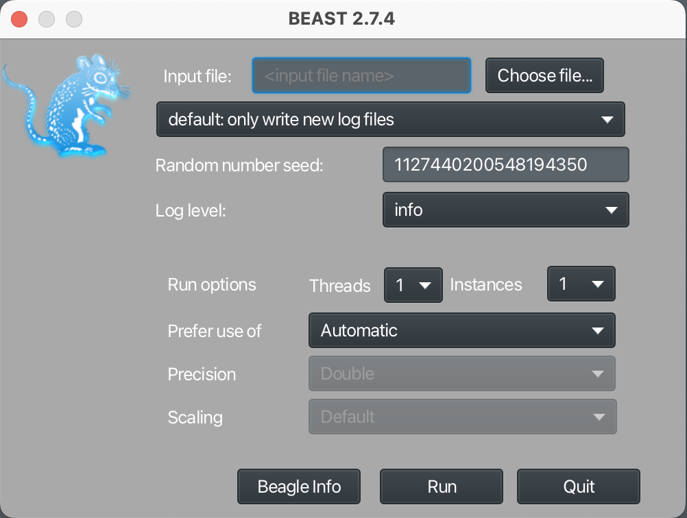

## Goals

What follows is our workflow for the StarBEAST2 [@ogilvie2017] analysis for Zosterops. In this analysis we will generate Zosterops species trees from our individual Sanger sequenced loci using Bayesian phylogenetic inference and the Markov chain Monte Carlo (MCMC) algorithm.

## Getting started

We are using BEAST v2.7.4 for the analysis [@bouckaert2019; @bouckaert2014; @drummond2012; @drummond2007]. Quarto version 1.6.39 for Mac OS was used to document the workflow.

## General methods summary

A multilocus species tree was generated from the combined mtDNA and nuDNA Sanger sequencing data using *StarBEAST2* [@ogilvie2017] implemented in *BEAUTi2/BEAST2* v2.7.4 [@drummond2012; @bouckaert2014]. We used *bModelTest* in *StarBEAST2* to select the substitution model for each partition/locus [@bouckaert2017]. A strict molecular clock approach was used for each locus. Priors for substitution rates were estimated based on lognormal distributions. The prior distribution for ND2 and COI was based on a mean of 0.0105 substitutions/site/lineage/Ma and a standard deviation of 1 (5–95% quantile range of 0.00123 - 0.033 and a median clock rate of 0.00637). This range is consistent with mtDNA substitution rates reported in birds [@fleischer1998; @pereira2006; @weir2008; @eo2010]. For the intron loci we based our prior substitution rate distributions on a mean 1/10th that of the ND2 and COI rates or 0.00105 substitutions/site/lineage/Ma and a standard deviation of 1 (5–95% quantile range is 0.000123 - 0.0033 and the median clock rate is 0.000637). We justified the substitution prior distribution for the nuclear loci on the basis of previous estimations of nuclear substitution rates in vertebrates relative to those of mtDNA [@johnson2000; @johnson2000a; @prychitko2000; @armstrong2001]. Three analyses in *StarBEAST2*, labeled A, B, and C, were conducted with these parameters. The taxon set for the A and B runs included information on taxon (species and subspecies) and geography. The A runs included partitions for all eight loci and the B runs include only the mtDNA loci. Another set of runs (C runs) incorporated all partitions (mtDNA and nuDNA) but was based on only taxonomic assignments (genus, species, subspecies) for each sample and no additional geographic information. 20 independent runs were conducted for each analysis with 10M length Markov chain Monte Carlo (MCMC) chains, 1M burnin lengths, and results stored every 20,000 iterations for each individual run. Log and tree files were combined across these 20 runs using *LogCombiner* and a maximum clade credibility consensus tree was generated using *TreeAnnotator* for each of the three analyses (both *LogCombiner* and *TreeAnnotator* are included in the *BEAUTi2/BEAST2* v2.7.4 package). 

## Data files

This analysis requires the mitochondrial DNA (mtDNA) alignments and the phased nuclear coding DNA (nuDNA) alignments from the Sanger sequenced loci. The protocol for phasing the nuDNA alignments may be found in the **Sanger sequencing summary statistics and trees** section. In addition a taxon set file will be required to assign individual samples to their taxon and/or population of origin.

Subsequent analysis requires the following `fasta` files including the mtDNA alignments and the phased nuDNA alignments from the procedure described in the **Sanger sequencing summary statistics and trees** section.

- `COI.fasta`

- `ND2.fasta`

- `B3GNT9_phased.fasta`

- `BIRC2_phased.fasta`

- `CCDC_phased.fasta`

- `GPRC6_phased.fasta`

- `LACTBL_phased.fasta`

- `USP38_phased.fasta`

Below are the taxon set files required for these analyses.

- `Zosterops taxon sets A.txt`

- `Zosterops taxon sets B.txt`

## Software and packages

BEAST2 software is available [here](https://www.beast2.org/). This analysis was conducted on a prior version of BEAST2 (v2.7.4 available [here](https://github.com/CompEvol/beast2/releases)) but nearly identical results were achieved using the most recent version of BEAST2 (v2.7.7 as of the writing of this protocol). BEAUTi2 is the tool available with BEAST2 that allows for package management and a graphical user interface (GUI) to generate the `xml` files needed to run analyses. The programs LogCombiner and TreeAnnotator are also included with the BEAST2 install and will be needed to process the results of the MCMC runs. In addition, the program [Tracer](https://beast.community/tracer) will be required to assess the results of an MCMC run and [FigTree](https://beast.community/figtree) to edit and visualize species trees produced by BEAST2. Below is a summary of the needed software for this analysis and links to downloads.

- [BEAST2 v2.7.4](https://github.com/CompEvol/beast2/releases) [@bouckaert2019] This install will include BEAST2, BEAUTi2, LogCombiner, and TreeAnnotator.

- [Tracer](https://beast.community/tracer) [@rambaut2018]

- [FigTree](https://beast.community/figtree)

In addition the following packages will need to be installed from the BEAUTi2 GUI using the package manager. To install packages in BEAUTi2 select **File** from the top bar and **Manage Packages** from the drop down menu. The package manager will display a table of installed packages and their latest versions. To install select the desired package and click on the **Install/Upgrade** button. After installing or upgrading packages you will have to close BEAUTi2 and restart before proceeding. Install the following packages.

- [bModelTest](https://github.com/BEAST2-Dev/bModelTest) [@bouckaert2017]

- [StarBEAST2](https://github.com/genomescale/starbeast2) [@ogilvie2017]

## Generating the xml file

After installing the needed packages restart BEAUTi2. From the **File** menu select **Template** and then **StarBeast2**. The StarBEAST2 template should display nine tabs titled as follows; **Partitions**, **Taxon Sets**, **Tip Dates**, **Gene Ploidy**, **Population Model**, **Site Model**, **Clock Model**, **Priors**, and **MCMC**.

### Partitions

Sequence alignments will be added to the `xml` file in the **Partitions** tab. This can be done by either clicking the **+** button at the bottom of the tab and selecting **Import Alignment** from the subsequent menu options or by simply dragging the `fasta` file for each alignment into the **Partitions** tab. After specifying that an alignment is being imported select **nucleotide** when asked by BEAUTi2 to "Choose the datatype". For each locus the correct number of taxa, sites, and data type should be listed. For each the file name will be used as the name BEAST2 uses for that particular locus. Also each locus should have a **Site Model**, **Clock Model**, and **Tree** unique to that alignment and with the same name. The **Partition** tab should look like this when completed.

{fig-align="center" width="630"}

### Taxon sets

For the mtDNA alignments each individual sample has only a single sequence while there are two sequences for the diploid nuDNA alignments. The two phased sequences for each diploid individual sample should be labeled *a* and *b* (i.e. ZJja004a and ZJja004b are the two phased sequences for sample ZJja004). The *a* and *b* suffixes were automatically added to sample names for the phased sequences in PHASE 2.1.1 (see **Sanger sequencing summary statistics and trees**). For consistency an *a* suffix was manually added to the sample name for each sequence in the mtDNA alignments to prevent a third sample name from appearing for each sample with both mtDNA and nuDNA sequences in the **Taxon sets** tab.

Some project numbers do not necessarily reflect the taxonomic origin of the individual samples. For example, samples ZJlo001 - ZJlo005 appear based on their project number designations to be *Zosterops japonicus loochoensis* but these project numbers were assigned in error before realizing they originated on the island of Chichijima outside the range of *Z. japonicus loochoensis*. For the Ogasawara Islands the subspecies designation for *Z. japonicus* is uncertain with some suspicion that these birds are subspecies hybrids between *Z. japonicus stejnegeri* in the Izu Islands and *Z. japonicus alani* in the Ogasawara/Volcano Islands. For our purposes we assigned birds in the Ogasawara and Volcano Islands the taxonomic designation *Z. japonicus alani* and birds in the Izu Islands *Z. japonicus stejnegeri* with the realization that gene flow may be occurring throughout these oceanic islands.

Click the **Taxon sets** tab. A list of sample names corresponding to the sequences in the alignments should appear in the **Taxon** column. For each sample a designation could be manually entered into the **Species/Population** column (time consuming) or automatically filled from a taxon sets file. To automatically add information on taxon assignment and/or population of origin click the **Guess** button at the bottom of the tab. Another window will open. Select the radio button corresponding to the **read from file** and the corresponding **Browse** button to select the appropriate taxon sets file. Click the **Show options** button and select **txt** to allow for the selection of `txt` files as taxon set entries. For the first set of BEAST2 runs samples were grouped by taxon (species and subspecies) and geography (island or island group) according to the `Zosterops taxon sets A.txt` file. This file is tab delimited and contains no headers and two columns with the identifying string for each individual sequence and the associated taxon and locality data as follows.

```         
ZAsu001a    Zosterops atrifrons surdus
ZAsu001b    Zosterops atrifrons surdus
ZAsu002a    Zosterops atrifrons surdus
ZAsu002b    Zosterops atrifrons surdus
ZEba001a    Zosterops everetti basilanicus
ZEba001b    Zosterops everetti basilanicus
ZEba002a    Zosterops everetti basilanicus
ZEba002b    Zosterops everetti basilanicus
ZEba003a    Zosterops everetti basilanicus
ZEba003b    Zosterops everetti basilanicus
ZEbo001a    Zosterops everetti boholensis
ZEbo001b    Zosterops everetti boholensis
ZERxx001a   Zosterops erythropleurus
ZERxx002a   Zosterops erythropleurus
ZERxx002b   Zosterops erythropleurus
ZERxx003a   Zosterops erythropleurus
ZERxx003b   Zosterops erythropleurus
ZERxx004a   Zosterops erythropleurus
ZERxx004b   Zosterops erythropleurus
ZERxx005a   Zosterops erythropleurus
ZERxx005b   Zosterops erythropleurus
ZJal001a    Zosterops japonicus alani HAHAJIMA
ZJal001b    Zosterops japonicus alani HAHAJIMA
ZJal002a    Zosterops japonicus alani HAHAJIMA
ZJal003a    Zosterops japonicus alani HAHAJIMA
ZJal004a    Zosterops japonicus alani HAHAJIMA
ZJal005a    Zosterops japonicus alani HAHAJIMA
ZJal006a    Zosterops japonicus alani IMOTOJIMA
ZJal006b    Zosterops japonicus alani IMOTOJIMA
ZJal007a    Zosterops japonicus alani IMOTOJIMA
ZJal008a    Zosterops japonicus alani IMOTOJIMA
ZJal009a    Zosterops japonicus alani IMOTOJIMA
ZJal010a    Zosterops japonicus alani ANEJIMA
ZJal010b    Zosterops japonicus alani ANEJIMA
ZJal011a    Zosterops japonicus alani ANEJIMA
ZJal012a    Zosterops japonicus alani ANEJIMA
ZJal013a    Zosterops japonicus alani ANEJIMA
ZJal014a    Zosterops japonicus alani ANEJIMA
ZJal015a    Zosterops japonicus alani IMOTOJIMA
ZJal016a    Zosterops japonicus alani IWOJIMA
ZJal016b    Zosterops japonicus alani IWOJIMA
ZJba001a    Zosterops meyeni LANYU
ZJba002a    Zosterops meyeni LANYU
ZJin001a    Zosterops japonicus insularis OSUMI
ZJin001b    Zosterops japonicus insularis OSUMI
ZJin003a    Zosterops japonicus insularis OSUMI
ZJin003b    Zosterops japonicus insularis OSUMI
ZJja001a    Zosterops japonicus japonicus GEOJE
ZJja001b    Zosterops japonicus japonicus GEOJE
ZJja002a    Zosterops japonicus japonicus GEOJE
ZJja003a    Zosterops japonicus japonicus JEJU
ZJja003b    Zosterops japonicus japonicus JEJU
ZJja004a    Zosterops japonicus japonicus JEJU
ZJja004b    Zosterops japonicus japonicus JEJU
ZJja005a    Zosterops japonicus japonicus JEJU
ZJja006a    Zosterops japonicus japonicus JEJU
ZJja007a    Zosterops japonicus japonicus JEJU
ZJja008a    Zosterops japonicus japonicus HONSHU
ZJja009a    Zosterops japonicus japonicus HEUKSANDO
ZJja010a    Zosterops japonicus japonicus HEUKSANDO
ZJja011a    Zosterops japonicus japonicus HEUKSANDO
ZJja012a    Zosterops japonicus japonicus HONSHU
ZJja012b    Zosterops japonicus japonicus HONSHU
ZJja013a    Zosterops japonicus japonicus HONSHU
ZJja014a    Zosterops japonicus japonicus HONSHU
ZJja014b    Zosterops japonicus japonicus HONSHU
ZJja015a    Zosterops japonicus japonicus HONSHU
ZJja015b    Zosterops japonicus japonicus HONSHU
ZJja016a    Zosterops japonicus japonicus SHIKOKU
ZJja016b    Zosterops japonicus japonicus SHIKOKU
ZJja017a    Zosterops japonicus japonicus HONSHU
ZJja017b    Zosterops japonicus japonicus HONSHU
ZJja018a    Zosterops japonicus japonicus HOKKAIDO
ZJja018b    Zosterops japonicus japonicus HOKKAIDO
ZJja019a    Zosterops japonicus japonicus HONSHU
ZJja019b    Zosterops japonicus japonicus HONSHU
ZJja021a    Zosterops japonicus japonicus HONSHU
ZJja022a    Zosterops japonicus japonicus HONSHU
ZJja022b    Zosterops japonicus japonicus HONSHU
ZJja024a    Zosterops japonicus japonicus HONSHU
ZJja024b    Zosterops japonicus japonicus HONSHU
ZJja026a    Zosterops japonicus japonicus HONSHU
ZJja031a    Zosterops japonicus japonicus HONSHU
ZJja032a    Zosterops japonicus japonicus HONSHU
ZJja034a    Zosterops japonicus japonicus TSUSHIMA
ZJja034b    Zosterops japonicus japonicus TSUSHIMA
ZJja035a    Zosterops japonicus japonicus TSUSHIMA
ZJlo001a    Zosterops japonicus alani CHICHIJIMA
ZJlo001b    Zosterops japonicus alani CHICHIJIMA
ZJlo002a    Zosterops japonicus alani CHICHIJIMA
ZJlo003a    Zosterops japonicus alani CHICHIJIMA
ZJlo004a    Zosterops japonicus alani CHICHIJIMA
ZJlo005a    Zosterops japonicus alani CHICHIJIMA
ZJlo006a    Zosterops japonicus loochoensis IRIOMOTE
ZJlo006b    Zosterops japonicus loochoensis IRIOMOTE
ZJlo007a    Zosterops japonicus loochoensis OKINAWA
ZJlo007b    Zosterops japonicus loochoensis OKINAWA
ZJlo008a    Zosterops japonicus loochoensis OKINAWA
ZJlo009a    Zosterops japonicus loochoensis OKINAWA
ZJlo010a    Zosterops japonicus loochoensis ISHIGAKI
ZJlo010b    Zosterops japonicus loochoensis ISHIGAKI
ZJlo011a    Zosterops japonicus loochoensis ISHIGAKI
ZJlo012a    Zosterops japonicus loochoensis KIKAI
ZJlo012b    Zosterops japonicus loochoensis KIKAI
ZJlo013a    Zosterops japonicus loochoensis KIKAI
ZJlo014a    Zosterops japonicus loochoensis IRIOMOTE
ZJlo014b    Zosterops japonicus loochoensis IRIOMOTE
ZJlo015a    Zosterops japonicus loochoensis AMAMI
ZJlo015b    Zosterops japonicus loochoensis AMAMI
ZJlo016a    Zosterops japonicus loochoensis MIYAKO
ZJlo016b    Zosterops japonicus loochoensis MIYAKO
ZJlo017a    Zosterops japonicus loochoensis IRIOMOTE
ZJlo018a    Zosterops japonicus loochoensis IRIOMOTE
ZJlo020a    Zosterops japonicus loochoensis IRIOMOTE
ZJlo021a    Zosterops japonicus loochoensis TOKUNO
ZJlo021b    Zosterops japonicus loochoensis TOKUNO
ZJlo022a    Zosterops japonicus loochoensis TOKUNO
ZJlo023a    Zosterops japonicus loochoensis OKINOERABU
ZJlo023b    Zosterops japonicus loochoensis OKINOERABU
ZJlo024a    Zosterops japonicus loochoensis YONAGUNI
ZJlo024b    Zosterops japonicus loochoensis YONAGUNI
ZJlo026a    Zosterops japonicus loochoensis MIYAKO
ZJlo027a    Zosterops japonicus loochoensis YONAGUNI
ZJlo031a    Zosterops japonicus loochoensis KUME
ZJlo031b    Zosterops japonicus loochoensis KUME
ZJlo032a    Zosterops japonicus loochoensis KUME
ZJlo034a    Zosterops japonicus loochoensis MIYAKO
ZJlo035a    Zosterops japonicus loochoensis OKINAWA
ZJlo035b    Zosterops japonicus loochoensis OKINAWA
ZJlo038a    Zosterops japonicus loochoensis OKINAWA
ZJlo039a    Zosterops japonicus loochoensis ISHIGAKI
ZJlo042a    Zosterops japonicus loochoensis AMAMI
ZJlo042b    Zosterops japonicus loochoensis AMAMI
ZJlo045a    Zosterops japonicus loochoensis AMAMI
ZJlo051a    Zosterops japonicus loochoensis OKINOERABU
ZJlo055a    Zosterops japonicus loochoensis KIKAI
ZJlo055b    Zosterops japonicus loochoensis KIKAI
ZJsi001a    Zosterops simplex TAIWAN
ZJsi001b    Zosterops simplex TAIWAN
ZJsi002a    Zosterops simplex TAIWAN
ZJsi002b    Zosterops simplex TAIWAN
ZJsi003a    Zosterops simplex TAIWAN
ZJsi003b    Zosterops simplex TAIWAN
ZJsi005a    Zosterops simplex TAIWAN
ZJsi005b    Zosterops simplex TAIWAN
ZJsi015a    Zosterops simplex MACAO
ZJsi015b    Zosterops simplex MACAO
ZJsi017a    Zosterops simplex GUANGXI
ZJsi017b    Zosterops simplex GUANGXI
ZJsi018a    Zosterops simplex SICHUAN
ZJsi018b    Zosterops simplex SICHUAN
ZJsi023a    Zosterops simplex GUANGDONG
ZJsi024a    Zosterops simplex GUANGDONG
ZJsi025a    Zosterops simplex GUANGDONG
ZJsi026a    Zosterops simplex YUNNAN
ZJsi026b    Zosterops simplex YUNNAN
ZJsi027a    Zosterops simplex GUANGXI
ZJsi027b    Zosterops simplex GUANGXI
ZJsi028a    Zosterops simplex GUANGXI
ZJsi032a    Zosterops simplex GUANGXI
ZJsi032b    Zosterops simplex GUANGXI
ZJst001a    Zosterops japonicus stejnegeri NIIJIMA
ZJst001b    Zosterops japonicus stejnegeri NIIJIMA
ZJst002a    Zosterops japonicus stejnegeri AOGASHIMA
ZJst002b    Zosterops japonicus stejnegeri AOGASHIMA
ZJst006a    Zosterops japonicus stejnegeri AOGASHIMA
ZJst007a    Zosterops japonicus stejnegeri KOZUSHIMA
ZJst007b    Zosterops japonicus stejnegeri KOZUSHIMA
ZJst008a    Zosterops japonicus stejnegeri KOZUSHIMA
ZJst010a    Zosterops japonicus stejnegeri KOZUSHIMA
ZJst011a    Zosterops japonicus stejnegeri KOZUSHIMA
ZJst012a    Zosterops japonicus stejnegeri MIYAKE
ZJst012b    Zosterops japonicus stejnegeri MIYAKE
ZJst013a    Zosterops japonicus stejnegeri MIYAKE
ZJst014a    Zosterops japonicus stejnegeri MIYAKE
ZJst015a    Zosterops japonicus stejnegeri MIYAKE
ZJst016a    Zosterops japonicus stejnegeri MIYAKE
ZJst017a    Zosterops japonicus stejnegeri NIIJIMA
ZMOdi001a   Zosterops montanus diuatae MINDANAO
ZMOdi001b   Zosterops montanus diuatae MINDANAO
ZMOha001a   Zosterops montanus halconensis MINDORO
ZMOha001b   Zosterops montanus halconensis MINDORO
ZMOmo001a   Zosterops montanus montanus SULAWESI
ZMOmo001b   Zosterops montanus montanus SULAWESI
ZMOmo002a   Zosterops montanus montanus JAVA
ZMOmo002b   Zosterops montanus montanus JAVA
ZMOmo003a   Zosterops montanus montanus JAVA
ZMOmo003b   Zosterops montanus montanus JAVA
ZMOmo004a   Zosterops montanus montanus JAVA
ZMOmo004b   Zosterops montanus montanus JAVA
ZMOpa001a   Zosterops montanus parkesi PALAWAN
ZMOpa001b   Zosterops montanus parkesi PALAWAN
ZMOpa002a   Zosterops montanus parkesi PALAWAN
ZMOpa002b   Zosterops montanus parkesi PALAWAN
ZMOpe001a   Zosterops montanus pectoralis NEGROS
ZMOpe001b   Zosterops montanus pectoralis NEGROS
ZMOpe002a   Zosterops montanus pectoralis NEGROS
ZMOpe002b   Zosterops montanus pectoralis NEGROS
ZMOpe003a   Zosterops montanus pectoralis NEGROS
ZMOpe003b   Zosterops montanus pectoralis NEGROS
ZMOvu001a   Zosterops montanus vulcani MINDANAO
ZMOvu001b   Zosterops montanus vulcani MINDANAO
ZMOvu002a   Zosterops montanus vulcani MINDANAO
ZMOvu002b   Zosterops montanus vulcani MINDANAO
ZMOvu003a   Zosterops montanus vulcani MINDANAO
ZMOvu003b   Zosterops montanus vulcani MINDANAO
ZMOvu004a   Zosterops montanus vulcani MINDANAO
ZMOvu004b   Zosterops montanus vulcani MINDANAO
ZMOvu005a   Zosterops montanus vulcani MINDANAO
ZMOvu006a   Zosterops montanus vulcani MINDANAO
ZMOvu006b   Zosterops montanus vulcani MINDANAO
ZMOvu007a   Zosterops montanus vulcani MINDANAO
ZMOwh002a   Zosterops montanus whiteheadi LUZON
ZMOwh002b   Zosterops montanus whiteheadi LUZON
ZMOwh003a   Zosterops montanus whiteheadi LUZON
ZMOwh003b   Zosterops montanus whiteheadi LUZON
ZMOwh004a   Zosterops montanus whiteheadi LUZON
ZMOwh004b   Zosterops montanus whiteheadi LUZON
ZMOwh005a   Zosterops montanus whiteheadi LUZON
ZMOwh005b   Zosterops montanus whiteheadi LUZON
ZMOwh006a   Zosterops montanus whiteheadi LUZON
ZMOwh006b   Zosterops montanus whiteheadi LUZON
ZMOxx001a   Zosterops montanus PANAY
ZMOxx002a   Zosterops montanus PANAY
ZMOxx002b   Zosterops montanus PANAY
ZMOxx003a   Zosterops montanus PANAY
ZMOxx003b   Zosterops montanus PANAY
ZMOxx004a   Zosterops montanus PANAY
ZMOxx004b   Zosterops montanus PANAY
ZMOxx005a   Zosterops montanus PANAY
ZMOxx005b   Zosterops montanus PANAY
ZMOxx006a   Zosterops montanus PANAY
ZMOxx006b   Zosterops montanus PANAY
ZMOxx007a   Zosterops montanus PANAY
ZMOxx007b   Zosterops montanus PANAY
ZMOxx008a   Zosterops montanus PANAY
ZMOxx008b   Zosterops montanus PANAY
ZMxx001a    Zosterops meyeni BATANES
ZMxx001b    Zosterops meyeni BATANES
ZMxx002a    Zosterops meyeni BATANES
ZMxx002b    Zosterops meyeni BATANES
ZMxx003a    Zosterops meyeni LANYU
ZMxx003b    Zosterops meyeni LANYU
ZMxx004a    Zosterops meyeni LANYU
ZMxx004b    Zosterops meyeni LANYU
ZMxx005a    Zosterops meyeni LANYU
ZMxx005b    Zosterops meyeni LANYU
ZMxx006a    Zosterops meyeni LANYU
ZMxx007a    Zosterops meyeni LANYU
ZMxx008a    Zosterops meyeni LANYU
ZNca001a    Zosterops nigrorum catamanensis CAMIGUINSUR
ZNca001b    Zosterops nigrorum catamanensis CAMIGUINSUR
ZNin001a    Zosterops nigrorum innominatus LUZON
ZNin001b    Zosterops nigrorum innominatus LUZON
ZNlu001a    Zosterops nigrorum luzonicus LUZON
ZNlu001b    Zosterops nigrorum luzonicus LUZON
ZNme001a    Zosterops nigrorum meyleri CAMIGUINNORTE
ZNme001b    Zosterops nigrorum meyleri CAMIGUINNORTE
ZNni001a    Zosterops nigrorum nigrorum PANAY
ZNni001b    Zosterops nigrorum nigrorum PANAY
ZPxx001a    Zosterops simplex SINGAPORE
ZPxx001b    Zosterops simplex SINGAPORE
ZPxx002a    Zosterops simplex SINGAPORE
ZPxx002b    Zosterops simplex SINGAPORE
```

The file `Zosterops taxon sets B.txt` contains the same list of individual samples as the `Zosterops taxon sets A.txt` file but with samples collapsed according to taxon. There is no locality information in this file except for the samples of *Z. montanus* collected on the island of Panay. This file appears as follows.

```         
ZAsu001a    Zosterops atrifrons surdus
ZAsu001b    Zosterops atrifrons surdus
ZAsu002a    Zosterops atrifrons surdus
ZAsu002b    Zosterops atrifrons surdus
ZEba001a    Zosterops everetti basilanicus
ZEba001b    Zosterops everetti basilanicus
ZEba002a    Zosterops everetti basilanicus
ZEba002b    Zosterops everetti basilanicus
ZEba003a    Zosterops everetti basilanicus
ZEba003b    Zosterops everetti basilanicus
ZEbo001a    Zosterops everetti boholensis
ZEbo001b    Zosterops everetti boholensis
ZERxx001a   Zosterops erythropleurus
ZERxx002a   Zosterops erythropleurus
ZERxx002b   Zosterops erythropleurus
ZERxx003a   Zosterops erythropleurus
ZERxx003b   Zosterops erythropleurus
ZERxx004a   Zosterops erythropleurus
ZERxx004b   Zosterops erythropleurus
ZERxx005a   Zosterops erythropleurus
ZERxx005b   Zosterops erythropleurus
ZJal001a    Zosterops japonicus alani
ZJal001b    Zosterops japonicus alani
ZJal002a    Zosterops japonicus alani
ZJal003a    Zosterops japonicus alani
ZJal004a    Zosterops japonicus alani
ZJal005a    Zosterops japonicus alani
ZJal006a    Zosterops japonicus alani
ZJal006b    Zosterops japonicus alani
ZJal007a    Zosterops japonicus alani
ZJal008a    Zosterops japonicus alani
ZJal009a    Zosterops japonicus alani
ZJal010a    Zosterops japonicus alani
ZJal010b    Zosterops japonicus alani
ZJal011a    Zosterops japonicus alani
ZJal012a    Zosterops japonicus alani
ZJal013a    Zosterops japonicus alani
ZJal014a    Zosterops japonicus alani
ZJal015a    Zosterops japonicus alani
ZJal016a    Zosterops japonicus alani
ZJal016b    Zosterops japonicus alani
ZJba001a    Zosterops meyeni
ZJba002a    Zosterops meyeni
ZJin001a    Zosterops japonicus insularis
ZJin001b    Zosterops japonicus insularis
ZJin003a    Zosterops japonicus insularis
ZJin003b    Zosterops japonicus insularis
ZJja001a    Zosterops japonicus japonicus
ZJja001b    Zosterops japonicus japonicus
ZJja002a    Zosterops japonicus japonicus
ZJja003a    Zosterops japonicus japonicus
ZJja003b    Zosterops japonicus japonicus
ZJja004a    Zosterops japonicus japonicus
ZJja004b    Zosterops japonicus japonicus
ZJja005a    Zosterops japonicus japonicus
ZJja006a    Zosterops japonicus japonicus
ZJja007a    Zosterops japonicus japonicus
ZJja008a    Zosterops japonicus japonicus
ZJja009a    Zosterops japonicus japonicus
ZJja010a    Zosterops japonicus japonicus
ZJja011a    Zosterops japonicus japonicus
ZJja012a    Zosterops japonicus japonicus
ZJja012b    Zosterops japonicus japonicus
ZJja013a    Zosterops japonicus japonicus
ZJja014a    Zosterops japonicus japonicus
ZJja014b    Zosterops japonicus japonicus
ZJja015a    Zosterops japonicus japonicus
ZJja015b    Zosterops japonicus japonicus
ZJja016a    Zosterops japonicus japonicus
ZJja016b    Zosterops japonicus japonicus
ZJja017a    Zosterops japonicus japonicus
ZJja017b    Zosterops japonicus japonicus
ZJja018a    Zosterops japonicus japonicus
ZJja018b    Zosterops japonicus japonicus
ZJja019a    Zosterops japonicus japonicus
ZJja019b    Zosterops japonicus japonicus
ZJja021a    Zosterops japonicus japonicus
ZJja022a    Zosterops japonicus japonicus
ZJja022b    Zosterops japonicus japonicus
ZJja024a    Zosterops japonicus japonicus
ZJja024b    Zosterops japonicus japonicus
ZJja026a    Zosterops japonicus japonicus
ZJja031a    Zosterops japonicus japonicus
ZJja032a    Zosterops japonicus japonicus
ZJja034a    Zosterops japonicus japonicus
ZJja034b    Zosterops japonicus japonicus
ZJja035a    Zosterops japonicus japonicus
ZJlo001a    Zosterops japonicus alani
ZJlo001b    Zosterops japonicus alani
ZJlo002a    Zosterops japonicus alani
ZJlo003a    Zosterops japonicus alani
ZJlo004a    Zosterops japonicus alani
ZJlo005a    Zosterops japonicus alani
ZJlo006a    Zosterops japonicus loochoensis
ZJlo006b    Zosterops japonicus loochoensis
ZJlo007a    Zosterops japonicus loochoensis
ZJlo007b    Zosterops japonicus loochoensis
ZJlo008a    Zosterops japonicus loochoensis
ZJlo009a    Zosterops japonicus loochoensis
ZJlo010a    Zosterops japonicus loochoensis
ZJlo010b    Zosterops japonicus loochoensis
ZJlo011a    Zosterops japonicus loochoensis
ZJlo012a    Zosterops japonicus loochoensis
ZJlo012b    Zosterops japonicus loochoensis
ZJlo013a    Zosterops japonicus loochoensis
ZJlo014a    Zosterops japonicus loochoensis
ZJlo014b    Zosterops japonicus loochoensis
ZJlo015a    Zosterops japonicus loochoensis
ZJlo015b    Zosterops japonicus loochoensis
ZJlo016a    Zosterops japonicus loochoensis
ZJlo016b    Zosterops japonicus loochoensis
ZJlo017a    Zosterops japonicus loochoensis
ZJlo018a    Zosterops japonicus loochoensis
ZJlo020a    Zosterops japonicus loochoensis
ZJlo021a    Zosterops japonicus loochoensis
ZJlo021b    Zosterops japonicus loochoensis
ZJlo022a    Zosterops japonicus loochoensis
ZJlo023a    Zosterops japonicus loochoensis
ZJlo023b    Zosterops japonicus loochoensis
ZJlo024a    Zosterops japonicus loochoensis
ZJlo024b    Zosterops japonicus loochoensis
ZJlo026a    Zosterops japonicus loochoensis
ZJlo027a    Zosterops japonicus loochoensis
ZJlo031a    Zosterops japonicus loochoensis
ZJlo031b    Zosterops japonicus loochoensis
ZJlo032a    Zosterops japonicus loochoensis
ZJlo034a    Zosterops japonicus loochoensis
ZJlo035a    Zosterops japonicus loochoensis
ZJlo035b    Zosterops japonicus loochoensis
ZJlo038a    Zosterops japonicus loochoensis
ZJlo039a    Zosterops japonicus loochoensis
ZJlo042a    Zosterops japonicus loochoensis
ZJlo042b    Zosterops japonicus loochoensis
ZJlo045a    Zosterops japonicus loochoensis
ZJlo051a    Zosterops japonicus loochoensis
ZJlo055a    Zosterops japonicus loochoensis
ZJlo055b    Zosterops japonicus loochoensis
ZJsi001a    Zosterops simplex
ZJsi001b    Zosterops simplex
ZJsi002a    Zosterops simplex
ZJsi002b    Zosterops simplex
ZJsi003a    Zosterops simplex
ZJsi003b    Zosterops simplex
ZJsi005a    Zosterops simplex
ZJsi005b    Zosterops simplex
ZJsi015a    Zosterops simplex
ZJsi015b    Zosterops simplex
ZJsi017a    Zosterops simplex
ZJsi017b    Zosterops simplex
ZJsi018a    Zosterops simplex
ZJsi018b    Zosterops simplex
ZJsi023a    Zosterops simplex
ZJsi024a    Zosterops simplex
ZJsi025a    Zosterops simplex
ZJsi026a    Zosterops simplex
ZJsi026b    Zosterops simplex
ZJsi027a    Zosterops simplex
ZJsi027b    Zosterops simplex
ZJsi028a    Zosterops simplex
ZJsi032a    Zosterops simplex
ZJsi032b    Zosterops simplex
ZJst001a    Zosterops japonicus stejnegeri
ZJst001b    Zosterops japonicus stejnegeri
ZJst002a    Zosterops japonicus stejnegeri
ZJst002b    Zosterops japonicus stejnegeri
ZJst006a    Zosterops japonicus stejnegeri
ZJst007a    Zosterops japonicus stejnegeri
ZJst007b    Zosterops japonicus stejnegeri
ZJst008a    Zosterops japonicus stejnegeri
ZJst010a    Zosterops japonicus stejnegeri
ZJst011a    Zosterops japonicus stejnegeri
ZJst012a    Zosterops japonicus stejnegeri
ZJst012b    Zosterops japonicus stejnegeri
ZJst013a    Zosterops japonicus stejnegeri
ZJst014a    Zosterops japonicus stejnegeri
ZJst015a    Zosterops japonicus stejnegeri
ZJst016a    Zosterops japonicus stejnegeri
ZJst017a    Zosterops japonicus stejnegeri
ZMOdi001a   Zosterops montanus diuatae
ZMOdi001b   Zosterops montanus diuatae
ZMOha001a   Zosterops montanus halconensis
ZMOha001b   Zosterops montanus halconensis
ZMOmo001a   Zosterops montanus montanus
ZMOmo001b   Zosterops montanus montanus
ZMOmo002a   Zosterops montanus montanus
ZMOmo002b   Zosterops montanus montanus
ZMOmo003a   Zosterops montanus montanus
ZMOmo003b   Zosterops montanus montanus
ZMOmo004a   Zosterops montanus montanus
ZMOmo004b   Zosterops montanus montanus
ZMOpa001a   Zosterops montanus parkesi
ZMOpa001b   Zosterops montanus parkesi
ZMOpa002a   Zosterops montanus parkesi
ZMOpa002b   Zosterops montanus parkesi
ZMOpe001a   Zosterops montanus pectoralis
ZMOpe001b   Zosterops montanus pectoralis
ZMOpe002a   Zosterops montanus pectoralis
ZMOpe002b   Zosterops montanus pectoralis
ZMOpe003a   Zosterops montanus pectoralis
ZMOpe003b   Zosterops montanus pectoralis
ZMOvu001a   Zosterops montanus vulcani
ZMOvu001b   Zosterops montanus vulcani
ZMOvu002a   Zosterops montanus vulcani
ZMOvu002b   Zosterops montanus vulcani
ZMOvu003a   Zosterops montanus vulcani
ZMOvu003b   Zosterops montanus vulcani
ZMOvu004a   Zosterops montanus vulcani
ZMOvu004b   Zosterops montanus vulcani
ZMOvu005a   Zosterops montanus vulcani
ZMOvu006a   Zosterops montanus vulcani
ZMOvu006b   Zosterops montanus vulcani
ZMOvu007a   Zosterops montanus vulcani
ZMOwh002a   Zosterops montanus whiteheadi
ZMOwh002b   Zosterops montanus whiteheadi
ZMOwh003a   Zosterops montanus whiteheadi
ZMOwh003b   Zosterops montanus whiteheadi
ZMOwh004a   Zosterops montanus whiteheadi
ZMOwh004b   Zosterops montanus whiteheadi
ZMOwh005a   Zosterops montanus whiteheadi
ZMOwh005b   Zosterops montanus whiteheadi
ZMOwh006a   Zosterops montanus whiteheadi
ZMOwh006b   Zosterops montanus whiteheadi
ZMOxx001a   Zosterops montanus PANAY
ZMOxx002a   Zosterops montanus PANAY
ZMOxx002b   Zosterops montanus PANAY
ZMOxx003a   Zosterops montanus PANAY
ZMOxx003b   Zosterops montanus PANAY
ZMOxx004a   Zosterops montanus PANAY
ZMOxx004b   Zosterops montanus PANAY
ZMOxx005a   Zosterops montanus PANAY
ZMOxx005b   Zosterops montanus PANAY
ZMOxx006a   Zosterops montanus PANAY
ZMOxx006b   Zosterops montanus PANAY
ZMOxx007a   Zosterops montanus PANAY
ZMOxx007b   Zosterops montanus PANAY
ZMOxx008a   Zosterops montanus PANAY
ZMOxx008b   Zosterops montanus PANAY
ZMxx001a    Zosterops meyeni
ZMxx001b    Zosterops meyeni
ZMxx002a    Zosterops meyeni
ZMxx002b    Zosterops meyeni
ZMxx003a    Zosterops meyeni
ZMxx003b    Zosterops meyeni
ZMxx004a    Zosterops meyeni
ZMxx004b    Zosterops meyeni
ZMxx005a    Zosterops meyeni
ZMxx005b    Zosterops meyeni
ZMxx006a    Zosterops meyeni
ZMxx007a    Zosterops meyeni
ZMxx008a    Zosterops meyeni
ZNca001a    Zosterops nigrorum catamanensis
ZNca001b    Zosterops nigrorum catamanensis
ZNin001a    Zosterops nigrorum innominatus
ZNin001b    Zosterops nigrorum innominatus
ZNlu001a    Zosterops nigrorum luzonicus
ZNlu001b    Zosterops nigrorum luzonicus
ZNme001a    Zosterops nigrorum meyleri
ZNme001b    Zosterops nigrorum meyleri
ZNni001a    Zosterops nigrorum nigrorum
ZNni001b    Zosterops nigrorum nigrorum
ZPxx001a    Zosterops simplex SINGAPORE
ZPxx001b    Zosterops simplex SINGAPORE
ZPxx002a    Zosterops simplex SINGAPORE
ZPxx002b    Zosterops simplex SINGAPORE
```

`Zosterops taxon sets mtDNA.txt` is a third taxon sets file that is limited to samples from the mtDNA alignments (COI and ND2). This file includes both taxon and locality data but note that for each haploid mtDNA sample there are no identifiers with the *b* suffix.

```         
ZAsu001a    Zosterops atrifrons surdus
ZAsu002a    Zosterops atrifrons surdus
ZEba001a    Zosterops everetti basilanicus
ZEba002a    Zosterops everetti basilanicus
ZEba003a    Zosterops everetti basilanicus
ZEbo001a    Zosterops everetti boholensis
ZERxx001a   Zosterops erythropleurus
ZERxx002a   Zosterops erythropleurus
ZERxx003a   Zosterops erythropleurus
ZERxx004a   Zosterops erythropleurus
ZERxx005a   Zosterops erythropleurus
ZJal001a    Zosterops japonicus alani HAHAJIMA
ZJal002a    Zosterops japonicus alani HAHAJIMA
ZJal003a    Zosterops japonicus alani HAHAJIMA
ZJal004a    Zosterops japonicus alani HAHAJIMA
ZJal005a    Zosterops japonicus alani HAHAJIMA
ZJal006a    Zosterops japonicus alani IMOTOJIMA
ZJal007a    Zosterops japonicus alani IMOTOJIMA
ZJal008a    Zosterops japonicus alani IMOTOJIMA
ZJal009a    Zosterops japonicus alani IMOTOJIMA
ZJal010a    Zosterops japonicus alani ANEJIMA
ZJal011a    Zosterops japonicus alani ANEJIMA
ZJal012a    Zosterops japonicus alani ANEJIMA
ZJal013a    Zosterops japonicus alani ANEJIMA
ZJal014a    Zosterops japonicus alani ANEJIMA
ZJal015a    Zosterops japonicus alani IMOTOJIMA
ZJba001a    Zosterops meyeni LANYU
ZJba002a    Zosterops meyeni LANYU
ZJin001a    Zosterops japonicus insularis OSUMI
ZJin003a    Zosterops japonicus insularis OSUMI
ZJja002a    Zosterops japonicus japonicus GEOJE
ZJja004a    Zosterops japonicus japonicus JEJU
ZJja005a    Zosterops japonicus japonicus JEJU
ZJja006a    Zosterops japonicus japonicus JEJU
ZJja007a    Zosterops japonicus japonicus JEJU
ZJja008a    Zosterops japonicus japonicus HONSHU
ZJja009a    Zosterops japonicus japonicus HEUKSANDO
ZJja010a    Zosterops japonicus japonicus HEUKSANDO
ZJja011a    Zosterops japonicus japonicus HEUKSANDO
ZJja013a    Zosterops japonicus japonicus HONSHU
ZJja014a    Zosterops japonicus japonicus HONSHU
ZJja015a    Zosterops japonicus japonicus HONSHU
ZJja016a    Zosterops japonicus japonicus SHIKOKU
ZJja017a    Zosterops japonicus japonicus HONSHU
ZJja018a    Zosterops japonicus japonicus HOKKAIDO
ZJja019a    Zosterops japonicus japonicus HONSHU
ZJja021a    Zosterops japonicus japonicus HONSHU
ZJja022a    Zosterops japonicus japonicus HONSHU
ZJja026a    Zosterops japonicus japonicus HONSHU
ZJja031a    Zosterops japonicus japonicus HONSHU
ZJja032a    Zosterops japonicus japonicus HONSHU
ZJja034a    Zosterops japonicus japonicus TSUSHIMA
ZJja035a    Zosterops japonicus japonicus TSUSHIMA
ZJlo001a    Zosterops japonicus alani CHICHIJIMA
ZJlo002a    Zosterops japonicus alani CHICHIJIMA
ZJlo003a    Zosterops japonicus alani CHICHIJIMA
ZJlo004a    Zosterops japonicus alani CHICHIJIMA
ZJlo005a    Zosterops japonicus alani CHICHIJIMA
ZJlo007a    Zosterops japonicus loochoensis OKINAWA
ZJlo008a    Zosterops japonicus loochoensis OKINAWA
ZJlo009a    Zosterops japonicus loochoensis OKINAWA
ZJlo010a    Zosterops japonicus loochoensis ISHIGAKI
ZJlo011a    Zosterops japonicus loochoensis ISHIGAKI
ZJlo012a    Zosterops japonicus loochoensis KIKAI
ZJlo013a    Zosterops japonicus loochoensis KIKAI
ZJlo014a    Zosterops japonicus loochoensis IRIOMOTE
ZJlo015a    Zosterops japonicus loochoensis AMAMI
ZJlo016a    Zosterops japonicus loochoensis MIYAKO
ZJlo017a    Zosterops japonicus loochoensis IRIOMOTE
ZJlo018a    Zosterops japonicus loochoensis IRIOMOTE
ZJlo020a    Zosterops japonicus loochoensis IRIOMOTE
ZJlo021a    Zosterops japonicus loochoensis TOKUNO
ZJlo022a    Zosterops japonicus loochoensis TOKUNO
ZJlo023a    Zosterops japonicus loochoensis OKINOERABU
ZJlo024a    Zosterops japonicus loochoensis YONAGUNI
ZJlo026a    Zosterops japonicus loochoensis MIYAKO
ZJlo027a    Zosterops japonicus loochoensis YONAGUNI
ZJlo031a    Zosterops japonicus loochoensis KUME
ZJlo032a    Zosterops japonicus loochoensis KUME
ZJlo034a    Zosterops japonicus loochoensis MIYAKO
ZJlo038a    Zosterops japonicus loochoensis OKINAWA
ZJlo039a    Zosterops japonicus loochoensis ISHIGAKI
ZJlo042a    Zosterops japonicus loochoensis AMAMI
ZJlo045a    Zosterops japonicus loochoensis AMAMI
ZJlo051a    Zosterops japonicus loochoensis OKINOERABU
ZJsi017a    Zosterops simplex GUANGXI
ZJsi023a    Zosterops simplex GUANGDONG
ZJsi024a    Zosterops simplex GUANGDONG
ZJsi025a    Zosterops simplex GUANGDONG
ZJsi026a    Zosterops simplex YUNNAN
ZJsi027a    Zosterops simplex GUANGXI
ZJsi028a    Zosterops simplex GUANGXI
ZJst006a    Zosterops japonicus stejnegeri AOGASHIMA
ZJst007a    Zosterops japonicus stejnegeri KOZUSHIMA
ZJst008a    Zosterops japonicus stejnegeri KOZUSHIMA
ZJst010a    Zosterops japonicus stejnegeri KOZUSHIMA
ZJst011a    Zosterops japonicus stejnegeri KOZUSHIMA
ZJst012a    Zosterops japonicus stejnegeri MIYAKE
ZJst013a    Zosterops japonicus stejnegeri MIYAKE
ZJst014a    Zosterops japonicus stejnegeri MIYAKE
ZJst015a    Zosterops japonicus stejnegeri MIYAKE
ZJst016a    Zosterops japonicus stejnegeri MIYAKE
ZJst017a    Zosterops japonicus stejnegeri NIIJIMA
ZMOdi001a   Zosterops montanus diuatae MINDANAO
ZMOha001a   Zosterops montanus halconensis MINDORO
ZMOmo001a   Zosterops montanus montanus SULAWESI
ZMOmo002a   Zosterops montanus montanus JAVA
ZMOmo003a   Zosterops montanus montanus JAVA
ZMOmo004a   Zosterops montanus montanus JAVA
ZMOpa001a   Zosterops montanus parkesi PALAWAN
ZMOpa002a   Zosterops montanus parkesi PALAWAN
ZMOpe001a   Zosterops montanus pectoralis NEGROS
ZMOpe002a   Zosterops montanus pectoralis NEGROS
ZMOpe003a   Zosterops montanus pectoralis NEGROS
ZMOvu001a   Zosterops montanus vulcani MINDANAO
ZMOvu002a   Zosterops montanus vulcani MINDANAO
ZMOvu003a   Zosterops montanus vulcani MINDANAO
ZMOvu004a   Zosterops montanus vulcani MINDANAO
ZMOvu005a   Zosterops montanus vulcani MINDANAO
ZMOvu006a   Zosterops montanus vulcani MINDANAO
ZMOvu007a   Zosterops montanus vulcani MINDANAO
ZMOwh002a   Zosterops montanus whiteheadi LUZON
ZMOwh003a   Zosterops montanus whiteheadi LUZON
ZMOwh004a   Zosterops montanus whiteheadi LUZON
ZMOwh005a   Zosterops montanus whiteheadi LUZON
ZMOwh006a   Zosterops montanus whiteheadi LUZON
ZMOxx001a   Zosterops montanus PANAY
ZMOxx002a   Zosterops montanus PANAY
ZMOxx003a   Zosterops montanus PANAY
ZMOxx004a   Zosterops montanus PANAY
ZMOxx005a   Zosterops montanus PANAY
ZMOxx006a   Zosterops montanus PANAY
ZMOxx007a   Zosterops montanus PANAY
ZMOxx008a   Zosterops montanus PANAY
ZMxx001a    Zosterops meyeni BATANES
ZMxx002a    Zosterops meyeni BATANES
ZMxx003a    Zosterops meyeni LANYU
ZMxx004a    Zosterops meyeni LANYU
ZMxx005a    Zosterops meyeni LANYU
ZMxx006a    Zosterops meyeni LANYU
ZMxx007a    Zosterops meyeni LANYU
ZMxx008a    Zosterops meyeni LANYU
ZNca001a    Zosterops nigrorum catamanensis CAMIGUINSUR
ZNin001a    Zosterops nigrorum innominatus LUZON
ZNlu001a    Zosterops nigrorum luzonicus LUZON
ZNme001a    Zosterops nigrorum meyleri CAMIGUINNORTE
ZNni001a    Zosterops nigrorum nigrorum PANAY
ZPxx001a    Zosterops simplex SINGAPORE
ZPxx002a    Zosterops simplex SINGAPORE
```

Different sets of StarBEAST2 runs will employ different `xml` files each with a different taxon set. Below is what the **Taxon sets** tab should look like with `Zosterops taxon sets A.txt`. The first run will be with this taxon set specifying both taxon and geographic localities.

{fig-align="center" width="630"}

### Tip dates

The next tab in BEAUTi2 is the **Tip Dates** tab. The only selection in this tab is a check box associated with **Use tip dates**. Leave this box unchecked and proceed to the next tab.

{fig-align="center" width="630"}

### **Gene ploidy**

The ploidy for each locus is set on the next tab titled, appropriately, **Gene Ploidy**. A list of loci corresponding to those alignments imported into the **Partitions** tab should appear in the **Gene Ploidy** tab. Enter the ploidy for each locus in the corresponding box. nuDNA loci are diploid and biparentally inherited so for those loci enter a ploidy of 2.0. The mtDNA loci are uniparentally inherited and haploid. For the mtDNA loci enter 0.5 in the ploidy box. When completed this tab should appear as follows.

{fig-align="center" width="630"}

### Population Model

In the **Population Model** tab select **Analytical Population Size integration** from the drop-down menu.

{fig-align="center" width="630"}

### Site Model

Substitution models for each unlinked locus are set in the **Site Model** tab. For each locus use [bModelTest](https://github.com/BEAST2-Dev/bModelTest) to estimate the best substitution model. If the bModelTest package (see **Software and Packages** section above) was installed then this option should be available in BEAUTi2 in the drop-down at the top of the **Site Model** tab as the **BEAST Model Test** option. For each locus select **BEAST Model Test** from the drop-down and for **Mutation Rate** click the **estimate** box. Mutation rates among loci are estimated relative to one another so leave the **Mutation Rate** at 1.0 for each locus. Repeat this process for each locus.

{fig-align="center" width="630"}

### Clock Model

Next set the molecular clock model. Click on the **Clock Model** tab. For each locus added to the **Partition** tab there should be a corresponding entry listed in the **Clock Model** tab. For all loci select **Strict Clock** from the drop-down menu at the top of the tab. The substitution rate for mtDNA was based on a divergence rate of 2.1% per million years (Ma). This equates to a mean of 1.05% or 0.0105 substitutions/site/lineage/Ma. This range is consistent with mtDNA substitution rates reported in birds [@fleischer1998; @pereira2006; @weir2008; @eo2010]. For both the mtDNA loci (COI and ND2) enter 0.0105 in the **Clock.rate** box and click the **estimate** box. For the nuDNA loci enter 0.00105 in the **Clock.rate** boxes and check the **estimate** box.

{fig-align="center" width="630"}

### Priors

StarBEAST2 is a Bayesian method and as such it requires the user to set the priors for various parameters. For these analyses the default priors will be used for everything except for the clock rates. As we did for the **Clock Model** tab, clock rate priors will be based off of molecular clock rates estimated in the literature. Click on the **Priors** tab and scroll down to the **strictClockRate** values for each locus. Select the arrow symbol on the left to reveal the settings for the **strictClockRate** prior distribution for each locus. A **LogNormal** distribution from the drop down menu should be selected for all the **strictClockRate** priors. The box to the right should have the initial clock rate for each locus (same as defined in the **Clock Rate** tab) and show lower and upper bounds from 0.0 to infinity. Consistent with mtDNA substitution rates reported in birds [@fleischer1998; @pereira2006; @weir2008; @eo2010] the mean clock rate (**M**) for the mtDNA loci (COI and ND2) will be set at 0.0105 substitutions/site/lineage/Ma with a standard deviation (**S**) of 1.0. Make sure the **Mean in Real Space** box is checked to view the prior distribution. For the mtDNA loci **M** = 0.0105 and **S** = 1.0 and a log normal distribution results in a 5 - 95% quantile range of 0.00123 - 0.033 and a median clock rate of 0.00637. The same conditions should be set for each nuDNA locus prior except that the mean (**M**) should be set at 1/10th the clock rate of the mtDNA loci (**M** = 0.00105). For the nuDNA loci the 5 - 95% quantile range is 0.000123 - 0.0033 and the median clock rate is 0.000637.

{fig-align="center" width="630"}

### MCMC

The final tab (**MCMC**) sets the parameters for the run. Enter 10 million (10000000) in the **Chain Length** box. Enter 20000 in the box titled **Store Every** to indicate that results should be stored every 20,000 iteration of the MCMC chain. The burnin period should be 1 million. Enter 1000000 into the corresponding **Pre Burnin** box. The number of initiation attempts should be 10 (enter 10 for the **Num Initiation Attempts** box). Leave the remaining parameters at their default values.

{fig-align="center" width="630"}

### Save xml file

All the needed parameters for the `xml` file are now completed. Save the file by selecting **File** from the top bar in BEAUTi2 and **Save as**.

Replicate multiple independent runs in three groups. Group A uses the `Zosterops taxon sets A.txt` file in the `xml` setup with both taxon and island information to define the individual samples. Group B also uses both taxon and island information in the BEAUTi2 **Taxon sets** tab during the `xml` setup but employs the `Zosterops taxon sets mtDNA.txt` file to define the individual samples. Group A `xml` files include all loci in the **Partitions** tab. Group B `xml` files include only the two mtDNA loci (COI and ND2) in the **Partitions** tab. Group C runs include all loci in the **Partitions** tab but use the `Zosterops taxon sets B.txt` file to define the samples by taxon only, collapsing populations across multiple localities into the same taxonomic group.

Create a working directory for each run labeled appropriately (A1-20; B1-20; C1-20). Create one `xml` file for each of these groups and duplicate that file 20 times changing the file name to create a sequential series of `xml` files from 1 -20 (A1-A20 for Group A, B1-B20 for Group B, and C1-C20 for group C).

Names for `xml` files for the first runs in each group are as follows. 'STARBEAST274' denotes the version of StarBEAST2 used and BMT denotes that these runs use bModelTest for the site model selection.

`Zosterops_STARBEAST274BMT_A1.xml`

`Zosterops_STARBEAST274BMT_B1.xml`

`Zosterops_STARBEAST274BMT_C1.xml`

## MCMC BEAST2 Runs

There will be three sets of 20 MCMC runs for this analysis. For each run follow these instructions. Create a separate directory for each run labeled A1 - A20 for the Group A runs, B1 - B20 for the Group B runs, and C1 - C20 for the Group C runs. Each directory should contain the appropriate `xml` file created in BEAUTi2. Open BEAST2. The following dialog window should appear. Use the **Choose file...** button to select the appropriate `xml` file for the run. A different value should appear in the **Random number seed box** with each separate run. If your machine will allow it, increase the number of threads and instances. Our runs were executed with 20 threads and 4 instances on either an Apple M1 iMac with 16GB RAM or an Apple M2 Max MacBook Pro with 96GB RAM. Click the **Run** button. Once BEAST2 is running the dialog window may be closed and the progress of the run monitored. Each run on either of these machines took approximately 30 - 40 minutes.

{fig-align="center" width="630"}

## Combining log and tree files

For each of the run groups (A, B, and C) combine the `log` and the `trees` files generated by BEAST and saved in the run directory. Open the LogCombiner application included with the BEAST2 download. For **File type** select **Log Files** from the drop-down. Drag and drop all the `log` files from StarBEAST2 runs within a group into the **Select input files** box. Click the **Choose file...** button and at the prompt name the combined `log` file. Combined `log` files for the three groups of StarBEAST2 runs are as follows.

`Zosterops_logs_A.log`

`Zosterops_logs_B.log`

`Zosterops_logs_C.log`

Repeat the same process for the species tree files (`trees`) for the three run groups (A, B, and C). Combine the species trees from each run and not the individual locus trees. Open the LogCombiner application and select **Tree Files** from the **File Type** drop-down. Drag and drop all the `trees` files from StarBEAST2 runs within a group into the **Select input files** box. Click the **Choose file...** button and at the prompt name the combined `trees` file. Combined `trees` files for the three groups of StarBEAST2 runs are as follows.

`Zosterops_trees_A.trees`

`Zosterops_trees_B.trees`

`Zosterops_trees_C.trees`

## Maximum clade credibility consensus tree

Open the TreeAnnotator application included with the BEAST2 download. Enter 10 for the **Burn in percentage**. Leave the **Posterior probability limit** at 0.0. Choose **Maximum clade credibility tree** from the drop-down menu for **Target tree type** and **Common Ancestor heights** for the **Node heights**. Select the combined species tree file from the previous step by clicking the **Choose file...** button at the **Input Tree File** prompt. For the **Output File** selection click the **Choose file...** button and name the file and choose the appropriate directory. Consensus species tree files are named as follows.

`Zosterops_Speciestree_A.trees`

`Zosterops_Speciestree_B.trees`

`Zosterops_Speciestree_C.trees`

## Results

### A Runs

Consensus species tree from the A runs series of 20 replicate runs using all loci and the `Zosterops taxon sets A.txt` taxon set file. The tree is edited in [FigTree](https://beast.community/figtree) with posterior probability displayed at the nodes.

{width="1200"}

Consensus species tree from the A runs series of 20 replicate runs using all loci and the `Zosterops taxon sets A.txt` taxon set file. The tree is edited in [FigTree](https://beast.community/figtree) with 95% height displayed at the nodes and an axis in Ma.

{width="1200"}

### B Runs

Consensus species tree from the B runs series of 20 replicate runs using only the mtDNA loci (COI and ND2) and the `Zosterops taxon sets mtDNA.txt` taxon set file. This taxon file has the same taxonomic and geographic designations as `Zosterops taxon sets A.txt`. The tree is edited in [FigTree](https://beast.community/figtree) with posterior probability displayed at the nodes.

{width="1200"}

Consensus species tree from the B runs series of 20 replicate runs using only the mtDNA loci (COI and ND2) and the `Zosterops taxon sets mtDNA.txt` taxon set file. The tree is edited in [FigTree](https://beast.community/figtree) with 95% height displayed at the nodes and an axis in Ma.

{width="1200"}

### C Runs

Consensus species tree from the C runs series of 20 replicate runs using all loci and the `Zosterops taxon sets B.txt` taxon set file limited primarily to taxon designations. The tree is edited in [FigTree](https://beast.community/figtree) with posterior probability displayed at the nodes and an axis in Ma.

{width="1200"}

Consensus species tree from the C runs series of 20 replicate runs using all loci and the `Zosterops taxon sets B.txt` taxon set file limited primarily to taxon designations. The tree is edited in [FigTree](https://beast.community/figtree) with 95% height displayed at the nodes and an axis in Ma.

{width="1200"}
