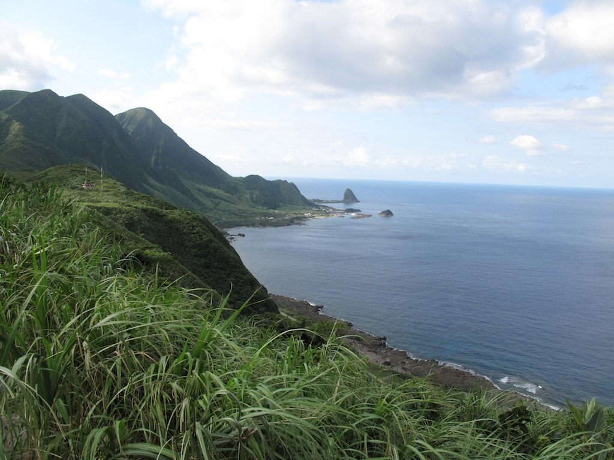
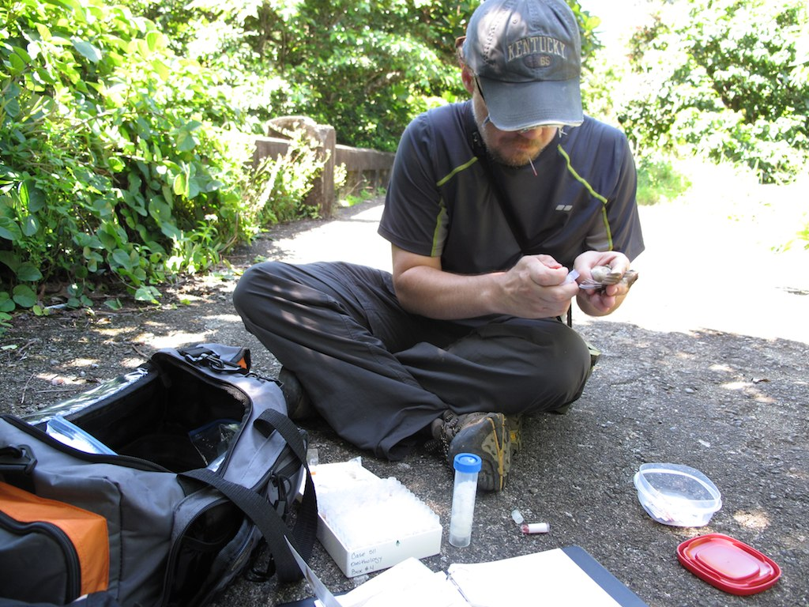
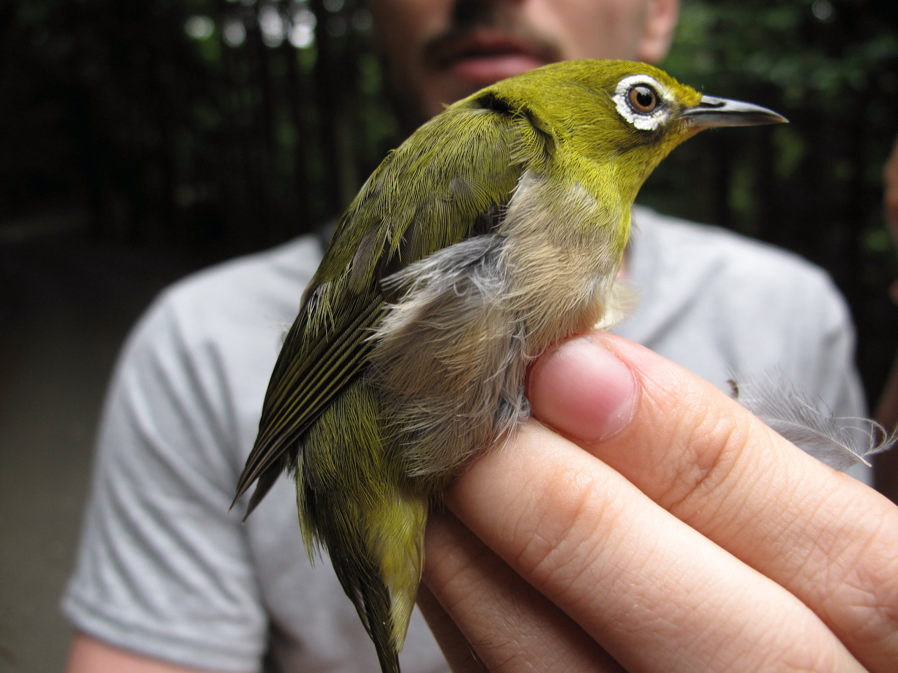
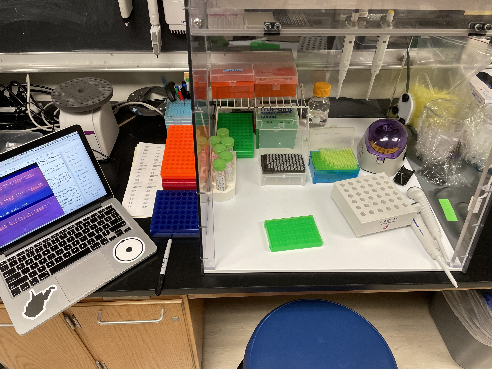

This study is part of a decades-long international collaboration to learn about the systematics, evolution, and island biogeography of East Asian and Philippine birds. This chapter in that story involves the systematics of a particularly complex group within the white-eye genus *Zosterops*. The systematics of the white-eyes of East Asia and the Philippines, dubbed the Asiatic white-eyes, has proven to be confounding. Various studies have made strides in understanding this group but have suffered from insufficient sampling [@lim2018; @jones2008; @gwee2020; @oliveros2021; @moyle2009]. We produced a RADseq dataset and coupled those data with a smaller allele-based Sanger sequenced dataset and linear morphometrics from museum study skins. Here we will describe in detail, perhaps excruciating, the methods and analyses in this work. The hope is that the work will be reproducible by our colleagues and accessible for students, especially for those learning to grapple with the complexities of large-scale single nucleotide polymorphism (SNP) datasets.

## Sampling

The strength of this study lies in its comprehensive sampling effort. 208 genetic samples and 354 museum skins were analyzed from several museums in the United States, China, Taiwan, and Japan. All of the sampling in this study is accessioned in natural history museums.

For the Asiatic white-eye complex we have sampled from many populations for the genetic analysis including all but three of the 15 subspecies within the combined *Z. japonicus* and *Z. montanus* group. This sampling was geographically widespread ranging from large temperate islands such as Hokkaido and Honshu, tiny, far-flung oceanic islands such as those in the Volcano group in the Pacific, and a variety of tropical islands in the Philippine and Indonesian archipelagos, as well as multiple taxa and populations for continental species ranging from Singapore to the Russian Far East.

{width="1024"}

## Lab work and analysis

All the bench work for this project was conducted either at the University of Kansas for RADseq and Marshall University or Cincinnati Museum Center for the Sanger sequenced loci. Initial analyses were done at the University of Kansas by Devon DeRaad and published in the journal *Biological Invasions* [@deraad2024]. Where those initial analyses focused on using the RADseq data and ecological niche modeling to study the origin and spread of the introduced populations in Hawaii and Southern California, this study takes those data and adds Sanger sequences and morphology to focus on the systematics of the group in Asia. The initial basic filtering and preparation of the RADseq data for analysis is documented in [@deraad2024]. All the analyses here are directed toward solving the puzzle of the species limits within this group and determining their relationships. The lead on those analyses were done by Herman Mays Jr. at Marshall University with considerable help from Laura Kubatko at Ohio State University.

{width="1024"}

## Museum morphometrics

Species are more than just the accumulation of neutral genetic differences. We added phenotypic data to these analyses to make for a more inclusive and integrative investigation of species limits and evolution in this group. Phenotypes in this study were focused on linear morphometrics derived from museum skins. Access to museum collections was generously provided by the American Museum of Natural History, Cincinnati Museum Center, The Field Museum, and the National Museum of Natural History at the Smithsonian. We have immense gratitude for these institutions and their staff for maintaining these collections and making them accessible.

{width="1024"}

## Acknowledgements

Herman L. Mays Jr., PhD (HLM) conducted these analyses and created this document. This research was only possible through decades of collaboration with colleagues and institutions in Taiwan, China, and Japan, the support of museum collections in the USA, and training and collaboration with Laura Kubatko at The Ohio State University. Support for HLM was provided by the National Science Foundation through a Mid-career Award (NSF#2322123). Additional acknowledgments appear in the published account of this work. Questions about these analyses and research program are welcomed and should be directed to HLM at maysh\@marshall.edu or maysher\@gmail.com. Additional information about the broader research program may be found at <https://www.monofilia.org>.

This work is dedicated to the memory of Robert S. Kennedy and his contributions to Philippine ornithology and conservation and his stewardship of the zoology collection at Cincinnati Museum Center.
