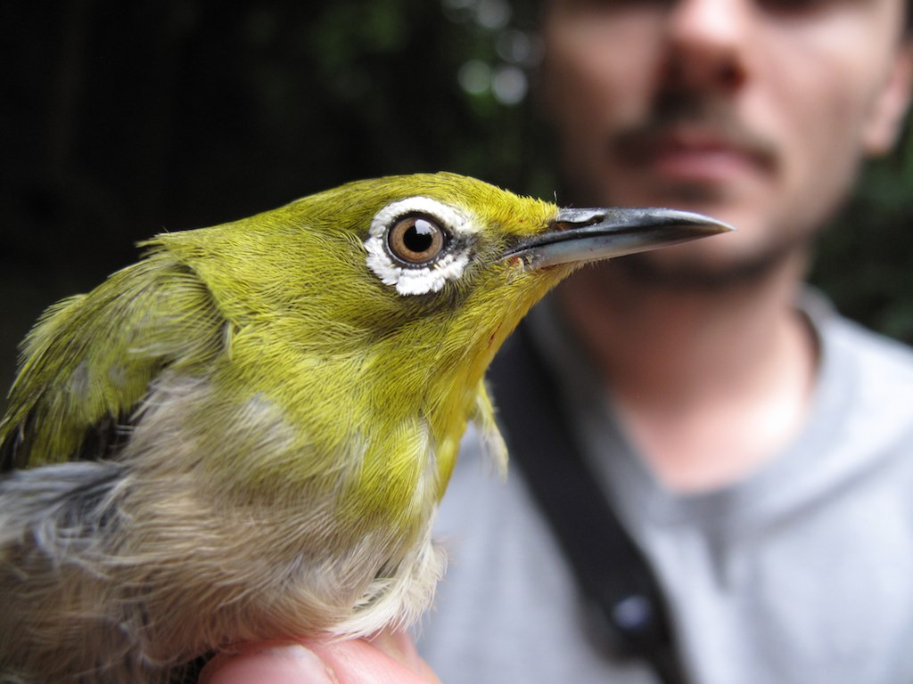

# The not-so-great speciator: Systematics and species limits in the Asiatic white-eye complex (*Zosterops spp.*)

## Authors

[Herman L. Mays Jr.](https://www.monofilia.org)\*, Marshall University, USA

Bailey D. McKay, American Museum of Natural History, USA

Isao Nishiumi, National Museum of Nature and Science, Japan

Cheng-Te Yao, Taiwan Biodiversity Research Institute, Taiwan

Fa-Sheng Zou, Guangdong Academy of Sciences, China

Madeline Boyd, Marshall University, USA

Devon DeRaad, University of California Los Angeles, USA

Ruey-Shing Lin, Taiwan Biodiversity Research Institute, Taiwan

Kazuto Kawakami, Forestry an Forest Products Research Institute, Japan

Chang-Hoe Kim, National Institute of Ecology, Republic of Korea

Laura Kubatko, The Ohio State University, USA

Robert Moyle, University of Kansas, USA

\*Corresponding author email: maysh\[at\]marshall.edu or maysher\[at\]gmail.com

*Last updated: `r format(Sys.time(), '%B %d, %Y %H:%M')`*

## Quarto

This is a Quarto website.

To learn more about Quarto websites visit <https://quarto.org/docs/websites>.
